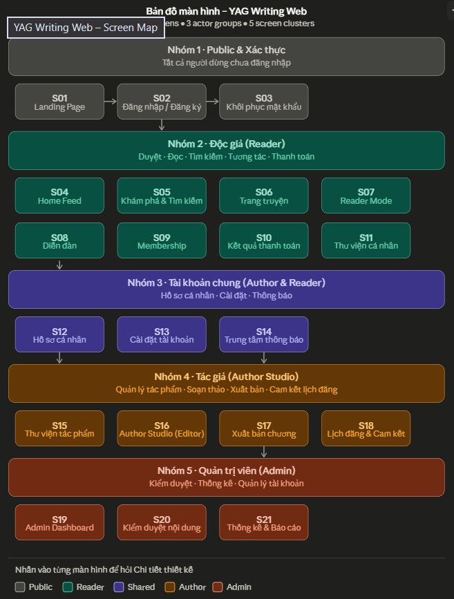

md_content = """# Bộ Tiêu Chuẩn Thiết Kế UI/UX – YAG Writing Web




## I. Hệ thống Design Token & Quy tắc màu
Dựa trên DESIGN.md + nguyên tắc Material Design 3 và Nielsen's 10 Usability Heuristics, nhóm áp dụng bộ quy tắc sau:

**Màu sắc có ngữ nghĩa (Semantic Color Rules)**

| Mục đích | Màu | Mã HEX | Khi nào dùng |
| :--- | :--- | :--- | :--- |
| CTA chính | Crimson Root | #C81C30 | Nút xuất bản, đăng ký, xác nhận thanh toán |
| Hover / Focus | Coral Drift | #FEBDB2 | Border focus input, hover card, tag outline |
| Nền trang đọc | Petal Light | #FFECCE | Toàn trang Reader Mode, nền chính Light |
| Text chính / Dark BG | Jungle | #41503D | Text body Light Mode; nền toàn trang Dark Mode |
| Thành công | Semantic Green | #22C55E | Duyệt, thanh toán OK, trạng thái APPROVED |
| Cảnh báo | Semantic Amber | #F59E0B | Gần deadline, nội dung FLAGGED, sắp hết quota |
| Lỗi / Từ chối | Semantic Red | #EF4444 | Validation lỗi, trạng thái REJECTED, lỗi API |
| Thông tin | Semantic Blue | #3B82F6 | Tooltip, badge thông tin trung lập |
| Nền surface | Near-white | #FAFAF8 | Card, modal, sidebar trên nền kem |

Quy tắc vàng: màu đỏ #C81C30 KHÔNG được dùng cho thông báo lỗi – đây là màu CTA thương hiệu. Lỗi dùng Semantic Red #EF4444. Hai màu này phải được phân biệt rõ ràng trong Tailwind config.

## II. Bộ Quy Tắc Thiết Kế Ràng Buộc

### 1. Typography
* Font: Inter (hệ thống sans-serif phổ thông, đọc tốt mọi lứa tuổi)
* Scale: 12 / 14 / 16 / 20 / 24 / 32px – không dùng size nào ngoài thang này
* Line-height: 1.6 cho body, 1.3 cho heading
* Tối thiểu 16px cho mọi văn bản đọc truyện (Reader Mode)

### 2. Spacing & Layout
* Dùng thang 4px base (4, 8, 12, 16, 24, 32, 48, 64px)
* Gutter chính: 24px desktop, 16px mobile
* Max content width: 1280px, căn giữa, padding ngoài 48px
* Reader Mode content width: tối đa 680px để tối ưu readability

### 3. Trạng thái tương tác (Interaction States)
* Mọi element tương tác phải có đủ 4 trạng thái: default → hover → active → disabled. Không được để người dùng đoán cái gì click được.

### 4. Loading & Async
* Cấm Spinner toàn trang – chỉ dùng Skeleton Loading khớp với layout thật
* AI responses (gợi ý tình tiết, tìm kiếm ngữ nghĩa) phải có trạng thái pending rõ ràng với text "AI đang phân tích…"
* Toast notification cho mọi action bất đồng bộ (xuất bản chương, thanh toán)

### 5. Feedback Pattern (dựa trên Nielsen Heuristic #1 – Visibility of system status)
* Toast nhẹ (bottom-right, 3 giây) cho các hành động nhỏ
* Modal xác nhận cho hành động không thể hoàn tác (xóa chương, khóa tài khoản)
* Banner sticky cho trạng thái quan trọng kéo dài (kiểm duyệt đang xử lý)

### 6. Accessibility
* Contrast ratio tối thiểu 4.5:1 (WCAG AA)
* Mọi icon phải có aria-label hoặc text kèm theo
* Focus ring rõ ràng (không xóa outline mặc định)
* Dark Mode: text #FFECCE trên nền #41503D hoặc tối hơn

## III. Đặc Tả 21 Màn Hình

### Nhóm 1 · Public & Xác thực

**S01 – Landing Page**
Mục tiêu: chuyển đổi khách vào Register. Layout hero full-width, hiển thị 3 tính năng nổi bật (AI Gợi ý, Tìm kiếm thông minh, Cộng đồng). CTA chính duy nhất: "Bắt đầu miễn phí" (#C81C30). Showcase top 6 truyện nổi bật dạng card ngang. Section so sánh gói Membership. Footer tối giản. Không có Navbar phức tạp – chỉ Logo + Đăng nhập + Đăng ký.
Use cases: U001 (entry point)

**S02 – Đăng nhập / Đăng ký**
Hai tab trên cùng form card căn giữa màn hình. Đăng ký yêu cầu: email, username, mật khẩu, xác nhận. Validation inline realtime (không đợi submit). Error message dùng Semantic Red, không dùng màu CTA. Toggle password visibility. Link "Quên mật khẩu" dẫn S03.
Use cases: U001

**S03 – Khôi phục mật khẩu**
3 bước tuần tự trong 1 trang: Nhập email → Nhập OTP → Đặt mật khẩu mới. Dùng Stepper UI (step indicator rõ ràng). Đếm ngược thời gian OTP. Không tách thành 3 route riêng gây confusion.
Use cases: U001

### Nhóm 2 · Độc giả

**S04 – Home Feed**
Navbar chính: Logo | Khám phá | Diễn đàn | [Avatar dropdown]. Hero banner carousel (3 truyện được đề xuất bởi AI). Section "Tiếp tục đọc" (nếu đã login, hiển thị lịch sử). Grid truyện đề xuất (AI Recommend) 2×4. Section "Mới đăng" dạng list ngang scroll. Section "Thể loại phổ biến" dạng tag pills. Skeleton loading cho mỗi section độc lập.
Use cases: U009, U010 (entry point)

**S05 – Khám phá & Tìm kiếm**
Thanh search nổi bật đầu trang. Hai chế độ: Tìm kiếm cơ bản (từ khóa) và AI Search (ngữ nghĩa – có badge "AI" kèm tooltip giải thích). Filter sidebar trái: thể loại, trạng thái (đang đăng/hoàn thành), xếp hạng, số chương. Grid kết quả 3 cột. Pagination vô hạn (infinite scroll). Khi AI Search đang xử lý, hiển thị skeleton + text "Đang tìm kiếm thông minh…".
Use cases: U007, U008

**S06 – Trang truyện (Story Detail)**
Layout 2 cột: cột trái 35% là ảnh bìa + metadata (thể loại, tag, tác giả, số chương, lượt đọc, rating). Cột phải 65% là mô tả + danh sách chương (có phân trang). CTA đọc: "Đọc từ đầu" và "Đọc tiếp" nếu đã có lịch sử. Nút "Lưu thư viện" (bookmark). Tab bình luận riêng biệt cuối trang. Truyện premium (chương khoá) hiển thị badge khoá + CTA Membership.
Use cases: U003 (view), U010 (comment), U011 (trigger)

**S07 – Reader Mode**
Màn hình đọc immersive: Navbar ẩn khi scroll xuống, hiện lại khi scroll lên. Content area tối đa 680px căn giữa, nền Petal Light #FFECCE. Thanh công cụ cố định (floating bottom bar): font-size slider, chuyển Light/Sepia/Dark, bookmark chương, điều hướng prev/next chapter. Không có sidebar hay quảng cáo. Chương khoá hiển thị blurred preview + modal mời mua Membership. Anti-copy: disable right-click + Ctrl+C (client-side).
Use cases: U007 (đọc chương)

**S08 – Diễn đàn**
Trang danh sách chủ đề: filter theo truyện, thể loại thảo luận. Mỗi chủ đề hiển thị tiêu đề, tác giả, số reply, last activity. Click vào chủ đề → trang thread: hiển thị bình luận theo cây (reply indented), real-time cập nhật qua WebSocket (bình luận mới trượt vào từ dưới không cần F5). Rich text composer (bold, italic, quote). Nút "Tạo chủ đề" dành cho user đã login.
Use cases: U010

**S09 – Membership**
3 card gói (Tháng / Quý / Năm) dạng so sánh horizontal. Card nổi bật "Quý" có viền accent + badge "Phổ biến nhất". Bảng so sánh quyền lợi phía dưới. CTA "Đăng ký ngay" → redirect VNPAY (external). Nếu đang có gói: hiển thị gói hiện tại + ngày hết hạn + nút "Gia hạn".
Use cases: U011

**S10 – Kết quả thanh toán**
Trang return URL từ VNPAY. 2 trạng thái: Thành công (icon check xanh, thông tin giao dịch, CTA "Bắt đầu đọc") hoặc Thất bại (icon X đỏ Semantic Red, lý do, CTA "Thử lại"). Không dùng màu CTA #C81C30 cho trạng thái lỗi.
Use cases: U012

**S11 – Thư viện cá nhân**
Tab: "Đang theo dõi" | "Đã hoàn thành" | "Lịch sử đọc". Grid card truyện, mỗi card có progress bar chapter đang đọc. Sắp xếp theo lần đọc gần nhất / tên. Nút "Bỏ theo dõi" có xác nhận nhẹ (tooltip confirm, không cần modal).
Use cases: U007 (library)

### Nhóm 3 · Tài khoản chung

**S12 – Hồ sơ cá nhân**
Avatar + display name + bio + stats (số truyện theo dõi / số chương đã đọc với Reader; số tác phẩm / tổng lượt đọc với Author). Tab: "Tác phẩm" (Author) | "Hoạt động" | "Bình luận". Nếu xem hồ sơ người khác: nút Follow. Badge độ uy tín tác giả (tỷ lệ đăng đúng lịch từ U014).
Use cases: U002

**S13 – Cài đặt tài khoản**
Sidebar trái: Thông tin cá nhân | Đổi mật khẩu | Tuỳ chọn hiển thị | Membership | Bảo mật. Mỗi section là form riêng với Save button cục bộ (không save toàn trang). Destructive actions (xóa tài khoản) ở cuối, màu đỏ Semantic Red, cần xác nhận 2 lớp.
Use cases: U002

**S14 – Trung tâm thông báo**
Danh sách thông báo theo thời gian thực (WebSocket). Phân loại: Hệ thống | Tác giả | Cộng đồng. Đánh dấu đọc bulk. Deep link: nhấn vào thông báo "Chương X vừa được duyệt" → dẫn thẳng vào S17 với trạng thái tương ứng.
Use cases: U013 (notify), U014 (notify)

### Nhóm 4 · Author Studio

**S15 – Thư viện tác phẩm (Author)**
Grid tác phẩm của tác giả. Mỗi card hiển thị: ảnh bìa, tên, số chương, trạng thái (Đang đăng / Hoàn thành / Tạm hoãn), badge lịch đăng (On Schedule / Overdue – màu Amber/Red). CTA "Tạo tác phẩm mới" nổi bật. Dropdown action trên mỗi card: Chỉnh sửa thông tin | Quản lý chương | Xem thống kê.
Use cases: U003

**S16 – Author Studio (Editor)**
Split-view bắt buộc toàn màn hình: 70% trái là editor distraction-free (hỗ trợ Markdown, autosave mỗi 30s, word count), 30% phải là AI Sidebar. AI Sidebar có 2 tab: "Gợi ý tình tiết" (context 1000 từ) và "Kiểm duyệt trước" (preview nhanh). Thanh trên editor: Lưu nháp | Xuất bản (dẫn S17) | Xem trước. Không có thanh nav ngoài – tập trung viết.
Use cases: U004, U006

**S17 – Xuất bản chương**
Form wizard 2 bước. Bước 1: tên chương, số thứ tự, loại (miễn phí/premium). Bước 2: xem trước nội dung + checkbox xác nhận cam kết nội dung. Nút "Xuất bản" (#C81C30) trigger async job (AI Moderator). Sau submit: banner "Đang kiểm duyệt AI – tối đa 5 phút" thay vì spinner chặn. Thông báo realtime qua WebSocket khi xong.
Use cases: U005, U013 (trigger)

**S18 – Lịch đăng & Cam kết**
Calendar view hiển thị lịch đăng chương đã cam kết. Màu xanh = đúng hạn, màu đỏ Amber = sắp trễ, màu Semantic Red = đã trễ. Form thêm/sửa lịch. Panel bên phải: thống kê tỷ lệ tuân thủ (compliance rate) dạng donut chart. Nhắc nhở tự động qua thông báo ≤ 24h.
Use cases: U014

### Nhóm 5 · Admin

**S19 – Admin Dashboard**
4 metric cards đầu trang: Người dùng mới 7 ngày | Truyện chờ duyệt | Doanh thu tháng | Vi phạm chờ xử lý. Chart doanh thu theo thời gian (line chart). Bảng "Task cần xử lý ngay" với priority badge. Sidebar trái: Dashboard | Kiểm duyệt | Người dùng | Thống kê. Mọi số liệu realtime.
Use cases: U015

**S20 – Kiểm duyệt nội dung**
Bảng danh sách chương cần duyệt: lọc theo trạng thái FLAGGED/PENDING. Mỗi row có: tên chương, tác giả, lý do AI gắn cờ, thời gian chờ. Click → panel bên phải mở nội dung chương + lý do AI + action buttons: "Duyệt" (xanh) | "Từ chối + Gửi cảnh báo" (Semantic Red) | "Khoá tài khoản" (có modal xác nhận). Audit log ghi mọi hành động.
Use cases: U013 (admin review), U015

**S21 – Thống kê & Báo cáo**
Tabs: Doanh thu | Người dùng | Nội dung | Tác giả. Bộ lọc ngày tháng linh hoạt. Chart dạng bar/line (Recharts). Bảng top tác giả theo lượt đọc / doanh thu chia sẻ. Nút "Xuất báo cáo CSV". Giám sát lộ trình tác giả vi phạm nhiều lần (U014 escalation).
Use cases: U014, U015

## IV. Luồng Điều Hướng Chính

Kết quả chạy mã
File generated successfully.

```text
Landing (S01) → Register (S02) → Home Feed (S04)
                                      ↓
                          Khám phá (S05) → Trang truyện (S06) → Reader Mode (S07)
                                                    ↓
                                          Membership (S09) → Thanh toán VNPAY → Kết quả (S10)
Author: Home → Author Studio (S16) → Xuất bản (S17) → [AI kiểm duyệt nền] → Notify (S14)
Admin:  Login → Dashboard (S19) → Kiểm duyệt (S20) → Action → Audit log
V. Trade-off & Quyết định thiết kế quan trọng
Một số điểm cần lưu ý khi implement:

Reader Mode (S07) không nên tách route hoàn toàn mà nên lazy-load Navbar để giữ Back button. Ẩn Navbar bằng CSS transition khi scroll, không unmount – tránh layout shift.

Author Studio (S16) là màn hình nặng nhất về UX. Autosave 30 giây phải dùng debounce + optimistic update (lưu local trước, sync server sau) để không block editor. Nếu mất kết nối, hiển thị banner "Offline – đang lưu cục bộ" thay vì báo lỗi.

Màu CTA vs Lỗi là trade-off khó nhất do DESIGN.md chọn đỏ làm màu thương hiệu. Giải pháp: dùng #C81C30 cho CTA button có icon hành động, còn lỗi validation dùng #EF4444 kết hợp icon ⚠ để người dùng phân biệt bằng 2 kênh (màu + icon), không chỉ dựa vào màu đơn thuần.

Forum real-time (S08) nên có fallback polling mỗi 5 giây nếu WebSocket ngắt, tránh người dùng ngồi không biết kết nối đã mất.