### Intro2SE - Project Proposal - Group1

# YAG - WRITING NOVELS WEB

_Đồ án môn học Nhập môn Công nghệ phần mềm - HCMUS - Chính quy/2025_2026._

**Mục lục**

- [1. Member Contribution Assessment](#1-member-contribution-assessment)
- [2. Preliminary Problem Statement](#2-preliminary-problem-statement)
- [3. Proposed Solution](#3-proposed-solution)
  - [3.1 Software](#31-software)
    - [3.1.1 Features](#311-features)
    - [3.1.2 Software Architecture](#312-software-architecture)
  - [3.2 Hardware](#32-hardware)
    - [3.2.1 Development Environment - Local](#321-development-environment---local)
    - [3.2.1 Production Environment - Google Cloud Platform](#321-production-environment---google-cloud-platform)
- [4. Development Plan](#4-development-plan)
  - [4.1 Requirements Analysis](#41-requirements-analysis)
    - [4.1.1 Project Context](#411-project-context)
    - [4.1.2 Stakeholders](#412-stakeholders)
    - [4.1.3 Requirements Elicitation](#413-requirements-elicitation)
    - [4.1.4 Functional Requirements](#414-functional-requirements)
    - [4.1.5 Non-functional Requirements](#415-non-functional-requirements)
  - [4.2 Software Design](#42-software-design)
    - [4.2.1 UX Design](#421-ux-design)
    - [4.2.2 UI Design](#422-ui-design)
    - [4.2.3 Database Design](#423-database-design)
  - [4.3 Implementation](#43-implementation)
    - [4.3.1 Technical](#431-technical)
    - [4.3.2 Implementation Objectives](#432-implementation-objectives)
    - [4.3.3 Implementation Activities](#433-implementation-activities)
    - [4.3.4 Deliverables](#434-deliverables)
  - [4.4 Testing](#44-testing)
    - [4.4.1 Testing Elicitation](#441-testing-elicitation)
    - [4.4.2 Non-Function Testing](#442-non-function-testing)
    - [4.4.4 Evaluation Criteria](#444-evaluation-criteria)
  - [4.5 Deployment and Maintainance](#45-deployment-and-maintainance)
- [5. Human Resources \& Costing Plan](#5-human-resources--costing-plan)
  - [5.1 Human Resources](#51-human-resources)
  - [5.2 Costing Plan](#52-costing-plan)
- [6. Tools setup](#6-tools-setup)
  - [6.1 Prerequisites](#61-prerequisites)
  - [6.2 Repository](#62-repository)
  - [6.3 Backend Setup (FastAPI)](#63-backend-setup-fastapi)
  - [6.4 Frontend Setup (Next.js)](#64-frontend-setup-nextjs)
  - [6.5 Docker](#65-docker)
  - [6.6 Environment Variables](#66-environment-variables)
- [7. AI Usage Declaration](#7-ai-usage-declaration)
- [8. Presentation](#8-presentation)
- [9. Reflective Report](#9-reflective-report)

## 1. Member Contribution Assessment

- **23120123 - Trần Gia Hiển - 35%**

| Nhiệm vụ                                   | Mô tả                                                                                                                                               |
| ------------------------------------------ | --------------------------------------------------------------------------------------------------------------------------------------------------- |
| _**Write Preliminary Problem Statement**_  | Phân tích bối cảnh, xác định các khó khăn của người dùng khi đọc/viết tiểu thuyết trực tuyến và định nghĩa bài toán mà hệ thống cần giải quyết      |
| _**Write Software Features**_              | Liệt kê và mô tả chi tiết các tính năng của hệ thống để giải quyết bài toán đã đặt ra                                                               |
| _**Write Testing**_                        | Xây dựng kế hoạch kiểm thử phần mềm, định nghĩa các phương pháp kiểm thử để đảm bảo chất lượng các chức năng                                        |
| _**Write Human Resources & Costing Plan**_ | Lập bảng phân công nhân sự và ước tính chi phí cần thiết cho việc vận hành hệ thống                                                                 |
| _**Review Software Architecture**_         | Đánh giá đề xuất về tính hợp lý của kiến trúc về phần mềm hệ thống, đảm bảo sơ đồ thiết kế đáp ứng tốt các tính năng và khả năng thực hiện          |
| _**Review Hardware**_                      | Đánh giá đề xuất các yêu cầu về thiết bị đầu cuối và hạ tầng máy chủ cần thiết để triển khai hệ thống                                               |
| _**Review Implementation**_                | Đánh giá đề xuất cho quá trình hiện thực hóa mã nguồn, đảm bảo đề xuất có trình bày các quy tắc cần tuân thủ khi viết code và chức năng đã thiết kế |

- **23120151 - Huỳnh Yến Nhi - 15%**

| Nhiệm vụ                                   | Mô tả                                                                                                                           |
| ------------------------------------------ | ------------------------------------------------------------------------------------------------------------------------------- |
| _**Write Implementation**_                 | Mô tả chi tiết các công nghệ sử dụng (ngôn ngữ lập trình, framework) và cách thức chuyển đổi từ thiết kế thành mã nguồn thực tế |
| _**Review Preliminary Problem Statement**_ | Đánh giá tính logic và mức độ thuyết phục của phần đặt vấn đề, đảm bảo bám sát nhu cầu thị trường và khả năng thực hiện         |
| _**Review Software Design**_               | Đánh giá đề xuất về giao diện (UI) và trải nghiệm người dùng (UX) để đảm bảo tính thẩm mỹ và dễ sử dụng                         |

- **23120169 - Nguyễn Phú Thọ - 20%**

| Nhiệm vụ                                    | Mô tả                                                                                                                                          |
| ------------------------------------------- | ---------------------------------------------------------------------------------------------------------------------------------------------- |
| _**Write Hardware**_                        | Đặc tả các cấu hình phần cứng tối thiểu và khuyến nghị để hệ thống hoạt động ổn định trên các nền tảng                                         |
| _**Write Deployment and Maintainance**_     | Xây dựng quy trình triển khai phần mềm lên môi trường thực tế và kế hoạch bảo trì, cập nhật hệ thống sau khi vận hành                          |
| _**Review Testing**_                        | Đánh giá kế hoạch và phương pháp kiểm thử đảm bảo các chức năng thực hiện chính xác, đảm bảo các lỗi tiềm tàng đều được bao phủ trong kế hoạch |
| _**Review Human Resources & Costing Plan**_ | Đánh giá đề xuất bảng tính chi phí và phân bổ nhân sự để đảm bảo tính thực tế và tối ưu ngân sách                                              |

- **23120177 - Phạm Hương Trà - 15%**

| Nhiệm vụ                                 | Mô tả                                                                                                                       |
| ---------------------------------------- | --------------------------------------------------------------------------------------------------------------------------- |
| _**Write Requirements Analysis**_        | Phân tích các yêu cầu Functional và Non-functional của hệ thống                                                             |
| _**Review Software Features**_           | Đánh giá tính khả thi của các tính năng đã đề xuất, loại bỏ hoặc bổ sung các tính năng cần thiết                            |
| _**Review Deployment and Maintainance**_ | Đánh giá đề xuất các phương án triển khai để đảm bảo tính an toàn và giảm thiểu thời gian gián đoạn của hệ thống (downtime) |

- **23120182 - Nguyễn Duy Trường - 15%**

| Nhiệm vụ                           | Mô tả                                                                                                    |
| ---------------------------------- | -------------------------------------------------------------------------------------------------------- |
| _**Write Software Architecture**_  | Thiết kế cấu trúc tổng thể về phần mềm hệ thống, bao gồm sơ đồ khối, luồng dữ liệu giữa Client và Server |
| _**Write Software Design**_        | Đưa ra đề xuất về một bản thiết kế chi tiết từ UI đến Database, cũng như thực hiện các yêu cầu kiểm thử  |
| _**Review Requirements Analysis**_ | Đánh giá đề xuất về tính đầy đủ của các yêu cầu đã phân tích, tránh bỏ sót nhu cầu của người dùng        |

## 2. Preliminary Problem Statement

    Written by: 23120123 Trần Gia Hiển
    Edited by: 23120123 Trần Gia Hiển
    Reviewed by: 23120151 Huỳnh Yến Nhi

Hiện nay, các tác phẩm văn học mạng ngày càng trở nên **phổ biến** và tiếp cận được với **lượng lớn độc giả** từ nhiều lứa tuổi, quốc gia. Tuy nhiên, đa phần các nền tảng lại không hỗ trợ đầy đủ các dịch vụ như tự động kiểm duyệt, hỗ trợ tìm ý tưởng, bối cảnh và cũng như xây dựng được một không gian tương tác mạng xã hội trực tiếp trên nền tảng. Là trưởng nhóm phát triển của một công ty phần mềm, nhóm bạn phải xây dựng một nền tảng viết truyện chữ uy tín. Nền tảng hỗ trợ môi trường **viết truyện thông minh bằng AI** và **xây dựng một cộng đồng** các tác giả, độc giả có thể dễ dàng kết nối với nhau như một trang mạng xã hội dành riêng cho hội mê truyện.

Các tác giả khi đăng tải có thể lựa chọn đăng một lần hoàn thiện hoặc hẹn lịch đăng từng chương của tác phẩm (theo tuần, theo tháng,...) và cam kết sẽ không dừng tác phẩm giữa chừng (drop). Truyện khi được đăng tải cần đảm bảo các yếu tố sau: tên truyện, mô tả cơ bản, thể loại, độ tuổi thích hợp, bìa truyện (nếu có),... điều này giúp các độc giả có thể dễ dàng tìm kiếm và tăng cường mức độ nhận diện của tác phẩm. Trong quá trình viết, các tác giả có thể nhờ AI hỗ trợ tìm ý tưởng, xây dựng bối cảnh, kiểm tra tính chính xác của sự kiện,... Và trước khi đăng tải, tác phẩm sẽ được kiểm duyệt với AI về nội dung có phù hợp (độ tuổi, lịch sử, chính trị, văn hóa,...). Các tác phẩm sau khi đăng tải lên sẽ được theo dõi sát sao về lượng truy cập, lượt đánh giá, nhận xét để tác giả có thể tiếp cận được xu hướng độc giả hiện nay.

Các độc giả có thể tìm kiếm và đọc các tác phẩm dựa trên tên truyện, thể loại hoặc tên của tác giả. Ngoài ra, độc giả có thể tìm kiếm dựa trên cốt truyện của tác phẩm nhờ vào AI hỗ trợ tìm kiếm thông minh. Trong quá trình đọc truyện, độc giả có thể đưa ra nhận xét, đánh dấu yêu thích cho từng chương truyện và tham gia vào cộng đồng của bộ truyện đó. Nếu yêu thích các tác phẩm của tác giả đó, độc giả có thể tham gia gói Membership để đọc các tác phẩm độc quyền, mới nhất, nhanh nhất.

Để đảm bảo được sự ổn định và nâng cao khả năng xử lý của AI, nhóm phải xây dựng một ứng dụng Web chạy trên các trình duyệt hiện đại hỗ trợ HTML5 và WebSockets để đồng bộ hóa bản thảo thời gian thực (Google Chrome, Microsoft Edge, Firefox, Safari). Hệ thống cần sử dụng Apache phục vụ phân phối nội dung và API của các nhà cung cấp LLM lớn như Google để xử lý các yêu cầu về ngôn ngữ tự nhiên. Đặc biệt, nhóm có thể đề xuất sử dụng React.js hoặc Next.js để xây dựng giao diện Single Page Application (SPA) tiện ích. Và Python (FastAPI) giúp tối ưu hóa việc tích hợp các mô hình AI và xử lý dữ liệu lớn ở phía sau.

Ngoài ra, để đảm bảo tính bảo mật và quyền sở hữu trí tuệ, các thông tin về tác phẩm, tác giả và độc giả đều cần được mã hóa bảo mật. Và tất cả các hoạt động trên nền tảng, người dùng cần đăng ký và đăng nhập để sử dụng nhằm đảm bảo sự an toàn của hệ thống.

## 3. Proposed Solution

### 3.1 Software

#### 3.1.1 Features

    Written by: 23120123 Trần Gia Hiển
    Edited by: 23120177 Phạm Hương Trà - 23120123 Trần Gia Hiển
    Reviewed by: 23120177 Phạm Hương Trà

| STT     | User Story                                                                                      | Tính năng                           |
| :------ | :---------------------------------------------------------------------------------------------- | :---------------------------------- |
| **I**   | **NHÓM TÍNH NĂNG AI**                                                                           |                                     |
| 1       | Là độc giả, tôi muốn tìm kiếm truyện dựa trên mô tả cốt truyện thay vì chỉ dùng từ khóa.        | Tìm kiếm thông minh (AI Search)     |
| 2       | Là tác giả, tôi muốn nhận gợi ý ý tưởng khi bị bí nội dung để mạch truyện trơn tru hơn.         | AI gợi ý tình tiết                  |
| 3       | Là tác giả, tôi muốn nội dung được tự động kiểm duyệt để đảm bảo không vi phạm quy tắc văn hóa. | Kiểm duyệt tự động bằng AI          |
| 4       | Là tác giả, tôi muốn quá trình AI kiểm duyệt và xử lý nội dung diễn ra nhanh chóng (< 5 phút).  | Xử lý và phản hồi nhanh             |
| **II**  | **NHÓM NGHIỆP VỤ CỐT LÕI**                                                                      |                                     |
| 5       | Là người dùng, tôi muốn nhận đề xuất truyện hay, xu hướng dựa trên sở thích cá nhân.            | Đề xuất truyện                      |
| 6       | Là độc giả, tôi muốn tìm kiếm truyện qua tên truyện, thể loại hoặc tên tác giả.                 | Tìm kiếm truyện (Cơ bản)            |
| 7       | Là tác giả, tôi muốn có không gian lưu trữ và quản lý tất cả truyện đã viết.                    | Thư viện tác phẩm                   |
| 8       | Là độc giả, tôi muốn lưu lại các tác phẩm mình yêu thích để theo dõi dễ dàng.                   | Thư viện đọc                        |
| 9       | Là tác giả, tôi muốn bảo vệ chất xám và ngăn chặn việc sao chép nội dung trái phép.             | Chống sao chép nội dung truyện      |
| **III** | **NHÓM TƯƠNG TÁC & DOANH THU**                                                                  |                                     |
| 10      | Là tác giả và độc giả, tôi muốn có diễn đàn để trao đổi, góp ý và xây dựng cộng đồng.           | Xây dựng cộng đồng, diễn đàn online |
| 11      | Là tác giả, tôi muốn thống kê chi tiết lượt đọc, yêu thích để nắm bắt tâm lý độc giả.           | Thống kê lượng truy cập, đánh giá   |
| 12      | Là tác giả, tôi muốn kiếm tiền từ tác phẩm qua các chương đọc trước dành cho hội viên.          | Gói Membership                      |
| **IV**  | **NHÓM BẢO MẬT & QUẢN TRỊ**                                                                     |                                     |
| 13      | Là người dùng, tôi muốn mật khẩu đăng nhập của mình được bảo vệ tuyệt đối, không thể dò được.   | Bảo vệ mật khẩu                     |
| 14      | Là người dùng, tôi muốn có cơ chế lấy lại tài khoản thông qua email khi quên mật khẩu.          | Quên mật khẩu, Reset mật khẩu       |
| 15      | Là quản trị viên, tôi muốn đảm bảo các tác giả thực hiện đúng cam kết lộ trình đăng tải truyện. | Cơ chế cam kết lộ trình đăng tải    |
| 16      | Là quản trị viên, tôi muốn theo dõi báo cáo tổng thể doanh thu từ toàn bộ hệ thống.             | Thống kê doanh thu                  |

#### 3.1.2 Software Architecture

    Written by: 23120182 Nguyễn Duy Trường
    Edited by: 23120123 Trần Gia Hiển
    Reviewed by: 23120123 Trần Gia Hiển

Hệ thống được thiết kế theo **kiến trúc Modular Monolith**. Trong đó, toàn bộ hệ thống được triển khai dưới dạng một khối thống nhất và chia sẻ chung các Cơ sở dữ liệu. Tuy nhiên, logic nghiệp vụ được phân tách nghiêm ngặt thành các Module độc lập (Domain-Driven Design).

Hệ thống được chia thành 4 tầng:

**a. Tầng hiển thị**

Đây là nơi người dùng trực tiếp tương tác với hệ thống. Tầng này không chứa logic xử lý phức tạp mà chỉ nhận lệnh và hiển thị kết quả. Tùy vào vai trò và thao tác, ứng dụng sẽ chuyển đổi giữa các không gian làm việc khác nhau:

- _**Web Portal cho Độc giả:**_ Giao diện mặc định dành cho trải nghiệm đọc truyện, tìm kiếm thông minh bằng AI, tương tác cộng đồng (diễn đàn, bình luận, đánh giá) và thao tác mua gói Membership.
- _**Web Portal cho Tác giả:**_ Khi người dùng muốn sáng tác, hệ thống sẽ chuyển sang giao diện chuyên biệt (Studio). Nơi đây cung cấp trình soạn thảo văn bản, công cụ AI hỗ trợ gợi ý tình tiết, cùng dashboard quản lý thư viện tác phẩm và thống kê doanh thu cá nhân.
- _**Admin Dashboard:**_ Nơi Admin theo dõi báo cáo doanh thu tổng và nhận cảnh báo nếu có tác giả vi phạm cam kết lộ trình đăng bài.

**b. Tầng điều phối và bảo mật**

Tầng này đóng vai trò kiểm duyệt mọi yêu cầu từ Tầng Hiển thị trước khi vào hệ thống cốt lõi bên dưới.

- _**Xác thực người dùng:**_
  - Xử lý đăng nhập/đăng ký.
  - Sử dụng thuật toán băm để bảo vệ mật khẩu không thể dò được.
  - Cấp quyền truy cập _- ví dụ: Chặn không cho người dùng miễn phí gọi API để đọc các chương truyện dành riêng cho gói Membership_.
- _**API Gateway:**_ Nhận request từ Web Portal và định tuyến nó đến đúng module xử lý ở tầng dưới - _ví dụ: Request tìm truyện sẽ được đẩy về Module tìm kiếm_.
- _**Rate Limiting & Anti-Bot:**_ Giới hạn số lượng request trong một giây để chống các cuộc tấn công DDoS, dò mật khẩu, và ngăn chặn bot tự động crawl trộm nội dung truyện.

**c. Tầng nghiệp vụ lõi**

Đây là nơi chứa toàn bộ Business Logic. Tầng này được chia thành các Module độc lập để dễ bảo trì:

- _**Viết truyện:**_
  - Xử lý việc tạo mới, lưu bản thảo, xuất bản truyện.
  - Quản lý thư viện tác phẩm của tác giả và thư viện yêu thích của độc giả.
- _**Membership và Thanh toán:**_ Ghi nhận giao dịch mua gói Membership, tự động mở khóa nội dung độc quyền và tính toán chia sẻ doanh thu cho tác giả.
- _**Cộng đồng:**_ Quản lý chức năng bình luận, đánh giá sao, diễn đàn online và các bảng xếp hạng cho truyện nổi bật.
- _**AI Smart Engine:**_
  - AI Generator: Phân tích ngữ cảnh đoạn truyện đang viết dở và trả về gợi ý nội dung cho tác giả.
  - AI Moderator: Tự động quét từ ngữ, ngữ nghĩa của bản thảo mới để phát hiện nội dung vi phạm văn hóa.
  - AI Search & Recommender: Phân tích câu truy vấn của người dùng để tìm ra cốt truyện tương ứng thay vì chỉ tìm theo từ khóa - _ví dụ: Truyện tiên hiệp có nam chính thông minh_.

**d. Tầng Cơ sở dữ liệu**

Nơi lưu trữ và tối ưu hóa tốc độ truy xuất dữ liệu.

- _**Cơ sở dữ liệu Quan hệ:**_ Chứa các dữ liệu cốt lõi có cấu trúc chặt chẽ như thông tin tài khoản, lịch sử giao dịch thanh toán, thiết lập hệ thống, và nội dung của các chương truyện.
- _**Cơ sở dữ liệu Vector:**_ Chuyên dùng để lưu trữ các từ khóa đặc trưng của mọi bộ truyện. Đây là thành phần bắt buộc phải có để hệ thống tìm kiếm và đề xuất thông minh bằng AI có thể hoạt động.
- _**Bộ nhớ đệm:**_ Lưu trữ tạm thời các dữ liệu được yêu cầu liên tục.

_**Giải pháp kỹ thuật cho từng Tính năng**_

| Tính năng                           | Module / Dịch vụ         | Giải pháp Kỹ thuật & Công nghệ (Sinh viên)                    |
| :---------------------------------- | :----------------------- | :------------------------------------------------------------ |
| **I. NHÓM AI SMART ENGINE**         |                          |                                                               |
| Tìm kiếm thông minh AI Search       | Module AI & Vector DB    | Chuyển mô tả sang Vector; dùng **pgvector** để tìm kiếm.      |
| AI gợi ý tình tiết                  | Module AI Smart Engine   | Tích hợp **API Gemini** + Prompt Engineering.                 |
| Kiểm duyệt tự động bằng AI          | Module AI Smart Engine   | Dùng LLM nhận diện nội dung nhạy cảm & Profanity Filter.      |
| Xử lý và phản hồi nhanh             | Module Xử lý bất đồng bộ | Dùng hàng đợi **Redis Queue** để xử lý AI chạy ngầm.          |
| **II. NHÓM NGHIỆP VỤ CỐT LÕI**      |                          |                                                               |
| Đề xuất truyện                      | Module Gợi ý             | Gợi ý theo thể loại; Cache danh sách Trending vào **Redis**.  |
| Tìm kiếm truyện (Cơ bản)            | Module Tìm kiếm          | Sử dụng **Full-Text Search** tích hợp sẵn của PostgreSQL.     |
| Thư viện tác phẩm                   | Module Nội dung          | Lưu Text vào SQL; lưu ảnh bìa lên **Cloudinary / Firebase**.  |
| Thư viện đọc                        | Module Nội dung          | Bảng trung gian lưu Bookmark và tiến độ chương đang đọc.      |
| Chống sao chép nội dung truyện      | Tầng Giao diện           | Chặn tool cào bằng **Rate Limit** (kết hợp JS bảo vệ UI).     |
| **III. NHÓM TƯƠNG TÁC & DOANH THU** |                          |                                                               |
| Xây dựng cộng đồng, diễn đàn        | Module Tương tác         | Dùng **FastAPI WebSockets** cho bình luận và Real-time.       |
| Thống kê lượng truy cập             | Module Thống kê          | Đếm View/Like qua **Redis**; định kỳ đồng bộ về Postgres.     |
| Gói Membership                      | Module Thanh toán        | Tích hợp **VNPAY Sandbox**; Phân quyền người dùng (**RBAC**). |
| **IV. NHÓM BẢO MẬT & QUẢN TRỊ**     |                          |                                                               |
| Bảo vệ mật khẩu                     | Module Xác thực          | Mã hóa **Bcrypt** + **Rate Limiting** chặn Brute-force.       |
| Quên mật khẩu, Reset mật khẩu       | Module Xác thực          | Gửi mã xác nhận qua Email (**Nodemailer / Gmail API**).       |
| Cơ chế cam kết lộ trình đăng tải    | Module Quản lý nội dung  | Dùng **Cron Job** kiểm tra ngày cập nhật và gửi thông báo.    |
| Thống kê doanh thu                  | Module Thống kê          | Truy vấn SQL Aggregation (SUM/COUNT) từ lịch sử giao dịch.    |

Hệ thống được xây dựng theo kiến trúc Modular Monolith nhằm tối ưu hóa hiệu năng và tài nguyên vận hành trong giai đoạn đầu. Bằng cách áp dụng tư duy thiết kế Domain-Driven Design, các module nghiệp vụ được đảm bảo tính độc lập và lỏng lẻo. Điều này tạo tiền đề vững chắc để hệ thống sẵn sàng chuyển đổi sang kiến trúc Microservices trong tương lai - đặc biệt là với các module tiêu tốn nhiều tài nguyên như AI Smart Engine - mà không cần tái cấu trúc toàn bộ mã nguồn. Việc sử dụng cơ sở dữ liệu tập trung cũng giúp đảm bảo tính nhất quán dữ liệu tuyệt đối cho các tính năng quan trọng như thanh toán và quản lý nội dung.

### 3.2 Hardware

    Written by: 23120169 Nguyễn Phú Thọ
    Edited by: 23120123 Trần Gia Hiển
    Reviewed by: 23120123 Trần Gia Hiển

Để đảm bảo hiệu quả trong quá trình phát triển và tính sẵn sàng khi vận hành, hệ thống được phân tách thành hai môi trường độc lập. Sự phân tách này giúp nhóm kiểm soát tốt mã nguồn, tối ưu hóa hiệu năng phần cứng sẵn có và triệt tiêu chi phí vận hành không cần thiết trong giai đoạn thử nghiệm.

#### 3.2.1 Development Environment - Local

Đây là môi trường làm việc chính của nhóm, nơi thực hiện toàn bộ quá trình lập trình, kiểm thử module và tinh chỉnh các mô hình AI.

- **Thiết bị vận hành:** Máy tính cá nhân có thông số hỗ trợ cơ bản sau:
  - CPU: Intel Core i7 (8 Cores/16 Threads) đảm bảo khả năng xử lý đa luồng mượt mà khi chạy đồng thời nhiều container.

  - RAM: 16GB - 32GB giúp vận hành trơn tru các công cụ lập trình (VS Code), Docker Desktop và các cơ sở dữ liệu cục bộ.

  - GPU: Hỗ trợ tăng tốc quá trình chạy thử nghiệm các mô hình AI nhỏ hoặc xử lý dữ liệu vector tại chỗ.

- **Docker & Docker Compose:** Toàn bộ hệ thống (Backend, Frontend, DB, Redis) được đóng gói thành các Container. Việc này đảm bảo môi trường phát triển trên máy cá nhân đồng nhất 100% với môi trường vận hành trên Cloud.

- **Lợi ích:** Không tốn chi phí thuê server trong suốt quá trình code và debug tốc độ phản hồi cực nhanh do truy xuất dữ liệu nội bộ (Localhost).

#### 3.2.1 Production Environment - Google Cloud Platform

Môi trường này đóng vai trò phục vụ khi sản phẩm đã cơ bản hoàn thiện và có thể chạy 24/7 (trong mức chi phí được hỗ trợ của GCP) trên các thiết bị có kết nối mạng.
| Thành phần | Dịch vụ đề xuất | Vai trò và Đặc điểm kỹ thuật |
| :--- | :--- | :--- |
| Nền tảng máy chủ | **Google Cloud Run** | Sử dụng mô hình Pay-as-you-go kết hợp Credit hỗ trợ. Hệ thống chỉ khởi chạy khi có yêu cầu, giúp tối ưu hóa ngân sách dự án. |
| CSDL đám mây | **Supabase**| Cung cấp gói Free Tier, giúp dữ liệu (tài khoản, giao dịch, truyện) luôn an toàn và sẵn sàng ngay cả khi máy cá nhân của nhóm ngoại tuyến. |
| Lưu trữ tệp tin | **Firebase Storage** | Lưu trữ tập trung ảnh bìa và dữ liệu media. Giúp giảm tải băng thông cho server chính và tăng tốc độ tải trang qua mạng phân phối nội dung. |
| Điều phối & Bảo mật | **Cloudflare** | Đóng vai trò lớp giáp bảo mật, quản lý tên miền, cung cấp HTTPS miễn phí và ngăn chặn các cuộc tấn công DDoS cơ bản. |

## 4. Development Plan

### 4.1 Requirements Analysis

    Written by: 23120177 Phạm Hương Trà
    Edited by:
    Reviewed by: 23120182 Nguyễn Duy Trường

#### 4.1.1 Project Context

Hệ thống là một nền tảng web hỗ trợ viết và đọc truyện trực tuyến, hướng đến cộng đồng người dùng yêu thích truyện chữ. Nền tảng không chỉ cung cấp môi trường đăng tải và đọc truyện mà còn tích hợp các yếu tố mạng xã hội nhằm tăng cường tương tác giữa tác giả và độc giả.

#### 4.1.2 Stakeholders

| Bên liên quan   | Mô tả                                                      |
| --------------- | ---------------------------------------------------------- |
| Tác giả         | Tạo, chỉnh sửa, đăng tải và quản lý truyện                 |
| Độc giả         | Tìm kiếm, đọc, đánh giá và tương tác với truyện            |
| Quản trị viên   | Quản lý người dùng, kiểm duyệt nội dung, giám sát hệ thống |
| Nhóm phát triển | Phân tích, thiết kế, xây dựng và bảo trì hệ thống          |

#### 4.1.3 Requirements Elicitation

Nhóm sử dụng các phương pháp sau để thu thập và làm rõ yêu cầu hệ thống:

- **User Story Mapping:** Xác định nhu cầu người dùng theo từng vai trò (tác giả, độc giả, quản trị viên) và chuyển đổi thành các chức năng hệ thống
- **Brainstorming:** Thảo luận nội bộ nhằm đề xuất và hoàn thiện các tính năng của hệ thống
- **Phân tích đối thủ:** Nghiên cứu các nền tảng đọc/viết truyện hiện có để tham khảo tính năng và cải tiến
- **Xác nhận yêu cầu:** Rà soát và thống nhất yêu cầu trong nhóm để đảm bảo tính khả thi và nhất quán

#### 4.1.4 Functional Requirements

Hệ thống bao gồm các chức năng chính sau:

- **Quản lý người dùng:** Đăng ký, đăng nhập, quên mật khẩu.
- **Quản lý truyện:** Tạo, chỉnh sửa, lưu trữ và đăng tải nội dung.
- **Hỗ trợ AI:** Gợi ý ý tưởng, kiểm tra và cải thiện nội dung.
- **Tìm kiếm và đề xuất truyện** theo nhiều tiêu chí.
- **Tương tác cộng đồng:** Bình luận, đánh giá, thảo luận.
- **Hệ thống membership:** Nội dung trả phí, quyền truy cập đặc biệt.
- **Thống kê và báo cáo** cho tác giả và quản trị viên.

#### 4.1.5 Non-functional Requirements

- **Hiệu năng:** Các chức năng AI và xử lý nội dung phải phản hồi trong thời gian hợp lý.
- **Bảo mật:** Dữ liệu người dùng và nội dung phải được mã hóa và bảo vệ an toàn.
- **Dễ sử dụng:** Giao diện trực quan, thân thiện với người dùng.
- **Tương thích:** Hệ thống hoạt động trên các trình duyệt hiện đại hỗ trợ HTML5.
- **Khả năng mở rộng:** Có khả năng mở rộng khi số lượng người dùng tăng.
- **Độ ổn định:** Hệ thống cần đảm bảo hoạt động ổn định và hạn chế lỗi.

### 4.2 Software Design

    Written by: 23120182 Nguyễn Duy Trường
    Edited by:
    Reviewed by: 23120151 Huỳnh Yến Nhi

#### 4.2.1 UX Design

_**a. Đăng truyện và Kiểm duyệt AI tự động**_

**Mục tiêu:** Tác giả có thể đăng nội dung chương truyện mới. Hệ thống phải đảm bảo nội dung không vi phạm quy tắc văn hóa thông qua AI, đồng thời trả về phản hồi cho tác giả trong thời gian dưới 5 phút mà không làm gián đoạn trải nghiệm sử dụng (không bắt người dùng nhìn màn hình loading liên tục).

**Các đối tượng tham gia (Actors & Components):**

- **Author (Tác giả):** Người dùng thực hiện gửi nội dung.
- **Frontend (Web/App):** Giao diện soạn thảo và quản lý truyện.
- **Story Controller:** API xử lý việc tiếp nhận và lưu trữ bản thảo.
- **RabbitMQ (Message Broker):** Hàng đợi lưu trữ các tác vụ cần xử lý ngầm.
- **AI Moderator Service:** Dịch vụ độc lập gọi LLM API để phân tích văn bản.
- **Database:** Cơ sở dữ liệu lưu trữ nội dung và trạng thái truyện.

**Biểu đồ trình tự (Sequence Diagram):**
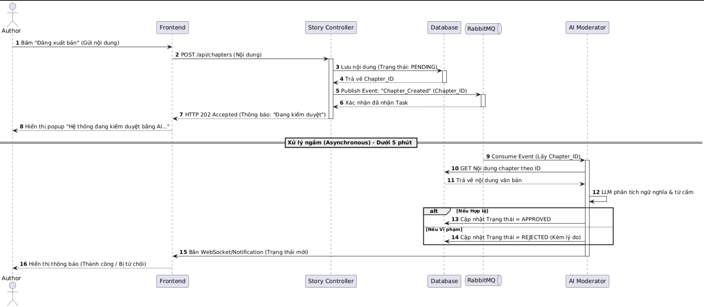

**Mô tả chi tiết luồng dữ liệu:**

- **(Bước 1-4):** Ngay khi tác giả bấm đăng bài, `Story Controller` không gọi ngay cho AI (vì AI xử lý text dài sẽ mất thời gian). Thay vào đó, nó lưu Database với trạng thái `PENDING` và đẩy một _Task_ vào hàng đợi `RabbitMQ`.
- **(Bước 5-6):** Hệ thống lập tức trả về cho tác giả thông báo HTTP 202 (Accepted) - nghĩa là "Đã tiếp nhận thành công, vui lòng đợi hệ thống quét". Tác giả lúc này có thể đóng tab hoặc viết tiếp chương khác mà không bị treo máy.
- **(Bước 7-12):** Dịch vụ `AI Moderator` chạy ngầm ở background, liên tục lấy các _Task_ từ `RabbitMQ` ra để xử lý. Sau khi gọi LLM phân tích xong, nó cập nhật kết quả vào `Database` và dùng WebSocket để thông báo về màn hình của tác giả. Thiết kế này giải quyết triệt để yêu cầu kiểm duyệt tốc độ cao, không giật lag.

_**b. Đăng ký gói Membership và Mở khóa truyện**_

**Mục tiêu:** Độc giả thực hiện thanh toán qua cổng điện tử (VNPAY/Momo) để nâng cấp tài khoản, hệ thống xử lý giao dịch an toàn và tự động cấp quyền đọc các chương truyện độc quyền.

**Các đối tượng tham gia (Actors & Components):**

- **Reader (Độc giả):** Người dùng muốn mua gói.
- **Frontend:** Giao diện hiển thị gói và xử lý chuyển hướng.
- **Payment Service:** Dịch vụ nội bộ quản lý giao dịch và gói cước.
- **Payment Gateway (VNPAY/Momo):** Cổng thanh toán bên thứ 3.
- **Database:** Lưu trữ hóa đơn và cập nhật `Role` của user.

**Biểu đồ trình tự (Sequence Diagram):**

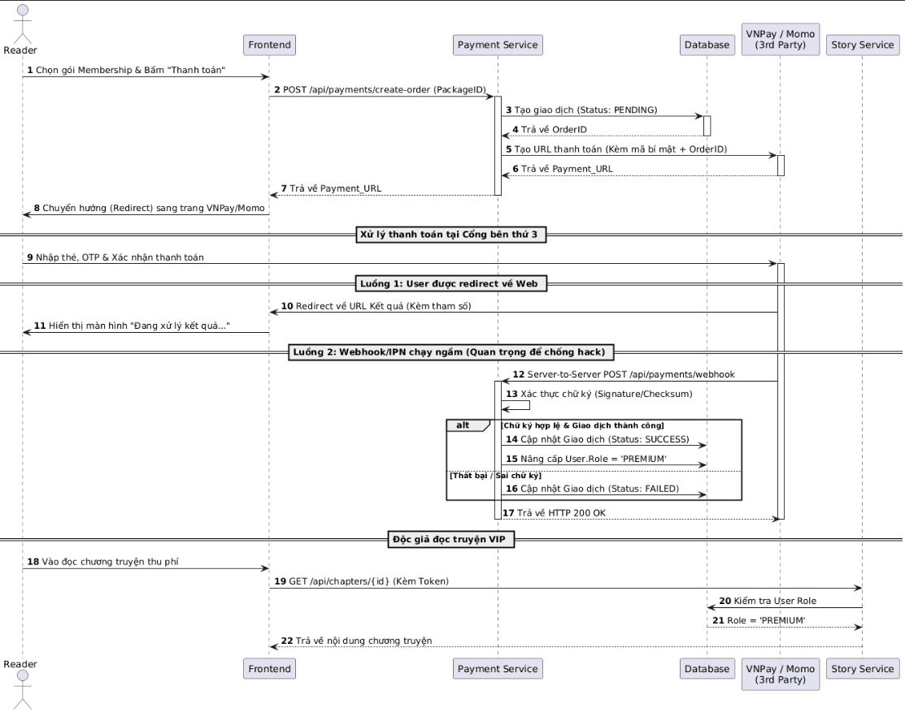

Hệ thống không bao giờ tin tưởng hoàn toàn vào dữ liệu do Frontend gửi lên sau khi thanh toán xong (vì user có thể can thiệp URL để fake kết quả). Việc nâng cấp tài khoản chỉ được thực hiện khi Payment Service nhận được tín hiệu xác nhận trực tiếp từ Server của cổng thanh toán và xác thực chữ ký thành công.

_**c. Tìm kiếm thông minh bằng AI (Semantic Search)**_

**Mục tiêu:** Độc giả nhập một đoạn mô tả (VD: "Truyện có nam chính làm hacker, xuyên không về quá khứ"), hệ thống phải hiểu ý nghĩa câu nói này và tìm ra truyện phù hợp thay vì chỉ tìm theo từ khóa chính xác.

**Các đối tượng tham gia (Actors & Components):**

- **Reader:** Người nhập câu truy vấn.
- **Search Service:** Dịch vụ nội bộ điều phối tìm kiếm.
- **Embedding Model:** Mô hình AI (OpenAI/HuggingFace) để biến text thành mảng số (Vector).
- **Vector DB (pgvector):** Cơ sở dữ liệu chuyên dụng tìm kiếm độ tương đồng vector.
- **Relational DB (PostgreSQL):** Chứa thông tin hiển thị (tên truyện, tác giả, ảnh bìa).

**Biểu đồ trình tự (Sequence Diagram):**
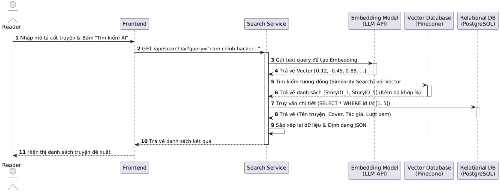

_**d. Chu trình đọc truyện và Tương tác của Độc giả**_

**Mục tiêu:** Mô tả trọn vẹn luồng trải nghiệm của một độc giả từ lúc bắt đầu chọn truyện, đọc chương cụ thể, cho đến việc để lại bình luận và đánh giá (Rate) tác phẩm.

**Các đối tượng tham gia (Actors & Components):**

- **Reader:** Người dùng thực hiện thao tác.
- **Frontend:** Ứng dụng Web/Mobile hiển thị truyện.
- **Story Service:** Dịch vụ xử lý logic truy xuất nội dung truyện.
- **Community Service:** Dịch vụ quản lý tương tác (bình luận, đánh giá).
- **Database (PostgreSQL) & Cache (Redis):** Nơi lưu trữ dữ liệu và đếm lượt xem (view) tốc độ cao.

**Biểu đồ trình tự (Sequence Diagram):**

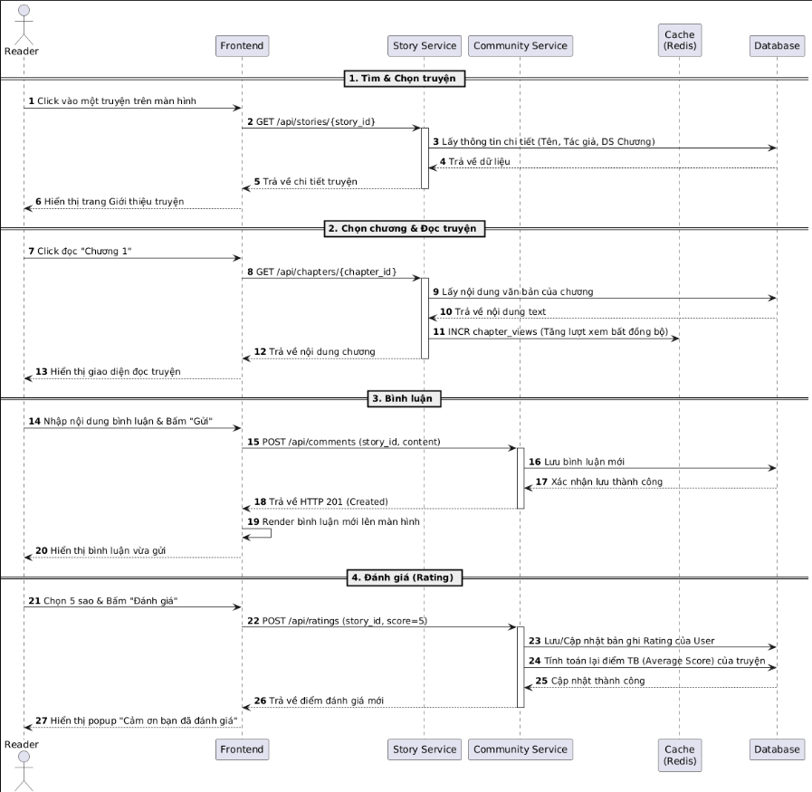

_**e. Quá trình hoạt động của Diễn đàn (Forum)**_

**Mục tiêu:** Mô tả cách người dùng đăng bài thảo luận mới, trả lời bài viết và nhận thông báo theo thời gian thực (Real-time) để tạo sự kết nối cộng đồng.

**Các đối tượng tham gia (Actors & Components):**

- **User (Độc giả/Tác giả):** Người dùng tham gia diễn đàn.
- **Frontend:** Giao diện diễn đàn.
- **Community Service:** Xử lý logic lưu trữ bài viết.
- **WebSocket Server (Socket.io):** Quản lý kết nối hai chiều (duplex) để đẩy dữ liệu thời gian thực.
- **Database:** Lưu trữ Topic và Reply.

**Biểu đồ trình tự (Sequence Diagram):**

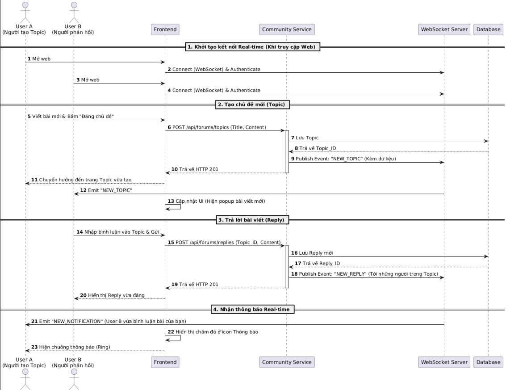

_**f. Quản trị viên và Cơ chế giám sát lộ trình đăng tải**_

**Mục tiêu:** Quản trị viên (Admin) cần theo dõi tiến độ của các tác giả có cam kết (đặc biệt là truyện thu phí). Hệ thống tự động quét và cảnh báo những tác giả có dấu hiệu "bỏ dở" (Drop) truyện quá thời hạn quy định.

**Các đối tượng tham gia (Actors & Components):**

- **Admin / Author:** Quản trị viên theo dõi và Tác giả nhận cảnh báo.
- **Cron Job (Task Scheduler):** Bộ lập lịch chạy ngầm định kỳ.
- **Content Management Service:** Dịch vụ quản lý nội dung và hợp đồng.
- **Notification Service:** Dịch vụ gửi thông báo/Email.
- **Database:** Nơi lưu trữ trạng thái cập nhật `last_updated_at`.

**Biểu đồ trình tự (Sequence Diagram):**

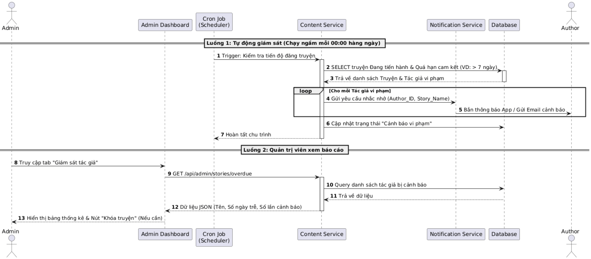

_**g. Thống kê và Báo cáo doanh thu Membership**_

**Mục tiêu:** Quản trị viên cần một hệ thống báo cáo chính xác về nguồn thu từ các gói Membership. Hệ thống phải hỗ trợ lọc dữ liệu theo thời gian, loại gói và xuất báo cáo (PDF/Excel) để phục vụ việc đối soát và lập kế hoạch kinh doanh.

**Các đối tượng tham gia (Actors & Components):**

- **Admin:** Người yêu cầu báo cáo.
- **Admin Dashboard:** Giao diện hiển thị biểu đồ và bảng số liệu.
- **Analytics Service:** Dịch vụ chịu trách nhiệm tính toán và tổng hợp dữ liệu (Aggregation).
- **Payment Database:** Nơi lưu trữ lịch sử các giao dịch thành công.
- **Report Engine:** Thành phần hỗ trợ xuất file báo cáo.

**Biểu đồ trình tự (Sequence Diagram):**

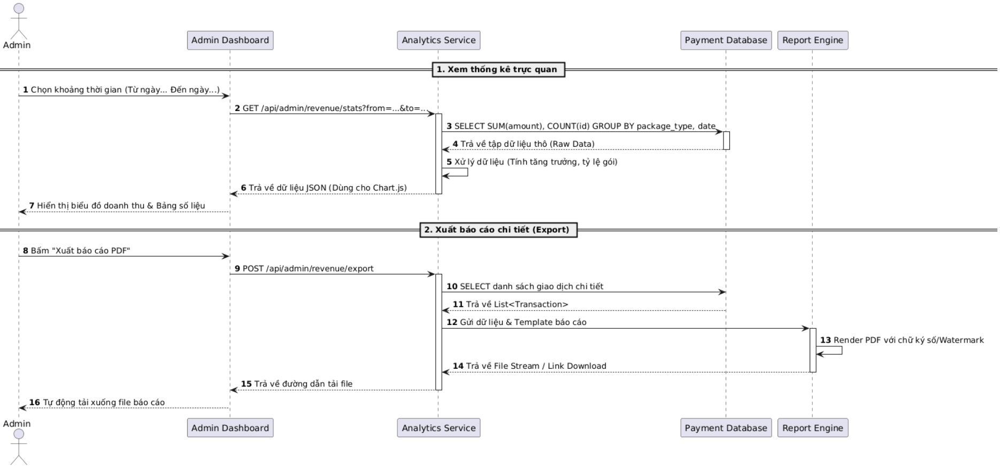

#### 4.2.2 UI Design

_**a. Chức năng đọc truyện**_

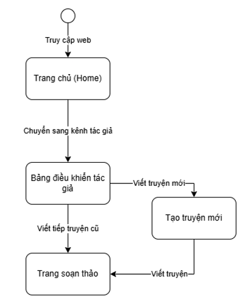

Do tính chất đặc thù của hệ thống đọc truyện, giao diện cần tuân thủ các nguyên tắc thiết kế sau:

- **Tập trung (Distraction-free):** Ẩn toàn bộ thanh điều hướng chính (Navbar) và Footer khi người dùng cuộn xuống.
- **Tùy biến:** Cung cấp bộ công cụ góc phải màn hình cho phép người dùng đổi màu nền (Light/Dark/Sepia) và tăng giảm kích cỡ chữ (Font size).
- **Bảo vệ tác quyền:** Sử dụng Rate Limiting ở API Gateway.

_**b. Chức năng viết truyện**_

**Layout chia đôi (Split View):** 70% màn hình bên trái dành cho khung soạn thảo văn bản, 30% bên phải là một Sidebar trượt có thể đóng/mở dành cho AI Assistant (để tác giả vừa viết vừa tham khảo gợi ý từ AI mà không cần chuyển tab).

_**c. Chức năng diễn đàn**_

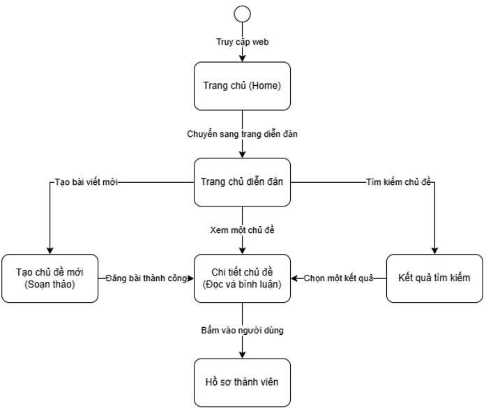

- **Trang chủ Diễn đàn (`ForumHome`):** Nơi hiển thị danh sách các bài viết (Topic) được phân loại theo Tag (VD: _Thảo luận truyện, Chia sẻ kinh nghiệm viết, Thông báo từ Admin_). Giao diện sử dụng thiết kế dạng bảng hoặc dạng thẻ (Card) giống các nền tảng Reddit hoặc Spiderum.
- **Tạo Chủ đề mới (`CreateTopic`):** Một màn hình chứa Editor thu gọn (không phức tạp như Editor viết truyện của tác giả), cho phép đính kèm ảnh và gán Tag phân loại.
- **Chi tiết Chủ đề (`TopicDetail`):** Là màn hình quan trọng nhất của luồng này. Nhờ ứng dụng WebSockets (đã thiết kế ở phần Backend), khi người dùng đang ở màn hình này và có một người khác gửi bình luận, bình luận đó sẽ tự động trượt xuống dưới cùng màn hình (hoặc hiện thông báo "Có bình luận mới") mà người dùng **không cần phải làm mới (F5) trang**.
- **Hồ sơ Thành viên (`UserProfile`):** Khi bấm vào avatar của một người bất kỳ trong Forum, giao diện sẽ chuyển sang trang hiển thị các chủ đề họ đã đăng và truyện họ đã viết (nếu họ là tác giả), giúp tăng tính gắn kết cộng đồng.

_**d. Trải nghiệm người dùng cho các tác vụ bất đồng bộ**_

Vì hệ thống có nhiều chức năng xử lý mất thời gian (AI Kiểm duyệt, Gọi thanh toán), thiết kế UI phải xử lý tốt trạng thái rỗng/đang tải:

- **Không dùng loading quay tròn (Spinner) toàn màn hình** khi kiểm duyệt truyện. Tác giả sau khi bấm "Đăng", bài viết sẽ vào tab "Đang chờ duyệt". UI trả họ về màn hình làm việc ngay lập tức.
- **Sử dụng Skeleton Loading** (Hiệu ứng khung xám lấp lánh) khi tải danh sách truyện gợi ý từ AI để tạo cảm giác trang web phản hồi nhanh.

#### 4.2.3 Database Design

Hệ thống lưu trữ áp dụng mô hình lai (Hybrid Database Architecture) để tối ưu hóa hiệu năng:

- **Relational Database (PostgreSQL):** Lưu trữ dữ liệu có cấu trúc chặt chẽ (Người dùng, Truyện, Giao dịch).
- **Vector Database (pgvector):** Lưu trữ các vector ngữ nghĩa phục vụ tính năng tìm kiếm thông minh AI Search.
- **In-memory Cache (Redis):** Lưu trữ dữ liệu tạm thời, đếm lượt xem và Leaderboard sự kiện.

_**a. Entity Relationship Diagram - ERD**_

Sơ đồ dưới đây mô tả cấu trúc của Cơ sở dữ liệu Quan hệ cốt lõi.

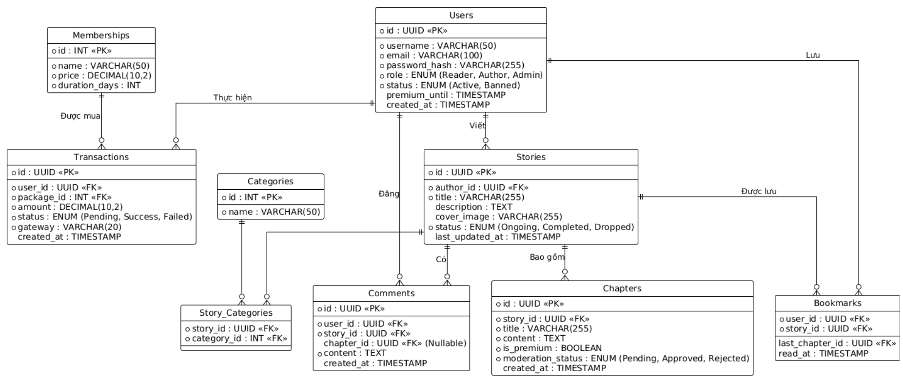

Để đáp ứng các User Story về tính năng và bảo mật, cấu trúc bảng có các điểm thiết kế quan trọng sau:

- **Bảng `Users` (Bảo vệ tài khoản & Phân quyền):**
  - Cột `password_hash`: Dữ liệu bắt buộc phải được băm bằng Bcrypt/Argon2 trước khi lưu. Không bao giờ lưu mật khẩu dạng plaintext.
  - Cột `premium_until`: Dùng để xác định hạn dùng Gói Membership của độc giả. Quá thời gian này, quyền truy cập truyện VIP sẽ tự động đóng lại.
- **Bảng `Chapters` (Kiểm duyệt AI & Doanh thu):**
  - Cột `is_premium` (Boolean): Nếu là `True`, API sẽ kiểm tra `premium_until` của người dùng trước khi trả về dữ liệu `content`.
  - Cột `moderation_status`: Khi tác giả đăng bài, hệ thống mặc định gán là `Pending`. Chỉ khi AI quét xong và đổi thành `Approved`, chương truyện mới được hiển thị cho độc giả.
- **Bảng nối `Story_Categories`:**
  - Cho phép một bộ truyện có thể thuộc nhiều thể loại khác nhau (Tiên hiệp, Hài hước, Xuyên không), hỗ trợ bộ lọc tìm kiếm chính xác.

_**b. Thiết kế Cấu trúc Vector Database (Dành riêng cho AI Search)**_

Cơ sở dữ liệu quan hệ (PostgreSQL) không thể tìm kiếm theo ngữ nghĩa (Semantic). Do đó, dữ liệu cốt truyện sẽ được đồng bộ sang **Vector Database** (như pgvector).

Mỗi khi một `Story` được tạo mới hoặc cập nhật, Backend sẽ gọi LLM (như OpenAI text-embedding-ada-002) biến cột `description` thành một mảng số (Vector) và lưu vào Vector DB.

**Cấu trúc Document trong Vector DB:**

- `id`: Chuỗi UUID (Trùng khớp với `id` của bảng `Stories` trong PostgreSQL).
- `values`: Mảng Float [0.012, -0.045, 0.998, ... 1536 dimensions] (Đại diện cho ý nghĩa của cốt truyện).
- `metadata`: `{ "author": "Tên tác giả", "status": "Ongoing", "is_premium": false }` (Lưu kèm siêu dữ liệu để hỗ trợ lọc (filtering) trước khi tìm kiếm vector, giúp tăng tốc độ phản hồi).

_**c. Thiết kế Cơ sở dữ liệu phân hệ Diễn đàn (Forum)**_

Cấu trúc này được tách biệt để quản lý các bài thảo luận, không nhầm lẫn với nội dung sáng tác chính, nhưng vẫn giữ liên kết chặt chẽ với thực thể Users và Stories.

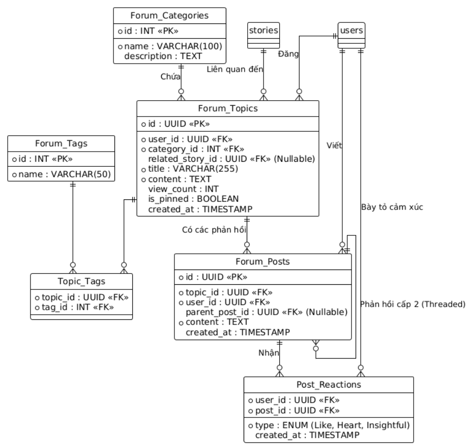

### 4.3 Implementation

    Written by: 23120151 Huỳnh Yến Nhi
    Edited by: null
    Reviewed by: 23120123 Trần Gia Hiển

#### 4.3.1 Technical

Sử dụng các công nghệ hiện đại nhằm đảm bảo khả năng mở rộng, hiệu năng và tích hợp AI:

- **Frontend:** Next.js (TypeScript), HTML5, CSS.
- **Backend:** Python (FastAPI).
- **Database & Storage:** PostgreSQL và pgvector.
- **Realtime Communication:** WebSocket phục vụ các chức năng tương tác thời gian thực.
- **AI Integration:** Google Gemini API cho các chức năng gợi ý nội dung, tìm kiếm thông minh và kiểm duyệt.
- **Development Tools:** Git/GitHub, Docker, Visual Studio Code (IDE).

#### 4.3.2 Implementation Objectives

- Hiện thực hóa các chức năng cốt lõi của hệ thống bao gồm xác thực người dùng, quản lý nội dung truyện, tìm kiếm và tương tác cộng đồng.
- Tích hợp các dịch vụ AI nhằm nâng cao trải nghiệm người dùng, bao gồm gợi ý nội dung, tìm kiếm thông minh và kiểm duyệt.
- Đảm bảo các module trong hệ thống có tính độc lập tương đối, dễ bảo trì và dễ mở rộng.
- Thiết lập môi trường phát triển, quy trình làm việc và tài liệu hỗ trợ nhằm đảm bảo tiến độ và chất lượng dự án.

#### 4.3.3 Implementation Activities

**Development Activities (Work Breakdown Structure – WBS)**

Nhóm phân rã giai đoạn hiện thực thành các đầu việc chính sau:

- **Thiết lập nền tảng dự án:** Tạo cấu trúc source code, khởi tạo repository Git, cấu hình frontend, backend, database và các biến môi trường.
- **Xây dựng chức năng xác thực:** Phát triển các màn hình và API cho đăng ký, đăng nhập, quên mật khẩu, phân quyền người dùng.
- **Phát triển chức năng truyện:** Hiện thực tạo truyện, chỉnh sửa, lưu nháp, đăng chương, quản lý thư viện tác phẩm.
- **Phát triển chức năng đọc và tìm kiếm:** Xây dựng trang đọc truyện, tìm kiếm theo tên truyện, thể loại, tác giả và truy vấn thông minh.
- **Phát triển cộng đồng và membership:** Làm bình luận, đánh giá, theo dõi truyện, gói membership và kiểm tra quyền đọc nội dung.
- **Tích hợp AI:** Thêm gợi ý ý tưởng, kiểm duyệt nội dung, AI search và các cơ chế gọi API AI phù hợp.
- **Kiểm thử và sửa lỗi:** Kiểm tra từng chức năng riêng lẻ và kiểm thử tích hợp giữa các module.
- **Hoàn thiện tài liệu và bàn giao:** Viết hướng dẫn sử dụng, tài liệu kỹ thuật và tổng hợp kết quả triển khai.

**Task Scheduling**

Trong thời gian 1 tháng, nhóm chia tiến độ thành 4 tuần với các mốc chính như sau:

| Tuần       | Giai đoạn & Nội dung thực hiện                                                                                                                                                                | Mục tiêu đầu ra (Deliverables)                                                          |
| :--------- | :-------------------------------------------------------------------------------------------------------------------------------------------------------------------------------------------- | :-------------------------------------------------------------------------------------- |
| **Tuần 1** | **Thiết lập hạ tầng & Kiến trúc:** Khởi tạo Repository, đóng gói Docker cho môi trường Dev. Dựng khung dự án theo kiến trúc **Modular Monolith**, cấu hình Database (PostgreSQL) và Git Flow. | Khung hệ thống (Skeleton) hoàn thiện; Dự án vận hành ổn định trên môi trường Local.     |
| **Tuần 2** | **Xác thực & Nghiệp vụ sáng tác:** Hiện thực Module Xác thực (Auth), quản lý người dùng. Xây dựng chức năng quản lý truyện, chương bản thảo và các logic CRUD cơ bản.                         | Người dùng có thể đăng ký/đăng nhập và bắt đầu quy trình sáng tác truyện.               |
| **Tuần 3** | **Tương tác & Nghiệp vụ kinh doanh:** Hoàn thiện giao diện đọc truyện, công cụ tìm kiếm, hệ thống bình luận Real-time. Triển khai Module Membership và phân quyền truy cập (RBAC).            | Hoàn thiện luồng trải nghiệm cho Độc giả; Hệ thống có khả năng phân quyền và tương tác. |
| **Tuần 4** | **Tích hợp AI & Kiểm thử:** Nhúng Gemini API, triển khai AI Smart Engine (Gợi ý, Kiểm duyệt). Thực hiện **Security Audit**, sửa lỗi, hoàn thiện tài liệu kỹ thuật và chuẩn bị Demo.           | Sản phẩm hoàn thiện (MVP) tích hợp AI; Bản Demo sẵn sàng triển khai trên Cloud.         |

Các công việc có quan hệ phụ thuộc được triển khai theo thứ tự: thiết lập nền tảng trước, sau đó mới phát triển các tính năng nghiệp vụ, cuối cùng mới tích hợp AI và tối ưu hệ thống.

**Supporting Activities**

**Environment Configuration**

Thiết lập repository Git, đồng thời cấu hình môi trường phát triển, kiểm thử và tích hợp với các công cụ cần thiết như IDE, build tools, database và Docker.

**Documentation**

Viết tài liệu kỹ thuật, comment trong mã nguồn và hướng dẫn người dùng để mô tả cách hệ thống hoạt động và cách sử dụng.

**Risk Management**

Xác định các rủi ro khi triển khai như chậm tiến độ, lỗi tích hợp hoặc không tương thích công nghệ, đồng thời đề xuất các biện pháp giảm thiểu đơn giản.

#### 4.3.4 Deliverables

Các sản phẩm đầu ra của giai đoạn Implementation bao gồm:

- **Project Schedule (Gantt Chart):** Lịch triển khai tổng quát thể hiện tiến độ và các mốc chính của dự án.
- **Work Breakdown Structure (WBS):** Danh sách phân rã các công việc cần thực hiện theo từng hạng mục.
- **Configuration Management Plan:** Kế hoạch quản lý cấu hình, bao gồm chiến lược nhánh Git và quy trình build.
- **Documentation Plan:** Kế hoạch viết tài liệu kỹ thuật và tài liệu hướng dẫn người dùng.
- **Bản triển khai thử nghiệm:** Phiên bản có thể chuyển sang giai đoạn kiểm thử tại mục 4.4.

### 4.4 Testing

    Written by: 23120123 Trần Gia Hiển
    Edited by:
    Reviewed by: 23120169 Nguyễn Phú Thọ

Kế hoạch kiểm thử nhằm mục đích đảm bảo hệ thống vận hành ổn định, bảo mật tuyệt đối nội dung tác phẩm và tối ưu hóa trải nghiệm người dùng đối với các tính năng AI.

#### 4.4.1 Testing Elicitation

- **Unit Testing**

  Mục tiêu: Kiểm tra tính chính xác và đầy đủ của các module (hàm băm mật khẩu, logic tính toán doanh thu membership, các module xử lý văn bản).

  Công cụ: **Pytest** cho Backend và **Jest/React Testing Library** cho Frontend.

- **Integration Testing**

  Mục tiêu: Kiểm tra sự tương tác giữa các dịch vụ. Đặc biệt là luồng dữ liệu hệ thống đảm bảo bản thảo được đưa vào hàng đợi và xử lý bởi AI mà không bị mất mát dữ liệu.

- **System Testing**

  Mục tiêu: Kiểm thử toàn diện luồng nghiệp vụ.

  Kịch bản: Tác giả đăng ký -> Viết truyện với hỗ trợ AI -> Gửi kiểm duyệt -> Độc giả tìm kiếm bằng AI Search -> Đăng ký Membership để đọc chương khóa.

#### 4.4.2 Non-Function Testing

- **Performance & Load Testing:**
  - Sử dụng công cụ **k6** hoặc **JMeter** để giả lập 1.000 kết nối WebSockets đồng thời.

  - Kiểm tra thời gian phản hồi của AI Moderator (đảm bảo < 5 phút).

- **Security Testing:**
  - Kiểm tra khả năng chống SQL Injection, XSS và ngăn chặn Brute-force tại cổng đăng nhập.

  - Bảo vệ bản quyền: Kiểm thử việc vô hiệu hóa sao chép trên các trình duyệt khác nhau (Chrome, Safari, Edge).

- **AI Model Evaluation:**
  - Đánh giá độ chính xác của AI Moderator trong việc phát hiện nội dung vi phạm văn hóa, chính trị (giảm thiểu tỷ lệ False Positive - xóa nhầm truyện).

#### 4.4.4 Evaluation Criteria

Hệ thống được coi là đạt yêu cầu khi:

- 100% các Unit Test vượt qua thành công.

- Các module có thể tương tác và kết nối cơ bản với nhau đảm bảo luồng dũ liệu trơn tru.

- Luồng hoạt động (system testing) không bị lỗi và hoạt động chính xác.

- Thời gian uptime hệ thống đạt tối thiểu 95% trong giai đoạn thử nghiệm.

### 4.5 Deployment and Maintainance

    Written by: 23120169 Nguyễn Phú Thọ
    Edited by:
    Reviewed by: 23120177 Phạm Hương Trà

**4.5.1 Deployment Plan:**

**Môi trường hệ thống:**

- _**Frontend:**_ Sử dụng Next.js để tối ưu hóa SEO (Server-Side Rendering) cho các tác phẩm văn học và cung cấp trải nghiệm SPA (Single Page Application) mượt mà. Triển khai trên Firebase Hosting để tăng tốc độ tải trang toàn cầu nhờ hệ thống CDN (Content Delivery Network) của Google (nếu định hướng phát triển web theo quy mô toàn cầu).
- _**Backend:**_ Chạy trên môi trường Dockerize với FastAPI, triển khai trên Google Cloud Run — dịch vụ serverless container của GCP (Google Cloud Platform) giúp đồng nhất môi trường từ lúc phát triển đến khi triển khai thực tế, đồng thời tự động scale theo lưu lượng truy cập.
- _**Web Server:**_ Sử dụng Apache làm Reverse Proxy để điều phối lưu lượng và quản lý chứng chỉ bảo mật SSL/TLS, kết hợp với Google Cloud Load Balancing để phân phối tải hiệu quả.
- _**Database**_ Sử dụng Cloud SQL for PostgreSQL để lưu trữ toàn bộ dữ liệu của nền tảng bao gồm tài khoản người dùng, gói membership, nội dung truyện, chương, bình luận và dữ liệu tương tác của độc giả. Và pgvector để lưu trữ các dữ liệu dạng Vector phục vụ cho các chức năng AI.

**Tích hợp AI và Real time:**

- Sử dụng WebSockets (thông qua FastAPI) để đồng bộ hóa bản thảo thời gian thực giữa tác giả và server, đảm bảo không thất thoát dữ liệu.
- Kết nối Google Gemini API thông qua một layer trung gian để kiểm soát quota, ghi log yêu cầu và tối ưu hóa thời gian phản hồi (latency). Việc cả hạ tầng lẫn AI đều nằm trong hệ sinh thái Google giúp giảm độ trễ đáng kể so với việc gọi API từ nền tảng bên ngoài.

**Chiến lược mở rộng (Sclaing Strategy):** Hệ thống tận dụng khả năng Auto-scaling của Google Cloud Run, tự động tăng số lượng container khi số lượng kết nối WebSocket vượt ngưỡng 1.000 kết nối đồng thời hoặc tỷ lệ sử dụng CPU backend vượt 70%. Ngược lại, hệ thống tự động thu hẹp tài nguyên trong giờ thấp điểm để tối ưu chi phí vận hành.

**Kế hoạch dự phòng và Rollback:** Áp dụng chiến lược Blue-Green Deployment trên Google Cloud Run, duy trì đồng thời hai phiên bản (revision) production. Khi phát hành phiên bản mới, lưu lượng được chuyển dần sang phiên bản mới thông qua tính năng Traffic Splitting của Cloud Run. Nếu phát hiện lỗi, hệ thống có thể rollback về phiên bản trước trong vòng dưới 5 phút mà không gây gián đoạn trải nghiệm người dùng.

**4.5.2 Bảo mật và quản lý dữ liệu:**

- _**Mã hóa dữ liệu:**_ Sử dụng chuẩn AES-256 để mã hóa các thông tin người dùng như mật khẩu, thông tin cá nhân và lịch sử thanh toán của người dùng. RSA được áp dụng cho các thông tin định danh. Toàn bộ dữ liệu truyền tải giữa client và server được bảo vệ bởi HTTPS/TLS. Các khóa mã hóa được quản lý tập trung qua Google Cloud Key Management Service (KMS).
- _**Bảo mật nội dung truyện:**_ Sử dụng Row Level Security (RLS) của Supabase / PostgreSQL để kiểm soát quyền truy cập theo từng vai trò như chương trả phí chỉ cho phép người dùng có gói membership đọc và tác giả chỉ có thể chỉnh sửa tác phẩm của chính mình.

- _**Xác thực và Phân quyền:**_ Triển khai Google Cloud Identity Platform kết hợp JWT (JSON Web Tokens) để quản lý phiên đăng nhập, đảm bảo mọi hành động tương tác (đọc truyện, thanh toán membership, đăng tải tác phẩm) đều được định danh rõ ràng và phân quyền chính xác theo từng vai trò (tác giả, độc giả, quản trị viên).

- _**Kiểm duyệt AI:**_ Tích hợp quy trình kiểm duyệt tự động sử dụng Google Gemini API ngay tại cổng upload để ngăn chặn nội dung vi phạm chính sách (độ tuổi, lịch sử, chính trị, văn hóa) trước khi dữ liệu được ghi vào cơ sở dữ liệu Vector pgvector.

- _**Áp dụng API Versioning:**_ Sử dụng các phiên bản API hợp lý để đảm bảo các lần cập nhật backend không gây breaking change, bảo vệ tính ổn định cho các client đang hoạt động

**4.5.3 Maintainance Plan:**

**Bảo trì định kỳ:**

- Cập nhật các công nghệ bảo mật của Python và Next.js thường xuyên cho hệ thống.
- Tối ưu hóa cấu trúc truy vấn PostgreSQL định kỳ (index, query optimization) để đảm bảo tốc độ tìm kiếm tác phẩm và các tính năng AI không bị suy giảm khi lượng dữ liệu tăng theo thời gian.
- Kiểm tra và làm mới (rotate) các khóa mã hóa trên Google Cloud KMS và chứng chỉ SSL theo chu kỳ 6 tháng.
- Rà soát định kỳ dung lượng Google Cloud Storage để tối ưu chi phí lưu trữ ảnh bìa và tài nguyên tĩnh.

**Giám sát hệ thống:**

- Sử dụng Google Cloud Monitoring kết hợp Google Cloud Logging để theo dõi các chỉ số đặc thù của nền tảng: số lượng kết nối WebSocket đồng thời, latency phản hồi từ Google Gemini API, tỷ lệ lỗi thanh toán membership, lượt đọc/ghi và lưu lượng truy cập theo thời gian thực.
- Thiết lập cảnh báo tự động (Alerting) khi các dịch vụ vượt ngưỡng quy định.

**Cập nhật tính năng và phản hồi:**

- Dựa trên số liệu về lượt đánh giá, nhận xét và hành vi đọc của độc giả được thu thập qua PostgreSQL và hệ thống Cache, nhóm điều chỉnh thuật toán gợi ý tác phẩm mỗi 4 tuần một lần theo mô hình Agile.
- Hỗ trợ kỹ thuật thường xuyên để xử lý các vấn đề về đăng nhập, quyền truy cập và gói Membership của người dùng.

**Phục hồi dữ liệu khi gặp sự cố:**

- Định nghĩa hai chỉ số phục hồi phù hợp với quy mô nền tảng: RTO (Recovery Time Objective) — thời gian tối đa để khôi phục hệ thống sau sự cố và RPO (Recovery Point Objective) — lượng dữ liệu tối đa có thể mất. Các giá trị cụ thể sẽ được xác định dựa trên kết quả kiểm thử tải và yêu cầu thực tế trong giai đoạn vận hành thử nghiệm.
- Thực hiện rèn luyện khôi phục từ backup (Disaster Recovery Drill) ít nhất một lần trong năm đầu vận hành, sau đó nâng lên định kỳ mỗi quý khi hệ thống đã ổn định.

## 5. Human Resources & Costing Plan

    Written by: 23120123 Trần Gia Hiển
    Edited by:
    Reviewed by: 23120169 Nguyễn Phú Thọ

### 5.1 Human Resources

Dự án được thực hiện bởi nhóm 5 thành viên được phân bổ như sau nhằm đảm bảo hệ thống hoàn thiện đúng tiến độ:

- Trần Gia Hiển (Project Manager & AI/Backend Lead): Chịu trách nhiệm quản lý tiến độ chung, thiết kế kiến trúc bảo mật cốt lõi, tích hợp API Google Gemini và phát triển các dịch vụ xử lý AI (Smart Engine). Giám sát chất lượng mã nguồn và rà soát kế hoạch kiểm thử.

- Nguyễn Phú Thọ (DevOps & Backend Engineer): Đảm nhiệm việc thiết lập CI/CD, cấu hình Docker và triển khai hệ thống lên Google Cloud Platform (Cloud Run). Quản lý hạ tầng mạng và tích hợp Redis/RabbitMQ.

- Nguyễn Duy Trường (Software Architect & Backend Developer): Thiết kế chi tiết cơ sở dữ liệu (PostgreSQL, pgvector) và phát triển các API

- Huỳnh Yến Nhi (Frontend Developer & QA): Chịu trách nhiệm chuyển đổi UI/UX thành giao diện thực tế bằng Next.js, đảm bảo tính tương tác mượt mà và thực hiện kiểm thử giao diện.

- Phạm Hương Trà (Business Analyst & Frontend Developer): Phân tích và rà soát lại các yêu cầu nghiệp vụ, đồng thời hỗ trợ phát triển các trang giao diện cho độc giả và tích hợp luồng thanh toán.

### 5.2 Costing Plan

**Bảng dự toán chi phí Cơ sở hạ tầng & Dịch vụ**

| Hạng mục                | Dịch vụ đề xuất            | Ước tính chi phí (USD/tháng) | Ghi chú                                                                                                              |
| :---------------------- | :------------------------- | :--------------------------- | :------------------------------------------------------------------------------------------------------------------- |
| **Frontend Hosting**    | Vercel / Firebase Hosting  | 0                            | Sử dụng gói Hobby/Free Tier, đáp ứng hoàn toàn băng thông cho giai đoạn phát triển và báo cáo.                       |
| **Backend & API**       | Google Cloud Run           | 0                            | Tận dụng tín dụng (Credit) GCP dành cho sinh viên; mô hình Serverless chỉ tính phí khi có request thực tế phát sinh. |
| **Relational Database** | Supabase (PostgreSQL)      | 0                            | Cung cấp sẵn cơ sở dữ liệu quan hệ mạnh mẽ kèm gói Free đủ dung lượng lưu trữ nội dung truyện và tài khoản.          |
| **Vector Database**     | pgvector                   | 0                            | Được tích hợp sẵn bên trong gói Free của Supabase, không yêu cầu cài đặt server riêng hay phát sinh chi phí.         |
| **In-memory Cache**     | Upstash (Serverless Redis) | 0                            | Quản lý Rate Limiting và hàng đợi thông báo mà không tốn phí duy trì server 24/7.                                    |
| **AI Engine**           | Google Gemini API          | 0                            | Gói Free Tier (15 RPM / 1 triệu token/phút) đáp ứng đủ nhu cầu kiểm duyệt và gợi ý văn bản cho đồ án.                |
| **Lưu trữ ảnh (Media)** | Cloudinary                 | 0                            | Gói miễn phí cung cấp 25 credits/tháng, tối ưu hóa việc phân phối ảnh bìa truyện qua CDN.                            |
| **Tên miền (Domain)**   | Tùy chọn (.tech / .me)     | 2 - 5                        | (Tùy chọn) Có thể đăng ký miễn phí 1 năm đầu tiên thông qua GitHub Student Developer Pack.                           |

## 6. Tools setup

    Written by: 23120123 Trần Gia Hiển
    Edited by:
    Reviewed by: 23120182 Nguyễn Duy Trường

### 6.1 Prerequisites

Các thành viên cần cài đặt sẵn các công cụ nền tảng sau trước khi tiến hành cấu hình dự án:

- Node.js (v18.x trở lên): Để chạy môi trường phát triển Next.js.

- Python (v3.10 trở lên): Để vận hành Backend FastAPI.

- Docker & Docker Compose: Công cụ bắt buộc để đóng gói và chạy các dịch vụ bổ trợ (PostgreSQL, Redis, RabbitMQ) trong container.

- Git: Quản lý phiên bản mã nguồn trên GitHub.

- Visual Studio Code (IDE): Trình soạn thảo mã nguồn khuyến nghị, cài đặt kèm các extension như Pylance (Python), ESLint (Next.js) và Docker.

### 6.2 Repository

Nhóm sử dụng GitHub làm nơi lưu trữ tập trung. Quy trình khởi tạo như sau:

Clone Repository:

    git clone https://github.com/zeus058/SE_Writing_Web.git
    cd SE_Writing_Web

Chiến lược nhánh:

    main: Nhánh chứa mã nguồn ổn định nhất để triển khai.
    develop: Nhánh chính để tích hợp các tính năng mới.
    feature/feature-name: Các nhánh riêng biệt để phát triển từng tính năng cụ thể.

### 6.3 Backend Setup (FastAPI)

Tạo môi trường ảo (Virtual Environment):

    cd backend
    python -m venv venv
    venv\Scripts\activate

Cài đặt thư viện:

    pip install -r requirements.txt

### 6.4 Frontend Setup (Next.js)

Cài đặt Dependencies:

    cd frontend
    npm install

Chạy môi trường phát triển:

    npm run dev

### 6.5 Docker

Sử dụng Docker Compose để khởi chạy cơ sở dữ liệu và các middleware nhằm đảm bảo môi trường local giống hệt môi trường Production:

    docker-compose up -d

Dịch vụ bao gồm:

- PostgreSQL: Cơ sở dữ liệu quan hệ chính (Port 5432).
- Redis: Bộ nhớ đệm và quản lý hàng đợi cho AI (Port 6379).
- RabbitMQ: Broker điều phối các tác vụ kiểm duyệt bất đồng bộ (Port 5672).

### 6.6 Environment Variables

Tạo file .env tại thư mục gốc của Backend và Frontend với các thông số bắt buộc:

    DATABASE_URL: Đường dẫn kết nối PostgreSQL.
    GEMINI_API_KEY: Mã định danh để gọi Google Gemini API.
    VNPAY_TMN_CODE & VNPAY_HASH_SECRET: Cấu hình thanh toán Sandbox.
    JWT_SECRET: Khóa bí mật để mã hóa token đăng nhập người dùng.

## 7. AI Usage Declaration

Trong quá trình thực hiện đồ án và xây dựng bản Proposal này, nhóm có sử dụng công cụ AI với vai trò là công cụ hỗ trợ rà soát logic hệ thống tuân thủ nguyên tắc minh bạch và liêm chính học thuật.

- **Công cụ:** Gemini 3.1, Google, gemini.google.com.

- **Thời gian truy cập:** 21:00 ngày 23 tháng 04 năm 2026.

- **Mục đích sử dụng:** Hỗ trợ phát hiện các lỗi mâu thuẫn logic trong kiến trúc phần mềm do các thành viên ghép bài có thể chưa đồng nhất; gợi ý định dạng trình bày (bảng biểu).

- **Câu lệnh đã sử dụng (Prompts used):**

  Bạn là chuyên gia trong việc xây dựng một ứng dụng Web SE.

  Đây là đồ án lớn trong môn học SE của tôi và phải xây dựng một web viết truyện có tích hợp AI (chuyên sâu). Đây là bản proposal của nhóm cho dự án trên.

  Bạn hãy đánh giá dự án về mức độ khả thi và khả năng thực hiện của nhóm. Ngoài ra tìm ra các lỗi sai và thiếu sót trong bản proposal của nhóm. Và đưa ra hướng chỉnh sửa cho phù hợp và chính xác.

  Bắt buộc phải tìm ra tất cả lỗi sai hoặc conflict trong hệ thống. Đồng thời, đánh giá dự án thật khó tính đảm bảo không có lỗi sai hoặc những việc làm ảnh hướng đến tính thực tế và tính khả thi của dự án.

- **Nội dung do AI tạo ra:**
  - Lỗ hổng về AI Quota & Costing (Chi phí và giới hạn AI):

    Hệ thống gọi Gemini API cho mọi bản thảo mới (AI Moderator) và mọi truy vấn tìm kiếm (Embedding).
    Lỗi thiếu sót: Các API LLM đều có Rate Limit (Giới hạn request/phút) và chi phí theo Token. Một chương truyện 3000 chữ đưa vào AI Moderator sẽ ngốn lượng token khổng lồ. Nếu 100 tác giả đăng bài cùng lúc, hệ thống sẽ sập do hit Rate Limit của Google.
    👉 Hướng xử lý: Cần thiết kế cơ chế Chunking (chia nhỏ text) khi nhúng vào Vector DB, và có cơ chế Fallback (trả về lỗi hoặc cho vào hàng đợi delay) khi API LLM báo hết Quota.

  - Lỗi tư duy bảo mật (Anti-piracy):

    Phần 4.2.2 UI Design đề xuất chặn chuột phải, vô hiệu hóa F12 và Ctrl+C để chống sao chép.
    Lỗi thiếu sót: Dưới góc độ an toàn thông tin, chặn UI ở Frontend chỉ là "trò trẻ con", dễ dàng bị bypass bằng cách tắt JavaScript hoặc dùng cURL. Kẻ cắp truyện (crawler) không dùng trình duyệt.
    👉 Hướng xử lý: Bạn đã đề cập đến Rate Limiting ở API Gateway, đó mới là cách đúng. Cần nhấn mạnh việc giới hạn số lượng chương truyện được fetch trên 1 IP trong 1 phút, kết hợp Cloudflare Bot Management.

- **Nội dung sinh viên tự làm và cách chỉnh sửa:** Toàn bộ ý tưởng hệ thống, tính năng, và các biểu đồ UML (Use case, ERD, Sequence, UI Flow) là do nhóm tự phân tích và thiết kế.

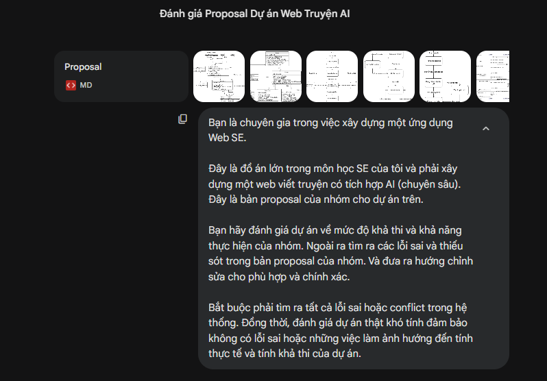
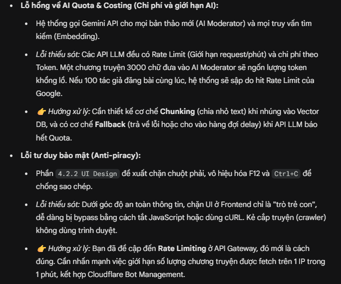

## 8. Presentation

## 9. Reflective Report
