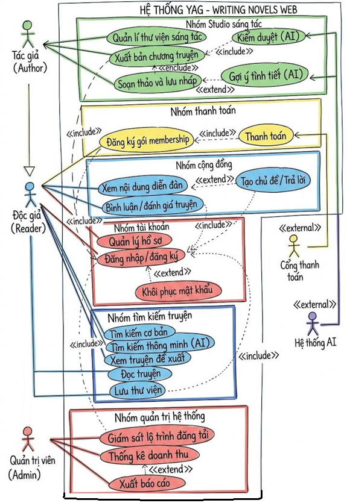
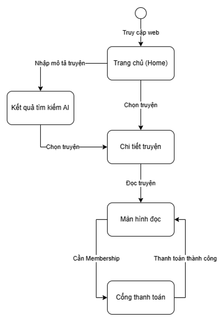

## [SE] WRITING WEB
*Đồ án môn học Nhập môn Công nghệ phần mềm - HCMUS_CQ/25_26.*

### 1. Proposal (Đề xuất dự án)
  *Tài liệu đặc tả chi tiết: [pa/Proposal.md](file:///d:/SE/PROJECT/SE_Writing_Web/pa/Proposal.md) | Video thuyết trình: [YouTube](https://www.youtube.com/watch?v=Kvm_CrbhuEI)*

  #### 🚀 Tóm tắt Dự án: **YAG - WRITING NOVELS WEB**
  **YAG** là một nền tảng Web thông minh đột phá dành cho cộng đồng yêu truyện chữ. Không chỉ đơn thuần là nơi đọc và đăng tải truyện, YAG mang lại một **không gian sáng tác thông minh hỗ trợ bởi AI** và **mạng xã hội tương tác thời gian thực (Real-time)** kết nối sâu sắc giữa tác giả và độc giả.

  ```mermaid
  graph TD
      A[Độc giả / Tác giả] -->|Next.js Web Portal| B(API Gateway & Rate Limiter)
      B -->|FastAPI Backend| C{Modular Monolith}
      C -->|AI Smart Engine| D[Gemini API & pgvector]
      C -->|Real-time Socket| E[WebSockets]
      C -->|Async Tasks| F[Redis Queue]
      C -->|CSDL Quan hệ| G[PostgreSQL & Supabase]
  ```

  #### 🌟 Phân Hệ Tính Năng Nổi Bật:
  - **🧠 AI Smart Engine (Động cơ AI Thông Minh):**
    - *AI gợi ý tình tiết:* Sử dụng **Gemini API** để gợi ý ý tưởng, phát triển cốt truyện khi tác giả bị "bí" nội dung.
    - *Kiểm duyệt tự động bằng AI:* Tự động quét từ ngữ, ngữ nghĩa của bản thảo mới để phát hiện nội dung vi phạm văn hóa trước khi xuất bản.
    - *Tìm kiếm ngữ nghĩa (AI Semantic Search):* Tìm kiếm truyện dựa trên mô tả cốt truyện (ví dụ: *"truyện xuyên không nhân vật chính làm hacker"*) thay vì từ khóa cứng bằng **pgvector**.
  - **⚡ Real-time Community (Cộng đồng thời gian thực):**
    - Diễn đàn online (Forum) thảo luận thời gian thực và bình luận tương tác tức thì qua **WebSockets**.
    - Đồng bộ bản thảo soạn thảo thời gian thực.
  - **💳 Membership & Revenue (Mô hình kinh doanh):**
    - Cơ chế mua gói **Membership** để đọc trước các chương truyện độc quyền của tác giả yêu thích, tích hợp cổng thanh toán **VNPAY Sandbox**.
  - **🛡️ Anti-Piracy & Security (Bảo mật & Chống cắp truyện):**
    - Bảo mật mật khẩu bằng thuật toán băm **Bcrypt**.
    - Sử dụng **Rate Limiting** ở API Gateway kết hợp Cloudflare Bot Management để ngăn chặn Bot tự động crawl nội dung truyện, kết hợp khóa UI cơ bản.

  #### 📐 Kiến Trúc Hệ Thống (Software Architecture):
  Hệ thống sử dụng kiến trúc **Modular Monolith** kết hợp tư duy thiết kế định hướng tên miền (**Domain-Driven Design - DDD**), đảm bảo tính tách biệt nghiệp vụ và sẵn sàng chuyển đổi sang Microservices khi quy mô tăng trưởng.
  - **Tầng Hiển thị (Frontend):** **Next.js** (React) xây dựng giao diện Single Page Application (SPA) tối ưu hóa trải nghiệm đọc/viết truyện chữ.
  - **Tầng Backend (FastAPI):** **Python (FastAPI)** và **Uvicorn** tối ưu hóa tích hợp các mô hình AI và xử lý các tác vụ bất đồng bộ ngầm thông qua hàng đợi **Redis Queue (RQ)**.
  - **Tầng Dữ liệu:** **PostgreSQL** (lưu trữ quan hệ cốt lõi), **pgvector** (lưu trữ và tìm kiếm vector ngữ nghĩa cốt truyện) và **Redis** (bộ nhớ đệm đếm lượt đọc và Rate Limiting).

  #### 🌐 Môi trường Triển khai (Infrastructure):
  - **Môi trường Phát triển (Local):** Đóng gói toàn bộ dịch vụ (Backend, Frontend, PostgreSQL, Redis) qua **Docker & Docker Compose** để đồng nhất môi trường 100%.
  - **Môi trường Vận hành (Production):** Máy chủ **Google Cloud Run** (Pay-as-you-go), CSDL đám mây **Supabase**, bộ lưu trữ ảnh bìa **Firebase Storage**, và lớp bảo mật phân phối **Cloudflare**.

  #### 👥 Đội ngũ Phát triển & Phân công:
  - **Trần Gia Hiển (PO, 35%):** Định nghĩa bài toán, mô tả tính năng, kế hoạch kiểm thử và chi phí.
  - **Nguyễn Duy Trường (Architect, 15%):** Thiết kế kiến trúc phần mềm, cơ sở dữ liệu quan hệ/vector và UX/UI.
  - **Nguyễn Phú Thọ (DevOps, 20%):** Đặc tả phần cứng, quy trình triển khai GCP/Docker và kế hoạch bảo trì.
  - **Phạm Hương Trà (BA, 15%):** Khảo sát và phân tích yêu cầu Functional & Non-functional.
  - **Huỳnh Yến Nhi (Designer, 15%):** Đặc tả công nghệ triển khai và thiết kế giao diện UI/UX.

  *👉 Chi tiết bảng phân công công việc trên [JIRA Board](https://rindx.atlassian.net/jira/software/projects/SWW/boards/2?atlOrigin=eyJpIjoiNjlhNmRiN2IxZTQzNGNlYmIyNjEyYWRmMGJkZTJiZTAiLCJwIjoiaiJ9)*
  
### 2. Requirements Analysis (Phân tích Yêu cầu)
  *Tài liệu đặc tả chi tiết: [pa/Requirement.md](file:///d:/SE/PROJECT/SE_Writing_Web/pa/Requirement.md) | Video thuyết trình: [YouTube](https://youtu.be/2hARxf5t9Cc)*

  #### 📌 Trình bày vấn đề (Problem Statement):
  Trong bối cảnh văn học mạng phát triển, các nền tảng hiện tại thường thiếu công cụ hỗ trợ tác giả sáng tác (như gợi ý ý tưởng, kiểm duyệt tự động, quản lý tiến độ) và chưa tạo được không gian tương tác cộng đồng thời gian thực mạnh mẽ. Độc giả cũng gặp khó khăn khi tìm kiếm truyện theo ngữ nghĩa cốt truyện. **YAG** hướng tới giải quyết triệt để vấn đề này bằng cách tích hợp trí tuệ nhân tạo (AI) đồng hành cùng tác giả và độc giả, kết hợp mô hình tương tác mạng xã hội thu nhỏ chạy trên nền trình duyệt hiện đại qua các giao thức tối ưu (WebSockets, Redis, RabbitMQ, VNPAY).

  #### 👥 Các Bên Liên Quan (Stakeholders):
  | Stakeholder | Mô tả vai trò |
  | :--- | :--- |
  | **Tác giả (Author)** | Soạn thảo truyện trong Studio, nhận gợi ý tình tiết từ AI, hẹn lịch đăng chương, và theo dõi doanh thu. |
  | **Độc giả (Reader)** | Đọc truyện, tìm kiếm truyện theo cốt truyện (AI Search), tương tác diễn đàn và mua gói Membership. |
  | **Quản trị viên (Admin)** | Quản lý người dùng, kiểm duyệt nội dung bị gắn cờ, và giám sát cam kết lộ trình đăng tải của tác giả. |
  | **Hệ thống AI (AI Engine)** | Gemini API cung cấp khả năng gợi ý ý tưởng, phân tích ngữ nghĩa tìm kiếm, và quét nội dung nhạy cảm. |
  | **Cổng thanh toán (VNPAY)** | Đối tác xử lý giao dịch thanh toán gói Membership an toàn qua chữ ký số IPN. |

  #### 📋 Yêu cầu Chức năng (Functional Requirements):
  Hệ thống bao gồm **15 yêu cầu chức năng chính (FR-01 đến FR-15)** được chia làm 5 phân hệ:
  - **Phân hệ 1: Quản lý Tài khoản & Phân quyền:** Đăng ký, đăng nhập, đặt lại mật khẩu qua email (mã hóa Bcrypt, xác thực JWT, bảo vệ Brute-force).
  - **Phân hệ 2: Hỗ trợ Sáng tác & Quản lý nội dung:** Tạo truyện, soạn thảo bản thảo tự động lưu (WebSockets), gợi ý phát triển tình tiết AI (Gemini), hẹn lịch đăng tải.
  - **Phân hệ 3: Tìm kiếm & Trải nghiệm Đọc:** Đọc truyện (Redis cache), tìm kiếm theo ngôn ngữ tự nhiên (AI Semantic Search với `pgvector`), và tự động đề xuất truyện.
  - **Phân hệ 4: Tương tác & Doanh thu:** Diễn đàn (Forum) thời gian thực, bình luận, đánh giá xếp hạng và thanh toán nâng cấp Membership qua cổng VNPAY.
  - **Phân hệ 5: Kiểm duyệt & Giám sát:** Tự động quét từ cấm & nội dung vi phạm bằng AI (RabbitMQ worker), lập lịch giám sát trễ hạn cam kết lộ trình (Cron Job).

  #### ⚙️ Yêu cầu Phi Chức năng (Non-functional Requirements):
  - **Hiệu năng (Performance):** Tìm kiếm thông minh phản hồi dưới **1.5 giây**; Độ trễ đồng bộ bản thảo thời gian thực dưới **200ms**; Kiểm duyệt AI bất đồng bộ qua hàng đợi dưới **5 phút**.
  - **Bảo mật (Security):** Mật khẩu băm bằng thuật toán **Bcrypt**; Áp dụng **Rate Limiting** ở API Gateway ngăn chặn bot cào trộm truyện; Giao thức truyền tải an toàn **HTTPS/TLS 1.2+**.
  - **Độ tin cậy (Reliability):** Cam kết độ sẵn sàng **Uptime ≥ 99.5%**; Sao lưu CSDL PostgreSQL hàng ngày lên Google Cloud Storage.
  - **Khả năng mở rộng (Scalability):** Thiết kế Modular Monolith sẵn sàng tách module AI thành Microservice độc lập.

  #### 🗺️ Sơ đồ Ca Sử Dụng (Use Case Diagram):
  Sơ đồ ca sử dụng của hệ thống phân chia rõ nét vai trò của Tác giả, Độc giả, Quản trị viên tương tác với hệ thống AI và Cổng thanh toán:
  
  

  #### 🤖 Sử dụng AI trong Đặc tả Yêu cầu:
  - **Sử dụng AI:** Nhóm đã sử dụng mô hình **Gemini 3.1 Pro** để hỗ trợ rà soát lỗi chính tả, cú pháp Markdown, và kiểm tra tính nhất quán (Traceability Matrix) giữa danh sách 15 yêu cầu chức năng (FR) và các Đặc tả Use Case chi tiết (U001 đến U015).
  - **Kiểm chứng sinh viên:** Nhóm tự rà soát, chỉnh sửa trực tiếp các lỗi định dạng thụt lề, bổ sung các luồng ngoại lệ (Alternative Scenarios) cho AI và thanh toán, đảm bảo tính thực tế của tài liệu.

  #### 🎤 Thuyết trình & Báo cáo:
  - Video thuyết trình của nhóm: [YouTube Link](https://youtu.be/2hARxf5t9Cc)
  - Phân chia công việc theo vai trò cân bằng (Mỗi thành viên đảm nhận **20%** khối lượng công việc, phối hợp nhịp nhàng giữa Phân tích, UI/UX, Đặc tả, Cơ sở dữ liệu và DevOps).
  
### 3. Design (Thiết kế Hệ thống)
  *Tài liệu đặc tả chi tiết: [pa/Proposal.md](file:///d:/SE/PROJECT/SE_Writing_Web/pa/Proposal.md) | Video thuyết trình: [YouTube](https://www.youtube.com/watch?v=Kvm_CrbhuEI)*

  #### 📐 Thiết kế Kiến Trúc Phần Mềm (Software Architecture):
  Hệ thống sử dụng kiến trúc **Modular Monolith** kết hợp tư duy thiết kế định hướng tên miền (**Domain-Driven Design - DDD**), đảm bảo tính tách biệt nghiệp vụ và sẵn sàng tách riêng dịch vụ AI tiêu tốn tài nguyên thành Microservices khi cần thiết.
  - **Tầng Hiển thị (Presentation Layer):** Next.js (React) cung cấp 3 phân hệ giao diện chuyên biệt:
    - *Reader Portal:* Màn hình đọc truyện tối giản, chế độ đọc tối tùy chỉnh (localStorage), tìm kiếm thông minh, và tương tác.
    - *Author Studio:* Giao diện chia đôi (Split View 70/30) tích hợp Editor soạn thảo bản thảo và Sidebar trợ lý AI.
    - *Admin Dashboard:* Quản lý kiểm duyệt nội dung bị gắn cờ và theo dõi số liệu doanh thu.
  - **Tầng Bảo mật & Điều phối:** API Gateway xác thực JWT, bảo vệ Brute-force và kiểm soát Rate Limiting chống bot cào dữ liệu.
  - **Tầng Nghiệp vụ Lõi:** FastAPI (Python) quản lý các modules: Sáng tác, Cộng đồng (WebSockets), Membership & Thanh toán (VNPAY), và AI Smart Engine (Gemini API, pgvector).
  - **Tầng Dữ liệu:** 
    - PostgreSQL lưu trữ dữ liệu quan hệ (Users, Stories, Chapters, Transactions).
    - pgvector lưu trữ mảng vector nhúng (Embedding 1536 chiều) cốt truyện phục vụ tìm kiếm thông minh.
    - Redis hỗ trợ in-memory cache đếm lượt xem, lưu nháp thời gian thực (<200ms) và quản lý hàng đợi Redis Queue ngầm.

  #### 📊 Thiết kế Cơ Sở Dữ Liệu (Database Design):
  Hệ thống lưu trữ áp dụng mô hình lai (Hybrid) được chuẩn hóa tối ưu:
  - **Sơ đồ ERD quan hệ cốt lõi:** Quản lý mối quan hệ chặt chẽ giữa 13 bảng: `users` 1-1 `profiles`, `users` 1-N `stories`, `stories` 1-N `chapters`, `chapters` 1-1 `ai_moderation_logs`, và các bảng liên kết `comments` (self-ref), `reviews`, `transactions`, `reading_histories`, `libraries`.
  - **CSDL Vector (pgvector):** Đồng bộ hóa cột mô tả cốt truyện (`plot_summary`) thành vector `embedding vector(1536)` để tìm kiếm tương đồng Cosine (`<=>`) với hiệu năng truy vấn dưới 1.5 giây thông qua chỉ mục `ivfflat`.
  
  Sơ đồ cơ sở dữ liệu quan hệ tổng thể của hệ thống:
  
  

  #### 🎨 Thiết kế UX/UI & Giao diện (UX/UI Design):
  Giao diện được thiết kế hiện đại, tập trung cao vào trải nghiệm đọc và soạn thảo:
  - **Reader Mode (Đọc truyện):** Bố cục gọn gàng, tự động ẩn thanh điều hướng chính khi đọc, cho phép tùy chỉnh màu nền (Light/Dark/Sepia) và kích thước font chữ.
  - **Author Studio (Sáng tác):** Trình soạn thảo văn bản chiếm 70% không gian chính kết hợp Sidebar trợ lý AI 30% bên phải để tác giả nhận gợi ý tình tiết tức thì mà không phải chuyển tab.
  - **Forum (Diễn đàn cộng đồng):** Bố cục dạng thẻ (Card) tương tự Reddit, cập nhật bình luận mới trực tiếp mà không cần làm mới trang (F5) nhờ WebSocket.

  Sơ đồ giao diện soạn thảo (Author Studio) và giao diện đọc truyện (Reader Mode):
  
  
  

  #### 🔄 Biểu đồ Trình tự Nghiệp vụ chính (Sequence Diagrams):
  Tài liệu Proposal đặc tả chi tiết luồng xử lý của các ca sử dụng phức tạp:
  - *Luồng kiểm duyệt AI ngầm:* Người dùng đăng bài -> Server lưu nháp `PENDING` -> Đẩy task vào RabbitMQ -> Trả về mã 202 ngay lập tức -> Worker xử lý ngầm và gửi thông báo WebSocket khi hoàn thành.
  - *Luồng thanh toán VNPAY an toàn:* Client chọn gói -> Server sinh URL thanh toán -> Redirect sang VNPAY -> VNPAY gửi callback bảo mật backend-to-backend (IPN) -> Backend verify chữ ký HMAC-SHA512 thành công -> Cập nhật DB và nâng cấp quyền hạn Membership.
  
  Biểu đồ trình tự kiểm duyệt tự động bằng AI bất đồng bộ:
  
  

  
### 5. Testing (Kiểm thử hệ thống)
  Template Document: [Proposal](https://docs.google.com/document/d/1OdcHX3nS9k8WmLqdl1wMzC03zZ7STPgf/edit?usp=sharing&ouid=116947766377760701705&rtpof=true&sd=true)

  #### Chia nhiệm vụ:
  [Phân chia công việc](https://rindx.atlassian.net/jira/software/projects/SWW/boards/2?atlOrigin=eyJpIjoiNjlhNmRiN2IxZTQzNGNlYmIyNjEyYWRmMGJkZTJiZTAiLCJwIjoiaiJ9)

  #### Kế hoạch Testing
    null

  #### Thiết kế Testcase
    null

  #### Sử dụng AI
  [Điều lệ khi sử dụng AI](https://drive.google.com/file/d/1lLKdEvTSlDWHut4bA9UNaNwowXbMSaTb/view?usp=sharing)
  
  [Thang điểm khi chấm AI](https://drive.google.com/file/d/1geDStmGh6TF9CgulAFcXsGmjrdl60AXW/view?usp=sharing)

  #### Thuyết trình
    - Nộp Video không quá 30 phút.
    - Tất cả các thành viên đều trình bày.
    - Nộp link Youtube Private. 
  
