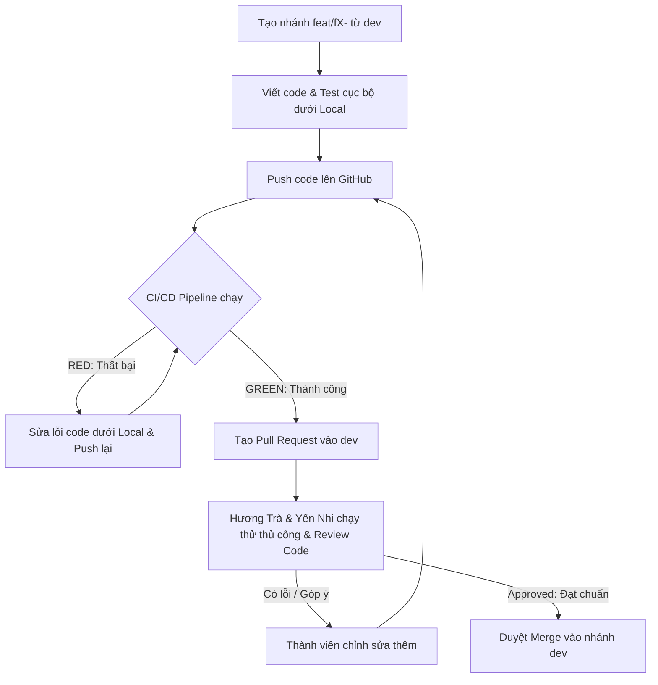

# HƯỚNG DẪN TRIỂN KHAI VÀ HỢP TÁC CODE (IMPLEMENTATION WORKFLOW)
## THƯ MỤC CHỨA BẢNG CÔNG VIỆC CHI TIẾT CỦA THÀNH VIÊN (DOCS/IMPLEMENT)

---

## 1. GIỚI THIỆU CHUNG
Thư mục này chứa bảng phân chia công việc chi tiết (WBS) của từng thành viên nhóm 1 trong quá trình triển khai dự án **YAG**. Để đảm bảo tiến độ và chất lượng mã nguồn, toàn bộ thành viên bắt buộc phải tuân thủ nghiêm ngặt quy trình quản lý nhánh và tích hợp liên tục (CI/CD) dưới đây.

---

## 2. QUY TẮC ĐẶT TÊN NHÁNH (GIT BRANCH CONVENTIONS)
Các thành viên khi phát triển tính năng mới bắt buộc phải tạo nhánh từ nhánh `dev` và đặt tên nhánh theo đúng mã tính năng (Feature ID) mà mình phụ trách:

| Thành viên | Feature ID | Phụ trách Feature | Quy tắc đặt tên nhánh |
| :--- | :--- | :--- | :--- |
| **Trần Gia Hiển** | **F1** | Authentication & Account Security | `feat/f1-auth` |
| **Nguyễn Duy Trường** | **F2** | Premium Membership Payment | `feat/f2-payment` |
| **Phạm Hương Trà** | **F3** | AI Novel Assistant & Semantic Search | `feat/f3-ai-engine` |
| **Huỳnh Yến Nhi** | **F4** | Collaborative Editor & Responsive UI/UX | `feat/f4-editor-ui` |
| **Nguyễn Phú Thọ** | **F5** | Async Queue Publishing & AI Moderation | `feat/f5-async-queue` |

*   **Nhánh tính năng mới:** `feat/fX-ten-tinh-nang` (ví dụ: `feat/f1-jwt-auth`, `feat/f2-vnpay-ipn`).
*   **Nhánh sửa lỗi:** `fix/fX-ten-loi` (ví dụ: `fix/f4-websocket-reconnect`).
*   **Nhánh tái cấu trúc:** `refactor/fX-ten-muc` (ví dụ: `refactor/f3-prompt-tuning`).

---

## 3. QUY TRÌNH KIỂM SOÁT CHẤT LƯỢNG CI/CD BẮT BUỘC
Hệ thống CI/CD (được thiết lập bởi **Nguyễn Phú Thọ**) sẽ tự động chạy thông qua GitHub Actions khi có bất kỳ ai thực hiện `push` code hoặc tạo `Pull Request` vào nhánh `dev` hoặc `main`.

### Các bước kiểm tra tự động của CI Pipeline:
1.  **Linter Check (Kiểm tra chuẩn cú pháp):**
    *   **Backend (Python):** Chạy `Flake8` để quét lỗi định dạng code, code thừa, import chưa sử dụng.
    *   **Frontend (Next.js):** Chạy `ESLint` kiểm tra chuẩn viết code TypeScript/React.
2.  **Automated Testing (Chạy bộ kiểm thử):**
    *   Tự động chạy toàn bộ suite test backend bằng `pytest` (gồm 28 test cases đã được thống nhất).

### ⚠️ QUY ĐỊNH BẮT BUỘC (Exit Gate Policy):
*   **Mã nguồn PUSH lên bắt buộc phải PASS CI/CD (Báo xanh):** Nếu CI/CD báo đỏ (fail test hoặc lỗi linter), thành viên phụ trách phải sửa đổi code cục bộ ngay lập tức và push đè lên để CI chạy lại cho đến khi chuyển xanh.
*   **Chặn Merge tự động:** Mọi Pull Request có CI/CD bị lỗi (đỏ) sẽ **bị hệ thống tự động khóa (Block)**, không cho phép bất kỳ ai merge vào nhánh chung `dev`.

---

## 4. QUY TRÌNH PHỐI HỢP GIT FLOW & CODE REVIEW

### Các bước phối hợp cụ thể:
1.  **Cập nhật database:** Trước khi code, chạy tệp SQL Migrations mới nhất của Duy Trường để cấu hình DB đồng bộ trên Docker cục bộ.
2.  **Đẩy mã nguồn:** Thực hiện code trên nhánh đúng quy tắc đặt tên, chạy linter & test cục bộ thành công trước khi push.
3.  **Tạo Pull Request (PR):** Đặt tiêu đề PR rõ ràng kèm mã Feature (ví dụ: `[F2] Tích hợp cổng thanh toán VNPAY IPN`).
4.  **Kiểm tra chất lượng (Code Review):** **Phạm Hương Trà** và **Huỳnh Yến Nhi** (QA/Testing) sẽ trực tiếp kiểm thử thủ công giao diện, kiểm tra logic code và phê duyệt PR. Chỉ khi có ít nhất 1 Approve và CI/CD báo xanh lá cây, PR mới được phép Merge vào nhánh `dev`.

---

## 5. TIÊU CHÍ HOÀN THÀNH CÔNG VIỆC (DEFINITION OF DONE)
Một Task chỉ được kéo sang cột **Done** trên Jira/Trello khi đáp ứng đủ các tiêu chí:
1.  [ ] Code sạch đạt chuẩn linter, không còn các đoạn code thừa, print debug hoặc console.log.
2.  [ ] Nhánh tính năng đã **Pass 100% CI/CD** trên GitHub Actions.
3.  [ ] Được QA/Testing Lead review trực tiếp và duyệt Merge thành công vào nhánh `dev`.
4.  [ ] Đã kết nối và kiểm thử chạy thông suốt giữa Frontend Next.js và Backend FastAPI cục bộ.
