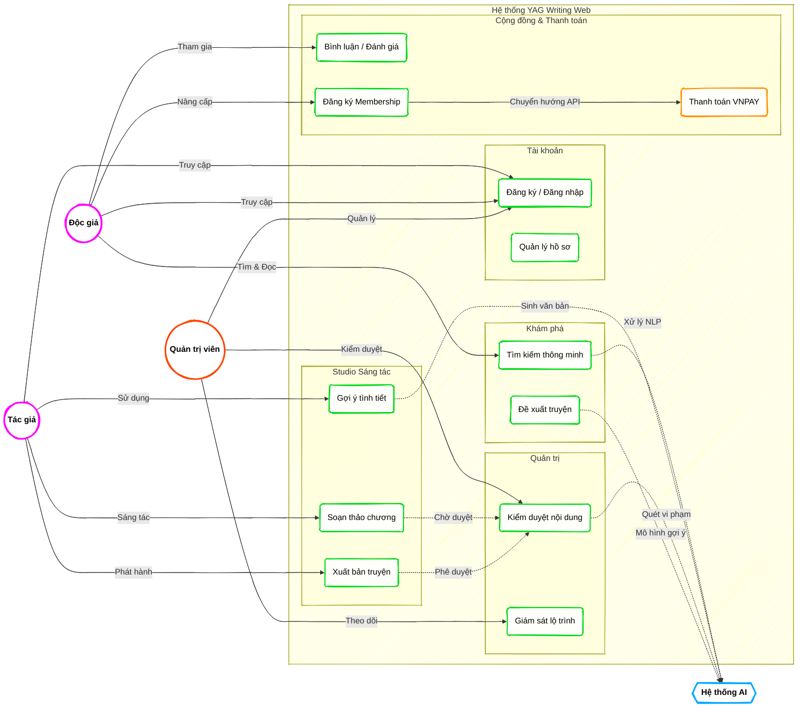

### Intro2SE - Requirements Analysis - Group 1

# YAG - WRITING NOVELS WEB

*Đồ án môn học Nhập môn Công nghệ phần mềm - HCMUS - Chính quy/2025_2026.*

**Mục lục**

- [1. Member Contribution Assessment](#1-member-contribution-assessment)
- [2. Problem Statement](#2-problem-statement)
  - [2.1. Business Description](#21-business-description)
  - [2.2. Operating Environment](#22-operating-environment)
  - [2.3. Design & Implementation Constraints](#23-design--implementation-constraints)
- [3. Requirements Overview](#3-requirements-overview)
  - [3.1. Stakeholders](#31-stakeholders)
  - [3.2. Requirements](#32-requirements)
    - [3.2.1. Functional Requirements Specification](#321-functional-requirements-specification)
    - [3.2.2. Non-Functional Requirements Specification](#322-non-functional-requirements-specification)
- [4. Requirements Analysis](#4-requirements-analysis)
  - [4.1. Use Case model](#41-use-case-model)
  - [4.2. Use Case Specification](#42-use-case-specification)
- [5. AI Usage Declaration](#5-ai-usage-declaration)
- [8. Presentation](#8-presentation)
- [9. Reflective Report](#9-reflective-report)

## 1. Member Contribution Assessment

### 23120123 - Trần Gia Hiển (20%)
| Loại | Nhiệm vụ | Mô tả chi tiết |
| :--- | :--- | :--- |
| **[Doc]** | Đặc tả Use Case AI | Hoàn thành đặc tả chi tiết nhóm Use Case thông minh: AI Search (U006), AI Suggest (U005), AI Recommend (U007), AI Moderate (U011). |
| **[Doc]** | Hoàn thiện tài liệu | Viết nội dung Mục 5 (AI Usage Declaration) và Mục 9 (Reflective Report). |
| **[Code]** | Cấu hình AI Engine | Thiết lập môi trường và cấu hình plugin `pgvector` cho tìm kiếm ngữ nghĩa. |

### 23120151 - Huỳnh Yến Nhi (20%)
| Loại | Nhiệm vụ | Mô tả chi tiết |
| :--- | :--- | :--- |
| **[Doc]** | Phân tích bài toán | Hoàn thành Mục 2 (Problem Statement) làm rõ bối cảnh và các ràng buộc thiết kế. |
| **[Doc]** | Prototype & UI | Chịu trách nhiệm phần Prototype/Mockup và thiết kế giao diện Studio, Forum. |
| **[Code]** | Frontend Studio | Hiện thực giao diện màn hình Author Studio với trình soạn thảo Distraction-free. |

### 23120169 - Nguyễn Phú Thọ (20%)
| Loại | Nhiệm vụ | Mô tả chi tiết |
| :--- | :--- | :--- |
| **[Doc]** | Review kỹ thuật | Đánh giá tính khả thi kỹ thuật của luồng xử lý bất đồng bộ (RabbitMQ) trong kiểm duyệt. |
| **[Doc]** | Đặc tả Giám sát | Hoàn thành đặc tả Use Case U012 (Giám sát cam kết lộ trình). |
| **[Code]** | Hạ tầng & CI/CD | Thiết lập Docker Compose (Postgres, Redis, RabbitMQ) và Git Flow cho nhóm. |
| **[Code]** | Hướng dẫn dự án | Viết file README chi tiết hướng dẫn cài đặt và vận hành hệ thống. |

### 23120177 - Phạm Hương Trà (20%)
| Loại | Nhiệm vụ | Mô tả chi tiết |
| :--- | :--- | :--- |
| **[Doc]** | Phân tích yêu cầu | Hoàn thành Mục 3 (Requirements Overview) bao gồm Stakeholders, FR và NFR. |
| **[Doc]** | Đặc tả Use Case Độc giả | Hoàn thành đặc tả nhóm Use Case: Interact (U008), Membership (U009), Payment (U010). |
| **[Code]** | Frontend Reader | Hiện thực giao diện đăng ký, đăng nhập và màn hình đọc truyện. |

### 23120182 - Nguyễn Duy Trường (20%)
| Loại | Nhiệm vụ | Mô tả chi tiết |
| :--- | :--- | :--- |
| **[Doc]** | Thiết kế Use Case | Phác thảo Use Case Diagram (Mục 4.1) và chốt danh sách Actor. |
| **[Doc]** | Đặc tả Use Case Tác giả | Hoàn thành đặc tả nhóm Use Case: Auth (U001), Profile (U002), Write (U003), Publish (U004). |
| **[Code]** | Database & Migration | Thiết kế Database Schema, viết file SQL Migrations và tạo Seed data mẫu. |

## 2. Problem Statement
    Written by: 23120151 Huỳnh Yến Nhi
    Edited by: 
    Reviewed by: 23120123 Trần Gia Hiển
### 2.1. Business Description
    

### 2.2. Operating Environment

### 2.3. Design & Implementation Constraints

## 3. Requirements Overview
    Written by: 23120177 Phạm Hương Trà
    Edited by: 
    Reviewed by: 23120151 Huỳnh Yến Nhi

### 3.1. Stakeholders

### 3.2. Requirements
#### 3.2.1. Functional Requirements Specification
    Written by: 23120177 Phạm Hương Trà
    Edited by: 
    Reviewed by: 23120182 Nguyễn Duy Trường

#### 3.2.2. Non-Functional Requirements Specification
    Written by: 23120177 Phạm Hương Trà
    Edited by: 
    Reviewed by: 23120182 Nguyễn Duy Trường

## 4. Requirements Analysis 
### 4.1. Use Case model
    Written by: 23120182 Nguyễn Duy Trường
    Edited by: 
    Reviewed by: 23120169 Nguyễn Phú Thọ
 

### 4.2. Use Case Specification
#### 4.2.1. U001: Đăng ký / Đăng nhập
    Written by: 23120182 Nguyễn Duy Trường
    Edited by: 
    Reviewed by: 23120177 Phạm Hương Trà

#### 4.2.2. U002: Quản lý hồ sơ
    Written by: 23120182 Nguyễn Duy Trường
    Edited by: 
    Reviewed by: 23120177 Phạm Hương Trà

#### 4.2.3. U003: Soạn thảo chương truyện
    Written by: 23120182 Nguyễn Duy Trường
    Edited by: 
    Reviewed by: 23120177 Phạm Hương Trà

#### 4.2.4. U004: Xuất bản truyện
    Written by: 23120182 Nguyễn Duy Trường
    Edited by: 
    Reviewed by: 23120177 Phạm Hương Trà

#### 4.2.5. U005: Gợi ý tình tiết AI
    Written by: 23120123 Trần Gia Hiển
    Edited by: 
    Reviewed by: 23120182 Nguyễn Duy Trường

| Mục | Nội dung |
| :--- | :--- |
| **Use case ID** | U005 |
| **Use Case** | Gợi ý tình tiết AI (AI Story Suggestion) |
| **Brief Description** | Hỗ trợ tác giả phát triển ý tưởng truyện dựa trên văn cảnh hiện tại khi gặp tình trạng bí ý tưởng. |
| **Actor** | Author, AI Engine (Gemini) |
| **Pre-Condition** | Tác giả đang trong giao diện soạn thảo và đã có nội dung bản thảo (ít nhất 100 từ) để làm ngữ cảnh. |
| **Result** | Danh sách các phương án gợi ý tình tiết tiếp theo được hiển thị để tác giả lựa chọn. |
| **Main Scenario** | 1. Tác giả chọn đoạn văn ngữ cảnh hoặc đặt con trỏ tại vị trí cần gợi ý. 2. Tác giả nhấn nút "AI Suggest". 3. Hệ thống gửi nội dung bản thảo hiện tại đến AI Engine qua API. 4. AI phân tích phong cách, bối cảnh và đưa ra 3 phương án phát triển tiếp theo. 5. Tác giả xem qua, chọn 1 phương án và nhấn "Chèn vào truyện". |
| **Alternative Scenarios** | - Ngữ cảnh quá ngắn: Hệ thống thông báo tác giả cần viết thêm để AI có đủ dữ liệu phân tích. - Lỗi kết nối AI: Hệ thống thông báo lỗi API và đề nghị tác giả thử lại sau. |
| **Non-Functional Constraints** | - Thời gian phản hồi của AI < 5 giây. - Gợi ý phải đảm bảo tính sáng tạo và phù hợp với thể loại truyện đang viết. |

#### 4.2.6. U006: Tìm kiếm thông minh AI
    Written by: 23120123 Trần Gia Hiển
    Edited by: 
    Reviewed by: 23120182 Nguyễn Duy Trường

| Mục | Nội dung |
| :--- | :--- |
| **Use case ID** | U006 |
| **Use Case** | Tìm kiếm thông minh AI (AI Semantic Search) |
| **Brief Description** | Tìm truyện bằng cách mô tả cốt truyện thông qua ngôn ngữ tự nhiên. |
| **Actor** | Reader, AI Engine |
| **Pre-Condition** | Độc giả truy cập thanh tìm kiếm thông minh. |
| **Result** | Danh sách truyện có nội dung tương đồng nhất với mô tả. |
| **Main Scenario** | 1. Độc giả nhập mô tả cốt truyện. 2. Hệ thống chuyển mô tả sang Vector. 3. So khớp Vector trong pgvector DB. 4. Hiển thị kết quả xếp hạng theo độ tương đồng. |
| **Alternative Scenarios** | - Không tìm thấy kết quả tương đồng: Gợi ý tìm kiếm theo từ khóa cơ bản. |
| **Non-Functional Constraints** | - Thời gian truy vấn Vector < 1s; Độ chính xác ngữ nghĩa cao. |

#### 4.2.7. U007: Đề xuất truyện
    Written by: 23120123 Trần Gia Hiển
    Edited by: 
    Reviewed by: 23120182 Nguyễn Duy Trường

#### 4.2.8. U008: Bình luận & Đánh giá
    Written by: 23120177 Phạm Hương Trà
    Edited by: 
    Reviewed by: 23120123 Trần Gia Hiển

#### 4.2.9. U009: Đăng ký Membership
    Written by: 23120177 Phạm Hương Trà
    Edited by: 
    Reviewed by: 23120123 Trần Gia Hiển

#### 4.2.10. U010: Thanh toán VNPAY
    Written by: 23120177 Phạm Hương Trà
    Edited by: 
    Reviewed by: 23120123 Trần Gia Hiển

#### 4.2.11. U011: Kiểm duyệt nội dung AI
    Written by: 23120123 Trần Gia Hiển
    Edited by: 
    Reviewed by: 23120169 Nguyễn Phú Thọ

| Mục | Nội dung |
| :--- | :--- |
| **Use case ID** | U011 |
| **Use Case** | Kiểm duyệt nội dung AI (Moderation) |
| **Brief Description** | Tự động quét nội dung vi phạm chính sách bằng AI. |
| **Actor** | AI Engine, Admin |
| **Pre-Condition** | Có chương truyện mới được xuất bản. |
| **Result** | Chương truyện được phê duyệt hoặc yêu cầu chỉnh sửa. |
| **Main Scenario** | 1. Hệ thống lấy nội dung chương truyện. 2. AI phân tích các yếu tố nhạy cảm. 3. Cập nhật trạng thái `Approved` nếu sạch. 4. Lưu log kiểm duyệt. |
| **Alternative Scenarios** | - AI nghi ngờ: Gắn cờ để Admin kiểm duyệt thủ công. |
| **Non-Functional Constraints** | - Tỷ lệ nhận diện sai thấp; Xử lý ngầm không block người dùng. |

#### 4.2.12. U012: Giám sát cam kết lộ trình
    Written by: 23120169 Nguyễn Phú Thọ
    Edited by: 
    Reviewed by: 23120151 Huỳnh Yến Nhi

## 5. AI Usage Declaration   
Chưa cần viết các mục này.

## 8. Presentation
Chưa cần viết các mục này.
Video thuyết trình:

## 9. Reflective Report

### 9.1 Most helpful sections
Chưa cần viết các mục này.
### 9.2 Unnecessary/Tedious sections
Chưa cần viết các mục này.