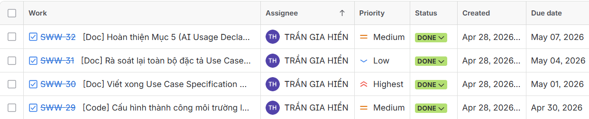
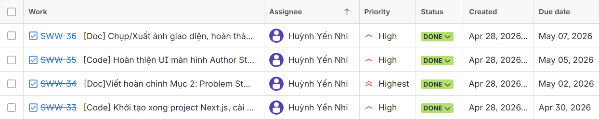
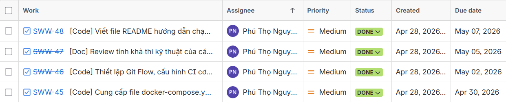
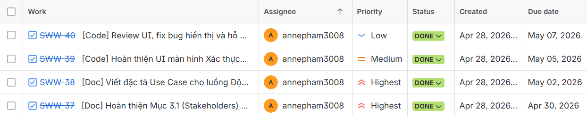
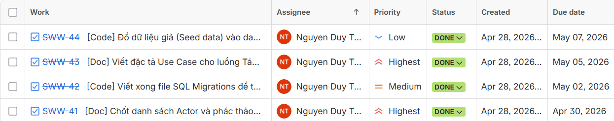
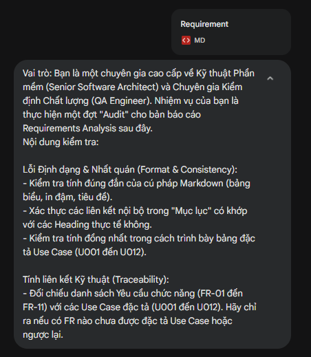
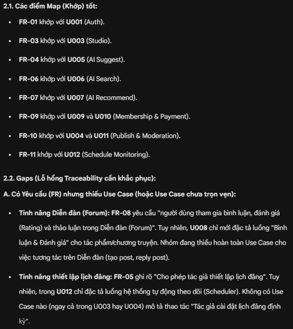

### Intro2SE - Requirements Analysis - Group 1

# YAG - WRITING NOVELS WEB

*Đồ án môn học Nhập môn Công nghệ phần mềm - HCMUS - Chính quy/2025_2026.*

**Mục lục**

- [1. Member Contribution Assessment](#1-member-contribution-assessment)
- [2. Problem Statement](#2-problem-statement)
  - [2.1. Business Description](#21-business-description)
  - [2.2. Operating Environment](#22-operating-environment)
  - [2.3. Design & Implementation Constraints](#23-design--implementation-constraints)
- [3. Requirements Overview](#3-requirements-overview)
  - [3.1. Stakeholders](#31-stakeholders)
  - [3.2. Requirements](#32-requirements)
    - [3.2.1. Functional Requirements Specification](#321-functional-requirements-specification)
    - [3.2.2. Non-Functional Requirements Specification](#322-non-functional-requirements-specification)
- [4. Requirements Analysis](#4-requirements-analysis)
  - [4.1. Use Case model](#41-use-case-model)
  - [4.2. Use Case Specification](#42-use-case-specification)
- [5. AI Usage Declaration](#5-ai-usage-declaration)
- [6. Presentation](#6-presentation)
- [7. Reflective Report](#7-reflective-report)

## 1. Member Contribution Assessment

### 23120123 - Trần Gia Hiển (20%)
| Nhiệm vụ | Mô tả chi tiết |
| :--- | :--- |
| Mô tả Use Case | Viết xong Use Case Specification cho các tính năng AI: AI Search (U008), AI Suggest (U006), AI Recommend (U009), AI Moderate (U013). |
| Rà soát Use Case | Rà soát lại toàn bộ đặc tả Use Case của các thành viên khác, bổ sung luồng ngoại lệ.|
| Hoàn thiện tài liệu | Hoàn thiện Mục 5 (AI Usage Declaration) và Mục 7 (Reflective Report). |
| Cấu hình AI Engine | Cấu hình thành công môi trường local cho plugin pgvector. |

### 23120151 - Huỳnh Yến Nhi (20%)
| Nhiệm vụ | Mô tả chi tiết |
 | :--- | :--- |
| Phân tích bài toán | Viết hoàn chỉnh Mục 2 (Problem Statement), làm rõ bối cảnh và ràng buộc thiết kế. |
| Cấu hình môi trường Frontend | Khởi tạo xong project Next.js, cài đặt TailwindCSS và đẩy code lên GitHub. |
| Cấu hình Frontend Studio | Hoàn thiện UI màn hình Author Studio (Split-view) và luồng Diễn đàn (Forum). |

### 23120169 - Nguyễn Phú Thọ (20%)
| Nhiệm vụ | Mô tả chi tiết |
 | :--- | :--- |
| Review kỹ thuật | Đánh giá tính khả thi kỹ thuật của luồng xử lý bất đồng bộ (RabbitMQ) trong kiểm duyệt. |
| Mô tả Giám sát | Hoàn thành đặc tả Use Case U014 (Giám sát cam kết lộ trình) và U015 (Quản trị hệ thống). |
| Hạ tầng & CI/CD | Cung cấp file docker-compose.yml hoàn chỉnh (PostgreSQL, Redis, RabbitMQ) và Thiết lập Git Flow, cấu hình CI cơ bản (Linter) trên GitHub. |
| Hướng dẫn dự án | Viết file README chi tiết hướng dẫn cài đặt và vận hành hệ thống. |

### 23120177 - Phạm Hương Trà (20%)
| Nhiệm vụ | Mô tả chi tiết |
 | :--- | :--- |
| Phân tích yêu cầu | Hoàn thành Mục 3 (Requirements Overview) bao gồm Stakeholders, FR và NFR. |
| Mô tả Use Case Độc giả | Hoàn thành đặc tả nhóm Use Case: Interact (U010), Membership (U011), Payment (U012). |
| Frontend Reader | Hoàn thiện UI màn hình Xác thực (Login/Register) và giao diện Đọc truyện. |

### 23120182 - Nguyễn Duy Trường (20%)
| Nhiệm vụ | Mô tả chi tiết |
 | :--- | :--- |
| Phân tích Use Case | Chốt danh sách Actor và phác thảo xong Use Case Diagram (StarUML/Visio). |
| Mô tả Use Case Tác giả | Hoàn thành đặc tả nhóm Use Case: Auth (U001), Profile (U002), Quản lý Tác phẩm (U003), Write (U004), Publish (U005). |
| Database & Migration | Viết xong file SQL Migrations để tạo bảng, khóa ngoại dựa trên bản vẽ ERD. |

## 2. Problem Statement
    Written by: 23120151 Huỳnh Yến Nhi
    Edited by: 
    Reviewed by: 23120123 Trần Gia Hiển
### 2.1. Business Description

Trong bối cảnh văn học mạng phát triển mạnh mẽ, nhu cầu xây dựng một nền tảng viết truyện hiện đại, thông minh và an toàn ngày càng cấp thiết. Các nền tảng hiện tại thường thiếu các tính năng hỗ trợ tác giả sáng tác hiệu quả (gợi ý ý tưởng, kiểm duyệt AI, quản lý tiến độ), đồng thời chưa tạo được môi trường tương tác cộng đồng mạnh mẽ giữa tác giả và độc giả. Độc giả gặp khó khăn khi tìm kiếm truyện phù hợp với sở thích, còn tác giả thiếu công cụ để tiếp cận, giữ chân độc giả và bảo vệ quyền sở hữu trí tuệ. Hệ thống YAG hướng đến giải quyết các vấn đề này bằng cách tích hợp AI hỗ trợ sáng tác, kiểm duyệt nội dung, tìm kiếm thông minh, đồng thời xây dựng một không gian mạng xã hội chuyên biệt cho cộng đồng mê truyện.

### 2.2. Operating Environment
- Hệ thống được triển khai dưới dạng Web Application, truy cập qua các trình duyệt hiện đại hỗ trợ HTML5 và WebSockets (Google Chrome, Microsoft Edge, Firefox).
- Backend sử dụng Python (FastAPI) để tích hợp AI, xử lý dữ liệu lớn và cung cấp API.
- Frontend phát triển với Next.js, xây dựng giao diện SPA tối ưu trải nghiệm người dùng.
- Dữ liệu lưu trữ trên PostgreSQL, hỗ trợ backup định kỳ lên Google Cloud Storage.
- Hệ thống sử dụng Nginx làm Reverse Proxy, kết hợp Cloudinary làm nền tảng CDN phân phối ảnh tĩnh, tối ưu tốc độ tải trang.
- Các dịch vụ phụ trợ như Redis, RabbitMQ phục vụ cache, xử lý bất đồng bộ và đồng bộ hóa bản thảo thời gian thực.
- Thanh toán thực hiện qua cổng VNPAY, đảm bảo an toàn và xác thực giao dịch.

### 2.3. Design & Implementation Constraints

- Hệ thống phải đảm bảo bảo mật thông tin người dùng, mã hóa mật khẩu (Bcrypt), JWT authentication, bảo vệ dữ liệu thanh toán qua HTTPS/TLS 1.2+.
- Tất cả người dùng đều phải đăng ký, đăng nhập để sử dụng dịch vụ.
- Tính năng AI phải xử lý bất đồng bộ, không gây treo giao diện người dùng, có giới hạn số request và fallback khi fail.
- Giao diện phải tương thích đa nền tảng, hỗ trợ các chế độ bảo vệ mắt (Dark mode).
- Thiết kế theo hướng Modular Monolith, sẵn sàng tách module AI thành Microservice khi cần mở rộng.
- Hệ thống phải hỗ trợ đồng bộ hóa bản thảo thời gian thực với độ trễ thấp (<200ms).
- Đảm bảo uptime tối thiểu 99.5%, dữ liệu phải được backup định kỳ.
- Tuân thủ các quy định về kiểm duyệt nội dung, bảo vệ quyền sở hữu trí tuệ và quyền riêng tư người dùng.

## 3. Requirements Overview
    Written by: 23120177 Phạm Hương Trà
    Edited by: 
    Reviewed by: 23120151 Huỳnh Yến Nhi

### 3.1. Stakeholders

| STT | Stakeholder | Mô tả vai trò |
| :--- | :--- | :--- |
| 1 | **Tác giả (Author)** | Người sáng tạo nội dung. Sử dụng Studio để soạn thảo, quản lý tác phẩm, nhận gợi ý từ AI và theo dõi thống kê, doanh thu. |
| 2 | **Độc giả (Reader)** | Người sử dụng dịch vụ. Tìm kiếm truyện bằng AI, tham gia cộng đồng tương tác và thực hiện thanh toán Membership nếu có nhu cầu. |
| 3 | **Quản trị viên (Admin)** | Nhân viên vận hành. Kiểm duyệt các nội dung bị gắn cờ, quản lý người dùng và giám sát các cam kết lộ trình của tác giả. |
| 4 | **Hệ thống AI (AI Engine)** | Tác nhân hệ thống (Gemini API). Cung cấp khả năng xử lý ngôn ngữ tự nhiên: gợi ý tình tiết, tìm kiếm ngữ nghĩa và quét nội dung vi phạm. |
| 5 | **Cổng thanh toán (VNPAY)** | Bên thứ ba xử lý giao dịch. Đảm bảo tính an toàn và xác thực các khoản thanh toán cho gói hội viên bằng chuẩn IPN. |
---
### 3.2. Requirements
#### 3.2.1. Functional Requirements Specification
    Written by: 23120177 Phạm Hương Trà
    Edited by: 
    Reviewed by: 23120182 Nguyễn Duy Trường

Các yêu cầu được phân nhóm dựa trên các luồng nghiệp vụ cốt lõi đã đề xuất trong kiến trúc hệ thống:

**Nhóm 1: Quản lý Tài khoản & Phân quyền**
*   **FR-01:** Hệ thống phải cho phép người dùng đăng ký, đăng nhập và đặt lại mật khẩu qua Email.
*   **FR-02:** Hệ thống phải thực hiện phân quyền người dùng để kiểm soát quyền đọc truyện và quyền truy cập Admin Dashboard.
*   **FR-03:** Hệ thống cho phép người dùng xem, cập nhật hồ sơ cá nhân và quản lý lịch sử hoạt động.

**Nhóm 2: Hỗ trợ Sáng tác & Quản lý nội dung**
*   **FR-04:** Cho phép tác giả tạo mới và cập nhật thông tin tổng quan của tác phẩm (tên truyện, ảnh bìa, thể loại, tóm tắt).
*   **FR-05:** Cung cấp trình soạn thảo hỗ trợ lưu bản thảo tự động thời gian thực (WebSockets).
*   **FR-06:** Tích hợp AI gợi ý phát triển tình tiết dựa trên ngữ cảnh bản thảo hiện tại.
*   **FR-07:** Cho phép tác giả thiết lập lịch đăng và thực hiện cam kết lộ trình.

**Nhóm 3: Tìm kiếm & Trải nghiệm Đọc**
*   **FR-08:** Cho phép độc giả truy cập danh sách chương, đọc nội dung truyện và lưu lịch sử đọc cá nhân.
*   **FR-09:** Cho phép tìm kiếm truyện qua tên, tác giả hoặc mô tả cốt truyện bằng ngôn ngữ tự nhiên.
*   **FR-10:** Tự động đề xuất danh sách truyện phù hợp với sở thích của từng độc giả dựa trên lịch sử tương tác.

**Nhóm 4: Tương tác & Doanh thu**
*   **FR-11:** Cho phép người dùng tham gia bình luận, đánh giá (Rating) trên từng chương truyện/tác phẩm.
*   **FR-12:** Xử lý thanh toán mua gói Membership qua cổng VNPAY để mở khóa các chương truyện độc quyền/đọc sớm.

**Nhóm 5: Kiểm duyệt & Giám sát**
*   **FR-13:** AI tự động quét và phân loại nội dung vi phạm chính sách ngay khi tác giả gửi yêu cầu xuất bản.
*   **FR-14:** Hệ thống Scheduler tự động gửi thông báo nhắc nhở và cảnh báo nếu tác giả trễ lịch cập nhật chương theo cam kết.
*   **FR-15:** Cung cấp Bảng điều khiển để Quản trị viên theo dõi số liệu, xử lý truyện vi phạm và quản lý người dùng.

#### 3.2.2. Non-Functional Requirements Specification
    Written by: 23120177 Phạm Hương Trà
    Edited by: 
    Reviewed by: 23120182 Nguyễn Duy Trường

**1. Hiệu năng (Performance)**
*   Thời gian phản hồi của tính năng Tìm kiếm thông minh AI phải dưới **1.5 giây**.
*   Các tác vụ nặng (Kiểm duyệt AI) phải được xử lý bất đồng bộ qua hàng đợi (RabbitMQ), không gây treo giao diện người dùng.
*   Hệ thống hỗ trợ đồng bộ hóa bản thảo thời gian thực với độ trễ (latency) dưới **200ms**.

**2. Bảo mật (Security)**
*   Mật khẩu phải được mã hóa bằng thuật toán **Bcrypt** trước khi lưu trữ.
*   Áp dụng **Rate Limiting** tại API Gateway để ngăn chặn bot tự động cào nội dung truyện (Anti-crawling).
*   Dữ liệu thanh toán phải được bảo vệ qua giao thức HTTPS/TLS 1.2 trở lên.

**3. Độ tin cậy & Sẵn sàng (Reliability & Availability)**
*   Hệ thống duy trì trạng thái sẵn sàng (Uptime) tối thiểu **99.5%**.
*   Dữ liệu PostgreSQL phải được sao lưu định kỳ (Daily backup) lên Google Cloud Storage.

**4. Khả năng mở rộng (Scalability)**
*   Thiết kế theo **Modular Monolith** để dễ dàng tách module AI Smart Engine thành Microservice độc lập khi lượng truy cập tăng cao.

**5. Tính khả dụng (Usability)**
*   Giao diện đọc truyện phải tương thích với mọi trình duyệt hiện đại và hỗ trợ các chế độ bảo vệ mắt (Dark mode, Sepia).

## 4. Requirements Analysis 
### 4.1. Use Case model
    Written by: 23120182 Nguyễn Duy Trường
    Edited by: 
    Reviewed by: 23120169 Nguyễn Phú Thọ

### 4.2. Use Case Specification
#### 4.2.1. U001: Đăng ký / Đăng nhập
    Written by: 23120182 Nguyễn Duy Trường
    Edited by: 
    Reviewed by: 23120177 Phạm Hương Trà

| Mục | Nội dung |
| :--- | :--- |
| **Use case ID** | U001 |
| **Use Case** | Đăng ký / Đăng nhập |
| **Brief Description** | Cho phép người dùng tạo tài khoản mới hoặc truy cập vào hệ thống để nhận các phân quyền tương ứng. |
| **Actor** | Người dùng (User) |
| **Pre-Condition** | Người dùng truy cập vào trang Đăng ký/Đăng nhập trên trình duyệt web. |
| **Result** | Thông tin được lưu trữ an toàn (Đăng ký) hoặc người dùng đăng nhập thành công, được cấp JWT và chuyển hướng giao diện. |
| **Main Scenario** | 1. Người dùng chọn Đăng ký hoặc Đăng nhập. 2. Người dùng nhập thông tin (email/username, mật khẩu). 3. Hệ thống kiểm tra tính hợp lệ của dữ liệu. 4. (Đăng ký) Hệ thống mã hóa mật khẩu bằng Bcrypt và lưu vào Database PostgreSQL. 5. (Đăng nhập) Hệ thống đối chiếu mật khẩu đã băm, cấp JWT và chuyển hướng. |
| **Alternative Scenarios** | - Email đã tồn tại (Đăng ký): Hiển thị lỗi và yêu cầu sử dụng email khác. - Sai thông tin (Đăng nhập): Hiển thị thông báo tài khoản hoặc mật khẩu không đúng. - Quên mật khẩu: Kích hoạt gửi link khôi phục qua Email. |
| **Non-Functional Constraints** | - Mật khẩu bắt buộc phải băm bằng Bcrypt. - Sử dụng Rate Limiting ở API Gateway để chống Brute-force. |

#### 4.2.2. U002: Quản lý hồ sơ
    Written by: 23120182 Nguyễn Duy Trường
    Edited by: 
    Reviewed by: 23120177 Phạm Hương Trà

| Mục | Nội dung |
| :--- | :--- |
| **Use case ID** | U002 |
| **Use Case** | Quản lý hồ sơ |
| **Brief Description** | Người dùng xem, cập nhật thông tin cá nhân và quản lý lịch sử hoạt động trên hệ thống. |
| **Actor** | Người dùng (User) |
| **Pre-Condition** | Người dùng đã đăng nhập thành công vào hệ thống (JWT còn hiệu lực). |
| **Result** | Thông tin cá nhân được cập nhật vào PostgreSQL; ảnh đại diện lưu trên Cloudinary. |
| **Main Scenario** | 1. Người dùng truy cập trang "Hồ sơ cá nhân". 2. Hệ thống hiển thị thông tin cơ bản và lịch sử hoạt động (truyện, forum). 3. Người dùng thay đổi thông tin (Ảnh đại diện, tên hiển thị). 4. Hệ thống tải ảnh lên Cloudinary và lấy URL. 5. Cập nhật dữ liệu vào PostgreSQL và hiển thị thông báo thành công. |
| **Alternative Scenarios** | - Đổi mật khẩu: Xác thực mật khẩu cũ bằng Bcrypt trước khi lưu mật khẩu mới. - Lỗi tải ảnh: Báo lỗi nếu ảnh sai định dạng hoặc quá dung lượng. - Xem hồ sơ public: Ẩn các nút chức năng bảo mật nếu xem hồ sơ người khác. |
| **Non-Functional Constraints** | - Bảo mật quyền riêng tư khi hiển thị thông tin Public. - Tối ưu hóa dung lượng lưu trữ ảnh thông qua CDN. |

#### 4.2.3. U003: Tạo & Quản lý Tác phẩm
    Written by: 23120182 Nguyễn Duy Trường
    Edited by: 
    Reviewed by: 23120151 Huỳnh Yến Nhi

| Mục | Nội dung |
| :--- | :--- |
| **Use case ID** | U003 |
| **Use Case** | Tạo & Quản lý Tác phẩm |
| **Brief Description** | Tác giả khởi tạo một bộ truyện mới, cập nhật thông tin chung (ảnh bìa, mô tả) trước khi bắt đầu viết các chương chi tiết. |
| **Actor** | Tác giả (Author) |
| **Pre-Condition** | Tác giả đang ở trong giao diện Author Studio. |
| **Result** | Tác phẩm mới được khởi tạo thành công trong Database, sẵn sàng để thêm chương. |
| **Main Scenario** | 1. Tác giả nhấn "Tạo truyện mới". 2. Nhập các thông tin bắt buộc: Tên truyện, Thể loại, Tóm tắt nội dung. 3. Upload ảnh bìa truyện (Lưu trên Cloudinary). 4. Hệ thống kiểm tra tính hợp lệ (Tên không trùng lặp, nội dung không vi phạm từ khóa cấm). 5. Hệ thống khởi tạo ID tác phẩm trong PostgreSQL và chuyển hướng tác giả đến giao diện quản lý chương (U004). |
| **Alternative Scenarios** | - Tên truyện đã tồn tại: Hệ thống yêu cầu chọn tên khác. - Sửa thông tin & Trạng thái: Tác giả truy cập truyện đã có, cập nhật thông tin, thay đổi trạng thái chương (Public/Private) hoặc xóa chương nếu cần. |
| **Non-Functional Constraints** | - Ảnh bìa tải lên phải được nén và tối ưu (CDN) để load nhanh. - Độ trễ khởi tạo truyện < 1 giây. |

#### 4.2.4. U004: Soạn thảo chương truyện
    Written by: 23120182 Nguyễn Duy Trường
    Edited by: 
    Reviewed by: 23120177 Phạm Hương Trà

| Mục | Nội dung |
| :--- | :--- |
| **Use case ID** | U004 |
| **Use Case** | Soạn thảo chương truyện |
| **Brief Description** | Tác giả nhập văn bản, nhận gợi ý từ AI trong không gian Studio và lưu bản nháp. |
| **Actor** | Tác giả (Author), Hệ thống AI (AI Smart Engine) |
| **Pre-Condition** | Tác giả đã đăng nhập, vào Studio và chọn thêm chương truyện mới. |
| **Result** | Nội dung được lưu an toàn vào Database dưới trạng thái Bản nháp (Draft). |
| **Main Scenario** | 1. Tác giả nhập tiêu đề và nội dung vào khung soạn thảo. 2. Tác giả yêu cầu AI hỗ trợ ý tưởng thông qua Sidebar bên phải. 3. AI Smart Engine phân tích ngữ cảnh, gọi Gemini API sinh văn bản gợi ý. 4. Tác giả tham khảo ý tưởng và hoàn thiện nội dung. 5. Tác giả nhấn "Lưu nháp", hệ thống lưu vào bảng Chapters trong PostgreSQL. |
| **Alternative Scenarios** | - AI hết Quota/Lỗi: Xử lý Fallback, báo lỗi AI bận nhưng không làm treo trang web. - Mất kết nối mạng: Tự động lưu tạm (Auto-save) xuống LocalStorage. |
| **Non-Functional Constraints** | - Giao diện chia đôi màn hình (Split View 70/30) giúp không gián đoạn trải nghiệm. |

#### 4.2.5. U005: Xuất bản truyện
    Written by: 23120182 Nguyễn Duy Trường
    Edited by: 
    Reviewed by: 23120177 Phạm Hương Trà

| Mục | Nội dung |
| :--- | :--- |
| **Use case ID** | U005 |
| **Use Case** | Xuất bản truyện |
| **Brief Description** | Tác giả gửi yêu cầu xuất bản, hệ thống tiếp nhận và tự động kiểm duyệt ngầm nội dung bằng AI. |
| **Actor** | Tác giả (Author), Hệ thống AI (AI Smart Engine) |
| **Pre-Condition** | Tác giả hoàn tất soạn thảo và đang ở giao diện Studio. |
| **Result** | Trạng thái chương truyện được cập nhật thành APPROVED (Hiển thị) hoặc REJECTED (Bị từ chối). |
| **Main Scenario** | 1. Tác giả thiết lập lịch đăng chương định kỳ (nếu có) và nhấn nút "Xuất bản". 2. Hệ thống lưu thông tin vào Database với trạng thái `PENDING` (chờ duyệt). 3. Hệ thống đẩy Task xuất bản vào hàng đợi RabbitMQ để kích hoạt tiến trình Kiểm duyệt AI (U013). 4. Trả về mã HTTP 202 (Accepted), thông báo chương đang chờ duyệt để tác giả có thể đóng tab và làm việc khác. |
| **Alternative Scenarios** | - Mất kết nối RabbitMQ: Hệ thống lưu trạng thái lỗi cục bộ và tự động Retry đẩy Task khi kết nối phục hồi, không làm mất lệnh xuất bản của tác giả. |
| **Non-Functional Constraints** | - Độ trễ phản hồi khi nhấn nút Xuất bản phải < 500ms (Không bắt tác giả chờ quá trình kiểm duyệt). - Không dùng màn hình loading gây gián đoạn công việc của tác giả. |

#### 4.2.6. U006: Gợi ý tình tiết AI
    Written by: 23120123 Trần Gia Hiển
    Edited by: 
    Reviewed by: 23120182 Nguyễn Duy Trường

| Mục | Nội dung |
| :--- | :--- |
| **Use case ID** | U006 |
| **Use Case** | Gợi ý tình tiết AI |
| **Brief Description** | Hỗ trợ tác giả phát triển ý tưởng truyện dựa trên văn cảnh hiện tại khi gặp tình trạng bí ý tưởng. |
| **Actor** | Author, AI Engine (Gemini) |
| **Pre-Condition** | Tác giả đang trong giao diện soạn thảo và đã có nội dung bản thảo (ít nhất 100 từ) để làm ngữ cảnh. |
| **Result** | Danh sách các phương án gợi ý tình tiết tiếp theo được hiển thị để tác giả lựa chọn. |
| **Main Scenario** | 1. Tác giả chọn đoạn văn ngữ cảnh hoặc đặt con trỏ tại vị trí cần gợi ý. 2. Tác giả nhấn nút "AI Suggest". 3. Hệ thống gửi nội dung bản thảo hiện tại đến AI Engine qua API. 4. AI phân tích phong cách, bối cảnh và đưa ra 3 phương án phát triển tiếp theo. 5. Tác giả xem qua, chọn 1 phương án và nhấn "Chèn vào truyện". |
| **Alternative Scenarios** | - Ngữ cảnh quá ngắn: Hệ thống thông báo tác giả cần viết thêm để AI có đủ dữ liệu phân tích. - Lỗi kết nối AI: Hệ thống thông báo lỗi API và đề nghị tác giả thử lại sau. |
| **Non-Functional Constraints** | - Thời gian phản hồi của AI < 5 giây. - Gợi ý phải đảm bảo tính sáng tạo và phù hợp với thể loại truyện đang viết. - Giới hạn văn cảnh tối đa (VD: 1000 từ) cho mỗi lần gọi API để tránh lỗi Rate Limit và tối ưu chi phí. |

#### 4.2.7. U007: Đọc truyện
    Written by: 23120123 Trần Gia Hiển
    Edited by: 
    Reviewed by:  23120177 Phạm Hương Trà

| Mục | Nội dung |
| :--- | :--- |
| **Use case ID** | U007 |
| **Use Case** | Đọc truyện |
| **Brief Description** | Độc giả truy cập vào một bộ truyện, xem danh sách chương, đọc nội dung và lưu lịch sử. |
| **Actor** | Độc giả (Reader) |
| **Pre-Condition** | Độc giả truy cập vào nền tảng|
| **Result** | Nội dung chương truyện được hiển thị, lịch sử đọc được ghi nhận. |
| **Main Scenario** | 1. Độc giả nhấn vào một truyện từ danh sách tìm kiếm hoặc đề xuất. 2. Hệ thống hiển thị Trang chi tiết truyện (Tên, Ảnh bìa, Tóm tắt, Danh sách chương). 3. Độc giả nhấn vào một chương cụ thể (hoặc nhấn "Đọc tiếp"). 4. Hệ thống ưu tiên lấy dữ liệu chương từ Redis Cache (nếu có), nếu Miss Cache thì truy vấn từ PostgreSQL và cập nhật lại Cache. 5. Hệ thống render nội dung lên màn hình và lưu "Chương đang đọc" vào Lịch sử người dùng. 6. Độc giả sử dụng các nút "Chương trước", "Chương sau" để tiếp tục đọc. |
| **Alternative Scenarios** | - Chương bị khóa: Nếu độc giả chưa có Membership (U011), hệ thống hiển thị thông báo yêu cầu nâng cấp gói cước. - Đổi giao diện đọc: Độc giả tùy chỉnh cỡ chữ, màu nền (Dark mode). - Báo cáo vi phạm (Report): Độc giả phát hiện nội dung độc hại/bản quyền, nhấn nút "Báo cáo", hệ thống gửi yêu cầu về Admin Dashboard (U015). |
| **Non-Functional Constraints** | - Thời gian tải nội dung chương < 0.5s để đảm bảo trải nghiệm đọc liền mạch. - Hỗ trợ SSR (Next.js) để tối ưu SEO cho trang đọc truyện. |

#### 4.2.8. U008: Tìm kiếm thông minh AI
    Written by: 23120123 Trần Gia Hiển
    Edited by: 
    Reviewed by: 23120182 Nguyễn Duy Trường

| Mục | Nội dung |
| :--- | :--- |
| **Use case ID** | U008 |
| **Use Case** | Tìm kiếm thông minh AI |
| **Brief Description** | Tìm truyện bằng cách mô tả cốt truyện thông qua ngôn ngữ tự nhiên. |
| **Actor** | Reader, AI Engine |
| **Pre-Condition** | Độc giả truy cập thanh tìm kiếm thông minh. |
| **Result** | Danh sách truyện có nội dung tương đồng nhất với mô tả. |
| **Main Scenario** | 1. Độc giả nhập mô tả cốt truyện. 2. Hệ thống chuyển mô tả sang Vector. 3. So khớp Vector trong pgvector DB. 4. Hiển thị kết quả xếp hạng theo độ tương đồng. |
| **Alternative Scenarios** | - Không tìm thấy kết quả tương đồng: Gợi ý tìm kiếm theo từ khóa cơ bản. |
| **Non-Functional Constraints** | - Thời gian truy vấn Vector < 1s; Độ chính xác ngữ nghĩa cao. |

#### 4.2.9. U009: Đề xuất truyện
    Written by: 23120123 Trần Gia Hiển
    Edited by: 
    Reviewed by: 23120182 Nguyễn Duy Trường

| Mục | Nội dung |
| :--- | :--- |
| **Use case ID** | U009 |
| **Use Case** | Đề xuất truyện |
| **Brief Description** | Hệ thống tự động gợi ý danh sách truyện phù hợp cho độc giả dựa trên lịch sử xem, đọc và tương tác cá nhân. |
| **Actor** | Reader, AI Engine |
| **Pre-Condition** | Độc giả truy cập hệ thống; có dữ liệu lịch sử tương tác hoặc sở thích đã đăng ký. |
| **Result** | Danh sách truyện đề xuất cá nhân hóa được hiển thị trên giao diện. |
| **Main Scenario** | 1. Độc giả truy cập vào Trang chủ hoặc mục "Gợi ý cho bạn". 2. Hệ thống truy xuất lịch sử tương tác (truyện đã đọc, thể loại, điểm đánh giá) của độc giả. 3. AI Engine thực hiện so khớp Vector sở thích người dùng với kho dữ liệu truyện trong `pgvector`. 4. Hệ thống chọn lọc và xếp hạng các tác phẩm có độ tương đồng cao nhất. 5. Hiển thị danh sách truyện đề xuất lên màn hình của độc giả. |
| **Alternative Scenarios** | - **Người dùng mới (Cold Start):** Hệ thống đề xuất dựa trên các thể loại được chọn khi đăng ký hoặc các truyện đang Trending. - **Lỗi hệ thống AI:** Chuyển sang đề xuất các truyện có lượt xem cao nhất (Top Views) để đảm bảo trải nghiệm không bị gián đoạn. |
| **Non-Functional Constraints** | - Thời gian sinh danh sách đề xuất < 1.5 giây. |

#### 4.2.10. U010: Bình luận & Đánh giá
    Written by: 23120177 Phạm Hương Trà
    Edited by: 
    Reviewed by: 23120123 Trần Gia Hiển

| Mục | Nội dung |
| :--- | :--- |
| **Use case ID** | U010 |
| **Use Case** | Bình luận & Đánh giá |
| **Brief Description** | Độc giả để lại ý kiến cá nhân và mức điểm đánh giá cho tác phẩm hoặc chương truyện cụ thể nhằm tăng tương tác cộng đồng. |
| **Actor** | Reader |
| **Pre-Condition** | Độc giả đã đăng nhập vào hệ thống và đang ở trang chi tiết truyện hoặc trang đọc chương. |
| **Result** | Bình luận/Đánh giá được lưu vào hệ thống và hiển thị công khai cho người dùng khác. |
| **Main Scenario** | 1. Độc giả nhập nội dung bình luận vào khung soạn thảo hoặc chọn số sao đánh giá (1-5 sao). 2. Độc giả nhấn nút "Gửi". 3. Hệ thống kiểm tra tính hợp lệ của nội dung (không trống, không vi phạm từ cấm cơ bản). 4. Hệ thống lưu dữ liệu vào cơ sở dữ liệu và cập nhật điểm trung bình (Rating) của truyện. 5. Hệ thống hiển thị bình luận mới lên giao diện (Real-time qua WebSockets). |
| **Alternative Scenarios** | - **Vi phạm từ cấm:** Hệ thống hiển thị cảnh báo nội dung không phù hợp và yêu cầu chỉnh sửa. - **Lỗi kết nối:** Hệ thống báo lỗi "Không thể gửi bình luận lúc này" và gợi ý thử lại. - **Báo cáo bình luận:** Độc giả có thể Report các bình luận toxic để Admin (U015) xử lý. |
| **Non-Functional Constraints** | - Thời gian hiển thị bình luận sau khi nhấn gửi < 1 giây. - Dữ liệu đánh giá phải được đồng bộ chính xác để không làm sai lệch điểm số của tác phẩm. |

#### 4.2.11. U011: Đăng ký Membership
    Written by: 23120177 Phạm Hương Trà
    Edited by: 
    Reviewed by: 23120123 Trần Gia Hiển

| Mục | Nội dung |
| :--- | :--- |
| **Use case ID** | U011 |
| **Use Case** | Đăng ký Membership |
| **Brief Description** | Độc giả lựa chọn và đăng ký gói hội viên để hưởng các đặc quyền: đọc chương khóa, đọc sớm hoặc không quảng cáo. |
| **Actor** | Reader |
| **Pre-Condition** | Độc giả đã đăng nhập và chưa có gói Membership hoặc gói hiện tại sắp hết hạn. |
| **Result** | Yêu cầu đăng ký được tạo và chuyển sang bước thanh toán. |
| **Main Scenario** | 1. Độc giả truy cập trang "Membership". 2. Độc giả xem danh sách các gói (Tháng/Quý/Năm) và các quyền lợi đi kèm. 3. Độc giả chọn gói phù hợp và nhấn "Đăng ký ngay". 4. Hệ thống xác nhận thông tin gói và tổng số tiền. 5. Hệ thống chuyển hướng người dùng sang giao diện thanh toán (U012). |
| **Alternative Scenarios** | - **Đã có gói:** Hệ thống hiển thị thông báo "Bạn đang trong gói Membership" và hiển thị ngày hết hạn thay vì nút đăng ký mới. |
| **Non-Functional Constraints** | - Giao diện hiển thị gói cước phải trực quan, dễ so sánh quyền lợi. |

#### 4.2.12. U012: Thanh toán VNPAY
    Written by: 23120177 Phạm Hương Trà
    Edited by: 
    Reviewed by: 23120123 Trần Gia Hiển

| Mục | Nội dung |
| :--- | :--- |
| **Use case ID** | U012 |
| **Use Case** | Thanh toán VNPAY (Payment) |
| **Brief Description** | Độc giả thực hiện thanh toán phí Membership thông qua cổng thanh toán VNPAY. |
| **Actor** | Reader, VNPAY System |
| **Pre-Condition** | Độc giả đã thực hiện bước Đăng ký Membership (U011). |
| **Result** | Giao dịch hoàn tất, tài khoản độc giả được nâng cấp lên hạng Membership. |
| **Main Scenario** | 1. Hệ thống tạo mã giao dịch duy nhất và gọi API VNPAY để lấy URL thanh toán. 2. Hệ thống chuyển hướng người dùng sang trang thanh toán của VNPAY. 3. Độc giả thực hiện xác thực và thanh toán trên giao diện VNPAY (App ngân hàng hoặc ví điện tử). 4. VNPAY gửi kết quả giao dịch ngầm về Backend qua IPN (Instant Payment Notification) và điều hướng người dùng về Return URL. 5. Backend kiểm tra chữ ký số (Checksum) từ IPN để đảm bảo an toàn và cập nhật trạng thái tài khoản. 6. Return URL hiển thị thông báo kết quả thành công cho người dùng trên giao diện. |
| **Alternative Scenarios** | - **Hủy thanh toán:** Người dùng nhấn nút "Quay lại" trên trang VNPAY. Hệ thống hủy giao dịch và đưa người dùng về trang chọn gói. - **Thanh toán thất bại:** Do lỗi số dư hoặc lỗi kỹ thuật từ ngân hàng. Hệ thống thông báo lỗi và cho phép thực hiện lại. |
| **Non-Functional Constraints** | - Bảo mật tuyệt đối: Không lưu thông tin thẻ/tài khoản ngân hàng của người dùng trên hệ thống YAG. - Thời gian xử lý cập nhật quyền hạn ngay sau khi nhận được phản hồi từ VNPAY < 2 giây. |

#### 4.2.13. U013: Kiểm duyệt nội dung AI
    Written by: 23120123 Trần Gia Hiển
    Edited by: 
    Reviewed by: 23120169 Nguyễn Phú Thọ

| Mục | Nội dung |
| :--- | :--- |
| **Use case ID** | U013 |
| **Use Case** | Kiểm duyệt nội dung AI |
| **Brief Description** | Tự động quét nội dung vi phạm chính sách bằng AI. |
| **Actor** | AI Engine, Admin |
| **Pre-Condition** | Có Task xuất bản chương mới nằm trong hàng đợi RabbitMQ (từ U005). |
| **Result** | Trạng thái chương truyện được cập nhật (APPROVED/REJECTED), sinh Vector tìm kiếm và thông báo cho tác giả. |
| **Main Scenario** | 1. Background Worker (AI Moderator) lấy Task từ RabbitMQ. 2. Worker gọi API Gemini để phân tích nội dung, quét các yếu tố nhạy cảm (NSFW, bạo lực). 3. Nếu an toàn, Worker cập nhật trạng thái chương thành `APPROVED` trong PostgreSQL. 4. Worker sinh Vector Embedding cho nội dung chương và lưu vào `pgvector` phục vụ Tìm kiếm (U008). 5. Lưu Log kiểm duyệt và gửi thông báo kết quả qua WebSocket/In-app cho tác giả. |
| **Alternative Scenarios** | - **Nội dung vi phạm/nghi ngờ:** Worker cập nhật trạng thái `REJECTED` (hoặc `FLAGGED`), báo lý do từ chối cho tác giả và đẩy lên Admin Dashboard (U015) để xem xét thêm. - **AI quá tải (Rate Limit):** Task được giữ an toàn trong RabbitMQ để Retry lại sau, đảm bảo không bỏ sót kiểm duyệt. |
| **Non-Functional Constraints** | - Quá trình kiểm duyệt bất đồng bộ phải hoàn thành dưới 5 phút. - Phân tách hoàn toàn khỏi Main Thread của Backend để không làm chậm server. |

#### 4.2.14. U014: Giám sát cam kết lộ trình
    Written by: 23120169 Nguyễn Phú Thọ
    Edited by: 
    Reviewed by: 23120151 Huỳnh Yến Nhi

| Mục | Nội dung |
| :--- | :--- |
| **Use case ID** | U014 |
| **Use Case** | Giám sát cam kết lộ trình (Schedule Commitment Monitoring) |
| **Brief Description** | Hệ thống tự động theo dõi và nhắc nhở tác giả đăng chương mới đúng lịch, đồng thời cảnh báo khi tác giả có nguy cơ vi phạm cam kết "không bỏ dở tác phẩm (drop)". |
| **Actor** | System (Scheduler), Author, Admin |
| **Pre-Condition** | Tác giả đã đăng ký lịch đăng chương định kỳ (theo tuần, theo tháng,…) và cam kết không drop tác phẩm khi xuất bản truyện. |
| **Result** | Hệ thống ghi nhận trạng thái tuân thủ lịch đăng của tác giả; tác giả được nhắc nhở hoặc bị cảnh báo vi phạm cam kết nếu trễ hạn. |
| **Main Scenario** | 1. Hệ thống Scheduler định kỳ kiểm tra danh sách các tác phẩm đang trong lịch đăng chương, chưa hoàn thành. 2. Hệ thống so sánh thời điểm hiện tại với lịch đăng đã cam kết của từng tác phẩm. 3. Nếu tác giả đăng chương đúng hạn, hệ thống cập nhật trạng thái `On Schedule` và ghi log. 4. Hệ thống cập nhật thống kê tỷ lệ tuân thủ cam kết (độ uy tín) lên hồ sơ tác giả. |
| **Alternative Scenarios** | - Tác giả sắp trễ hạn (còn ≤ 24 giờ): Hệ thống gửi thông báo nhắc nhở tác giả đăng chương đúng hạn. - Tác giả trễ hạn: Hệ thống cập nhật trạng thái `Overdue`, gửi cảnh báo vi phạm đến tác giả và gắn cờ tác phẩm để Admin xem xét. - Tác giả vi phạm nhiều lần: Admin nhận thông báo tổng hợp và có thể áp dụng biện pháp xử lý (hạ xếp hạng tác giả, tác phẩm; khóa tài khoản tạm thời). |
| **Non-Functional Constraints** | - Scheduler chạy tự động mỗi giờ, không yêu cầu thao tác thủ công. - Thông báo nhắc nhở phải được gửi đến tác giả trong vòng 5-10 phút kể từ khi phát hiện vi phạm. - Toàn bộ log giám sát phải được lưu trữ để phục vụ thống kê và kiểm tra khi cần. |

#### 4.2.15. U015: Quản trị hệ thống
    Written by: 23120169 Nguyễn Phú Thọ
    Edited by: 
    Reviewed by: 23120182 Nguyễn Duy Trường

| Mục | Nội dung |
| :--- | :--- |
| **Use case ID** | U015 |
| **Use Case** | Quản trị hệ thống (Admin Dashboard) |
| **Brief Description** | Quản trị viên giám sát hệ thống, xử lý các báo cáo vi phạm, và quản lý tài khoản người dùng/tác giả. |
| **Actor** | Quản trị viên (Admin) |
| **Pre-Condition** | Người dùng đăng nhập bằng tài khoản có Role là Admin. |
| **Result** | Trạng thái của nội dung hoặc tài khoản được cập nhật theo quyết định của Admin. |
| **Main Scenario** | 1. Admin truy cập trang Admin Dashboard. 2. Hệ thống hiển thị bảng thống kê tổng quan và danh sách các "Task cần xử lý" (truyện bị AI gắn cờ, báo cáo từ người dùng). 3. Admin nhấn vào một truyện bị gắn cờ để xem nội dung. 4. Admin đưa ra quyết định: Duyệt (Xóa cờ) hoặc Từ chối (Khóa chương truyện, Gửi email cảnh cáo tác giả). 5. Hệ thống thực thi hành động, cập nhật trạng thái trong PostgreSQL và lưu Audit Log. |
| **Alternative Scenarios** | - Khóa tài khoản: Admin tìm kiếm một User vi phạm nhiều lần, chọn chức năng "Khóa tài khoản" và chọn thời hạn (7 ngày, Vĩnh viễn). |
| **Non-Functional Constraints** | - Phân quyền chặt chẽ, mọi hành động của Admin phải được ghi log (Audit Trail) phục vụ truy vết. - Dashboard phải thống kê dữ liệu realtime theo thời gian thực. |

## 5. AI Usage Declaration   
Trong quá trình hoàn thiện tài liệu, nhóm có sử dụng công cụ AI để hỗ trợ rà soát lỗi và kiểm tra tính nhất quán của báo cáo. Dưới đây là thông tin khai báo chi tiết:

**Tên công cụ, phiên bản và nền tảng:** Gemini (Gemini 3.1 Pro), nền tảng Web của Google (gemini.google.com).

**Thời gian truy cập:** 17:20 ngày 08/05/2026.

**Prompt đã sử dụng:** "Vai trò: Bạn là một chuyên gia cao cấp về Kỹ thuật Phần mềm (Senior Software Architect) và Chuyên gia Kiểm định Chất lượng (QA Engineer). Nhiệm vụ của bạn là thực hiện một đợt 'Audit' cho bản báo cáo Requirements Analysis sau đây. Nội dung kiểm tra: Lỗi Định dạng & Nhất quán (Format & Consistency)... Tính liên kết Kỹ thuật (Traceability)..." (kèm theo toàn bộ nội dung file Requirement.md).

**Mục đích sử dụng:** Rà soát lỗi cú pháp Markdown, kiểm tra tính nhất quán trong cách trình bày và đánh giá tính liên kết (Traceability) giữa danh sách Yêu cầu chức năng (FR) và các Đặc tả Use Case.

**Nội dung AI sinh ra:** Một bản báo cáo Audit (Audit Report) chỉ ra các lỗi sai về liên kết mục lục, lỗi thụt lề text thành code block, đồng thời đánh giá tính liên kết giữa yêu cầu chức năng và Use Case để đảm bảo không bị thiếu sót luồng nghiệp vụ cốt lõi.

**Nội dung sinh viên tự làm & Kiểm chứng:** Nhóm đã đọc hiểu và tự đối chiếu lại các góp ý của AI với định hướng ban đầu của dự án. Nhóm hoàn toàn không sao chép văn bản của AI mà tự tay thực hiện việc sửa lỗi định dạng Markdown, đánh số lại mục lục và rà soát, tinh chỉnh lại các ràng buộc thiết kế, luồng hệ thống để tài liệu đạt độ hoàn thiện cao nhất.

## 6. Presentation
Video thuyết trình: https://youtu.be/2hARxf5t9Cc

## 7. Reflective Report
### 7.1 Most helpful sections
*   **Requirements Overview (Section 3):** Đây là phần quan trọng nhất giúp nhóm thống nhất được phạm vi dự án. Việc xác định rõ các Stakeholders và yêu cầu chức năng giúp nhóm tránh được việc phát triển lan man và tập trung vào các tính năng cốt lõi như AI Smart Engine.
*   **Use Case Specification (Section 4.2):** Giúp các thành viên hiểu sâu về luồng xử lý của hệ thống, đặc biệt là các kịch bản lỗi (Alternative Scenarios). Điều này cực kỳ hữu ích cho việc thiết kế Database và API chính xác ngay từ đầu.

### 7.2 Unnecessary/Tedious sections
Không có.
