### Intro2SE - Design - Group 1

# YAG - WRITING NOVELS WEB

*Đồ án môn học Nhập môn Công nghệ phần mềm - HCMUS - Chính quy/2025-2026.*

**Mục lục**

- [1. Member Contribution Assessment](#1-member-contribution-assessment)
- [2. Conceptual Model](#2-conceptual-model)
- [3. Architectural Design](#3-architectural-design)
  - [3.1. Architecture Diagram](#31-architecture-diagram)
    - [3.1.1. System Decomposition Tree Diagram](#311-system-decomposition-tree-diagram)
    - [3.1.2. Overall System Architecture Diagram](#312-overall-system-architecture-diagram)
    - [3.1.3. Các đặc điểm kiến trúc đặc biệt (Special Architectural Aspects)](#313-các-đặc-điểm-kiến-trúc-đặc-biệt-special-architectural-aspects)
  - [3.2. Class Diagram](#32-class-diagram)
  - [3.3. Class Specifications](#33-class-specifications)
    - [3.3.1. Class User](#331-class-user)
    - [3.3.2. Class Story](#332-class-story)
    - [3.3.3. Class Chapter](#333-class-chapter)
    - [3.3.4. Class Comment](#334-class-comment)
    - [3.3.5. Class Review](#335-class-review)
    - [3.3.6. Class MembershipPlan](#336-class-membershipplan)
    - [3.3.7. Class Transaction](#337-class-transaction)
    - [3.3.8. Class AIModerationLog](#338-class-aimoderationlog)
    - [3.3.9. Class PublishSchedule](#339-class-publishschedule)
    - [3.3.10. Class StoryEmbedding](#3310-class-storyembedding)
- [4. Data Design](#4-data-design)
  - [4.1. Data Diagram](#41-data-diagram)
  - [4.2. Data Specification](#42-data-specification)
    - [4.2.1. Bảng `users` (Tài khoản người dùng)](#421-bảng-users-tài-khoản-người-dùng)
    - [4.2.2. Bảng `profiles` (Thông tin hồ sơ chi tiết)](#422-bảng-profiles-thông-tin-hồ-sơ-chi-tiết)
    - [4.2.3. Bảng `stories` (Thông tin tác phẩm)](#423-bảng-stories-thông-tin-tác-phẩm)
    - [4.2.4. Bảng `chapters` (Nội dung chương truyện)](#424-bảng-chapters-nội-dung-chương-truyện)
    - [4.2.5. Bảng `comments` (Bình luận của độc giả)](#425-bảng-comments-bình-luận-của-độc-giả)
    - [4.2.6. Bảng `reviews` (Đánh giá tác phẩm)](#426-bảng-reviews-đánh-giá-tác-phẩm)
    - [4.2.7. Bảng `membership_plans` (Danh mục gói hội viên)](#427-bảng-membership_plans-danh-mục-gói-hội-viên)
    - [4.2.8. Bảng `transactions` (Giao dịch thanh toán)](#428-bảng-transactions-giao-dịch-thanh-toán)
    - [4.2.9. Bảng `ai_moderation_logs` (Nhật ký kiểm duyệt AI)](#429-bảng-ai_moderation_logs-nhật-ký-kiểm-duyệt-ai)
    - [4.2.10. Bảng `story_embeddings` (Dữ liệu Vector cốt truyện - pgvector)](#4210-bảng-story_embeddings-dữ-liệu-vector-cốt-truyện---pgvector)
    - [4.2.11. Bảng `publish_schedules` (Lịch đăng và cam kết lộ trình)](#4211-bảng-publish_schedules-lịch-đăng-và-cam-kết-lộ-trình)
    - [4.2.12. Bảng `reading_histories` (Lịch sử đọc truyện)](#4212-bảng-reading_histories-lịch-sử-đọc-truyện)
    - [4.2.13. Bảng `libraries` (Thư viện truyện cá nhân)](#4213-bảng-libraries-thư-viện-truyện-cá-nhân)
- [5. User Interface and User Experience Design](#5-user-interface-and-user-experience-design)
  - [5.1. Screen Diagram](#51-screen-diagram)
  - [5.2. Screen Specifications](#52-screen-specifications)
    - [5.2.1. S05 – Khám phá truyện (Discover & Search)](#521-s05--khám-phá-truyện-discover--search)
    - [5.2.2. S06 – Chi tiết truyện (Story Detail)](#522-s06--chi-tiết-truyện-story-detail)
    - [5.2.3. S07 – Trang truyện (Reader Mode)](#523-s07--trang-truyện-reader-mode)
    - [5.2.4. S16 – Author Studio (Editor)](#524-s16--author-studio-editor)
    - [5.2.5. S17 – Xuất bản chương](#525-s17--xuất-bản-chương)
    - [5.2.6. S20 – Kiểm duyệt nội dung (Admin)](#526-s20--kiểm-duyệt-nội-dung-admin)
  - [5.3. UI Design Examples for Remaining Screens](#53-ui-design-examples-for-remaining-screens)
- [6. AI Usage Declaration](#6-ai-usage-declaration)
- [7. Presentation](#7-presentation)
- [8. Reflective Report](#8-reflective-report)

## 1. Member Contribution Assessment

### 23120123 - Trần Gia Hiển (24%)

| Nhiệm vụ | Mô tả chi tiết |
| :--- | :--- |
| ***Thiết kế UI/UX Design*** | Thiết kế Screen Diagram, liệt kê các màn hình chính và luồng chuyển đổi giữa chúng. |
| ***Code Frontend*** | Code cho các màn hình S01 đến S04. |
| ***Design giao diện cơ bản*** | Design 21 giao diện UI cơ bản |

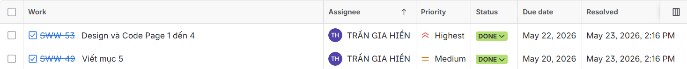

### 23120151 - Huỳnh Yến Nhi (19%)

| Nhiệm vụ | Mô tả chi tiết |
| :--- | :--- |
| ***Viết phần Conceptual Model*** | Xây dựng mô hình khái niệm (EER) thể hiện các thực thể ngữ nghĩa chính của hệ thống YAG: người dùng, tác giả, độc giả, tác phẩm, chương truyện, bình luận/đánh giá, Membership, giao dịch, kiểm duyệt AI, lịch đăng chương và dữ liệu tìm kiếm/gợi ý AI. |
| ***Rà soát UI example và bố cục Design*** | Kiểm tra tính rõ ràng của ảnh minh họa giao diện và sự đồng bộ giữa Conceptual Model, Data Design và UI/UX. |
| ***Code Frontend*** | Code cho các màn hình S09 đến S12. |

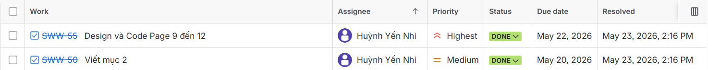

### 23120169 - Nguyễn Phú Thọ (19%)

| Nhiệm vụ | Mô tả chi tiết |
| :--- | :--- |
| ***Thiết kế Architecture Diagram*** | Thiết kế sơ đồ phân rã hệ thống và sơ đồ kiến trúc tổng thể, tập trung vào Modular Monolith, backend services, RabbitMQ và xử lý bất đồng bộ. |
| ***Rà soát Class Diagram và Class Specifications*** | Kiểm tra quan hệ lớp, cardinality, tính đầy đủ của các lớp nghiệp vụ cốt lõi và sự bám sát Use Case U001-U015. |
| ***Viết phần Architectural Design*** | Phối hợp với Phạm Hương Trà hoàn thiện Mục 3 (Architectural Design). |
| ***Code Frontend*** | Code cho các màn hình S17 đến S21. |

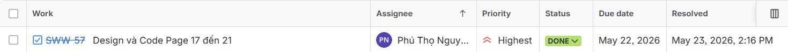

### 23120177 - Phạm Hương Trà (19%)

| Nhiệm vụ | Mô tả chi tiết |
| :--- | :--- |
| ***Thiết kế Class Diagram và Class Specifications*** | Thiết kế Class Diagram và đặc tả lớp, tập trung vào frontend-facing workflows, giao tiếp Client-Server và các thành phần giao diện Next.js. |
| ***Rà soát Screen Specifications*** | Kiểm tra event handling, trạng thái giao diện và tính nhất quán giữa UI/UX Design với Requirements Analysis. |
| ***Code Frontend*** | Code cho các màn hình S05 đến S08. |

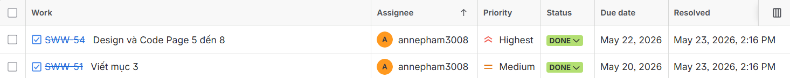

### 23120182 - Nguyễn Duy Trường (19%)

| Nhiệm vụ | Mô tả chi tiết |
| :--- | :--- |
| ***Thiết kế Data Diagram*** | Thiết kế Data Diagram (ERD) cho toàn bộ cơ sở dữ liệu PostgreSQL + pgvector. |
| ***Viết Data Specification*** | Viết Data Specification đặc tả 13 bảng dữ liệu của hệ thống YAG bao gồm cấu trúc cột, kiểu dữ liệu, ràng buộc và khóa. |
| ***Code Frontend*** | Code cho các màn hình S13 đến S16. |

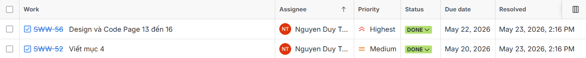

## 2. Conceptual Model
    Written by: 23120151 Huỳnh Yến Nhi
    Reviewed by: 23120123 Trần Gia Hiển

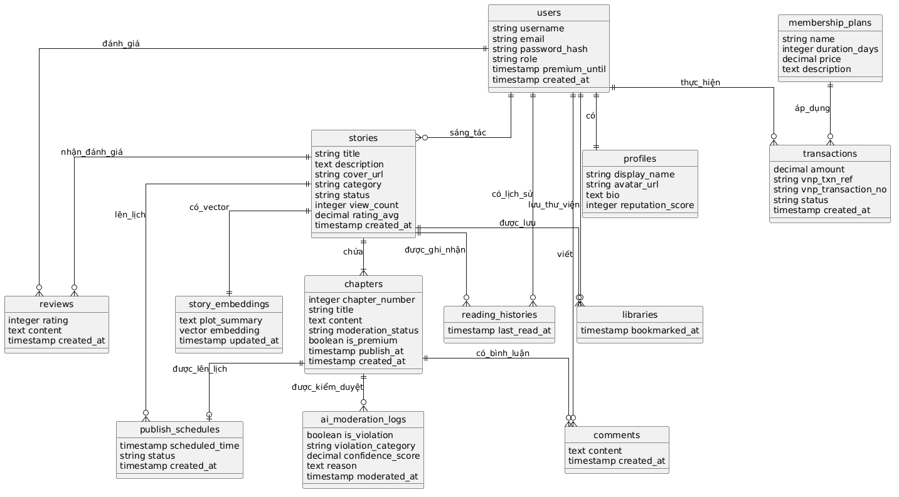

## 3. Architectural Design

### 3.1. Architecture Diagram
    Written by: 23120169 Nguyễn Phú Thọ
    Reviewed by: 23120123 Trần Gia Hiển

#### 3.1.1. System Decomposition Tree Diagram

System Decomposition Tree dưới đây thể hiện cấu trúc phân tầng và các thành phần cấu thành nên hệ thống YAG:



#### 3.1.2. Overall System Architecture Diagram

Sơ đồ kiến trúc tổng thể dưới đây minh họa mối quan hệ, luồng giao tiếp (Client-Server), tương tác thời gian thực (WebSockets) và xử lý bất đồng bộ (Message Queue) giữa các thành phần đã xác định ở sơ đồ phân rã:



#### 3.1.3. Các đặc điểm kiến trúc đặc biệt (Special Architectural Aspects)

1. **Kiến trúc Client-Server và Modular Monolith:**
   - Áp dụng triệt để mô hình Client-Server. 
   - Frontend là Single Page Application (SPA) xây dựng bằng **Next.js**, tách biệt hoàn toàn với Backend.
   - Backend sử dụng **FastAPI**. 
   - Các logic nghiệp vụ (Content, Payment, AI) được gom trong một khối để dễ triển khai, nhưng mã nguồn phân tách rõ ràng, sẵn sàng nâng cấp lên Microservices khi hệ thống mở rộng.

2. **Xử lý bất đồng bộ cường độ cao:**
   - Các tác vụ AI rất tốn thời gian. Để đảm bảo không treo UI, khi tác giả nhấn "Xuất bản", hệ thống chuyển tác vụ thành một Event đẩy vào **RabbitMQ**. Các Background Worker sẽ tiêu thụ hàng đợi này, gọi API Google Gemini và âm thầm cập nhật database.

3. **Giao tiếp thời gian thực, độ trễ thấp:**
   - Hệ thống yêu cầu độ trễ dưới 200ms cho tính năng soạn thảo (tự động lưu) và diễn đàn. Điều này được giải quyết bằng giao thức **WebSockets** tích hợp trực tiếp trên FastAPI, kết hợp cơ chế Pub/Sub của **Redis** để đồng bộ trạng thái giữa các client ngay lập tức.

4. **Tìm kiếm ngữ nghĩa qua Vector Database:**
   - Điểm khác biệt của hệ thống là khả năng tìm truyện qua mô tả tự nhiên (ví dụ: "nam chính là hacker"). Backend gọi Gemini API để chuyển hóa văn bản thành Vector Embedding, sau đó dùng **pgvector** để thực hiện phép đo Cosine Similarity để trích xuất truyện phù hợp nhất.

5. **Bảo mật nhiều lớp và Đảm bảo an toàn thanh toán:**
   - Bảo vệ mật khẩu qua mã hóa **Bcrypt**, xác thực phiên bằng **JWT**.
   - API Gateway kết hợp **Nginx** và cơ chế **Rate Limiting** để chặn các tool tự động cào dữ liệu (Anti-crawling) và tấn công DDoS.
   - Luồng thanh toán Membership tích hợp **VNPAY Sandbox** thông qua giao thức IPN (Instant Payment Notification) backend-to-backend, không phụ thuộc vào kết quả trả về từ Frontend, chống gian lận tuyệt đối.
   - Hệ thống có cơ chế sao lưu tự động định kỳ (Daily Backup) toàn bộ PostgreSQL lên **Google Cloud Storage**.

### 3.2. Class Diagram
    Written by: 23120177 Phạm Hương Trà
    Reviewed by: 23120182 Nguyễn Duy Trường

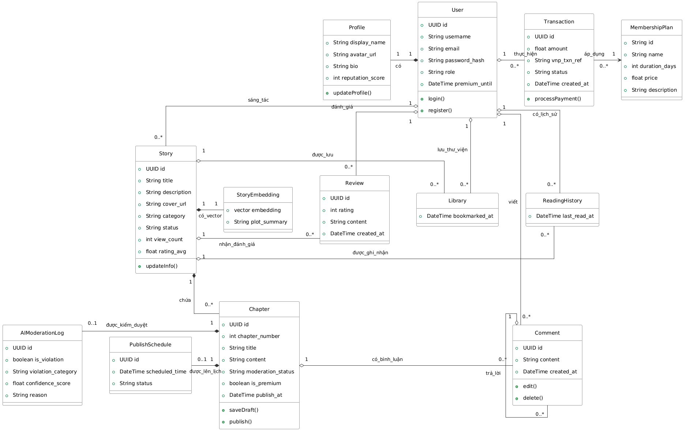

### 3.3. Class Specifications
    Written by: 23120177 Phạm Hương Trà
    Reviewed by: 23120182 Nguyễn Duy Trường

#### 3.3.1. Class User

> **Inherits from:** `None`

##### Attributes

| Seq | Property | Modifier | Constraint | Description |
| :--- | :--- | :--- | :--- | :--- |
| 1 | `id` | public | UUID, NOT NULL | Định danh duy nhất của người dùng |
| 2 | `username` | public | VARCHAR(50), UNIQUE | Tên đăng nhập hệ thống |
| 3 | `email` | public | VARCHAR(100), UNIQUE | Địa chỉ email để xác thực |
| 4 | `password_hash` | private | VARCHAR(255), NOT NULL | Mật khẩu đã được mã hóa (Bcrypt) |
| 5 | `role` | public | IN ('admin', 'author', 'reader') | Vai trò phân quyền trên hệ thống |
| 6 | `premium_until` | public | NULLABLE | Thời hạn hiệu lực của gói Membership |

##### Methods

| Seq | Operation | Modifier | Constraint | Description |
| :--- | :--- | :--- | :--- | :--- |
| 1 | `login()` | public | Requires Valid Credentials | Xác thực người dùng, trả về JWT token |
| 2 | `register()` | public | Unique Username/Email | Tạo tài khoản người dùng mới |

---

#### 3.3.2. Class Story

> **Inherits from:** `None`

##### Attributes

| Seq | Property | Modifier | Constraint | Description |
| :--- | :--- | :--- | :--- | :--- |
| 1 | `id` | public | UUID, NOT NULL | Định danh duy nhất của bộ truyện |
| 2 | `title` | public | VARCHAR(255), UNIQUE | Tên/Tiêu đề bộ truyện |
| 3 | `description` | public | TEXT, NOT NULL | Đoạn tóm tắt nội dung |
| 4 | `category` | public | VARCHAR(50), NOT NULL | Thể loại chính của tác phẩm |
| 5 | `status` | public | IN ('ongoing', 'completed', 'paused')| Trạng thái tiến độ sáng tác |
| 6 | `view_count` | public | Integer, >= 0 | Tổng số lượt đọc |
| 7 | `rating_avg` | public | Float, 0.0 - 5.0 | Điểm đánh giá trung bình |

##### Methods

| Seq | Operation | Modifier | Constraint | Description |
| :--- | :--- | :--- | :--- | :--- |
| 1 | `updateInfo()` | public | Requires Author Role | Cập nhật thông tin chung của truyện |

---

#### 3.3.3. Class Chapter

> **Inherits from:** `None`

##### Attributes

| Seq | Property | Modifier | Constraint | Description |
| :--- | :--- | :--- | :--- | :--- |
| 1 | `id` | public | UUID, NOT NULL | Định danh duy nhất của chương |
| 2 | `chapter_number` | public | Integer, > 0 | Số thứ tự chương |
| 3 | `title` | public | VARCHAR(255), NOT NULL | Tiêu đề của chương |
| 4 | `content` | private | TEXT, NOT NULL | Nội dung chi tiết của chương truyện |
| 5 | `moderation_status`| public | IN ('pending', 'approved', 'rejected')| Trạng thái kiểm duyệt AI |
| 6 | `is_premium` | public | Boolean, Default: FALSE | Yêu cầu Membership để đọc |
| 7 | `publish_at` | public | DateTime | Lịch xuất bản công khai |

##### Methods

| Seq | Operation | Modifier | Constraint | Description |
| :--- | :--- | :--- | :--- | :--- |
| 1 | `saveDraft()` | public | Requires Author Role | Lưu tạm nội dung (Autosave) |
| 2 | `publish()` | public | Triggers Moderation | Yêu cầu xuất bản chương lên hệ thống |

---

#### 3.3.4. Class Comment

> **Inherits from:** `None`

##### Attributes

| Seq | Property | Modifier | Constraint | Description |
| :--- | :--- | :--- | :--- | :--- |
| 1 | `id` | public | UUID, NOT NULL | Định danh duy nhất của bình luận |
| 2 | `content` | public | TEXT, NOT NULL | Nội dung bình luận của độc giả |
| 3 | `created_at` | public | DateTime, DEFAULT NOW() | Thời điểm đăng bình luận |

##### Methods

| Seq | Operation | Modifier | Constraint | Description |
| :--- | :--- | :--- | :--- | :--- |
| 1 | `edit()` | public | Must be Owner | Chỉnh sửa bình luận |
| 2 | `delete()` | public | Owner or Admin | Xóa bình luận khỏi hệ thống |

---

#### 3.3.5. Class Review

> **Inherits from:** `None`

##### Attributes

| Seq | Property | Modifier | Constraint | Description |
| :--- | :--- | :--- | :--- | :--- |
| 1 | `id` | public | UUID, NOT NULL | Định danh duy nhất của review |
| 2 | `rating` | public | Integer, 1 - 5 | Điểm số (số sao đánh giá) |
| 3 | `content` | public | TEXT, NULLABLE | Lời nhận xét chi tiết |
| 4 | `created_at` | public | DateTime, DEFAULT NOW() | Thời điểm gửi đánh giá |

##### Methods

| Seq | Operation | Modifier | Constraint | Description |
| :--- | :--- | :--- | :--- | :--- |
| 1 | `submitReview()`| public | Once per Story per User | Gửi đánh giá cho toàn bộ tác phẩm |

---

#### 3.3.6. Class MembershipPlan

> **Inherits from:** `None`

##### Attributes

| Seq | Property | Modifier | Constraint | Description |
| :--- | :--- | :--- | :--- | :--- |
| 1 | `id` | public | VARCHAR(30), NOT NULL | Mã gói cước (VD: MONTHLY) |
| 2 | `name` | public | VARCHAR(100), NOT NULL | Tên gói cước hiển thị |
| 3 | `duration_days`| public | Integer, > 0 | Thời gian hiệu lực tính bằng ngày |
| 4 | `price` | public | Float, >= 0.0 | Giá trị thanh toán (VND) |
| 5 | `description` | public | TEXT, NULLABLE | Đặc quyền đi kèm gói |

##### Methods

| Seq | Operation | Modifier | Constraint | Description |
| :--- | :--- | :--- | :--- | :--- |
| 1 | `getDetails()` | public | None | Truy xuất chi tiết các đặc quyền của gói |

---

#### 3.3.7. Class Transaction

> **Inherits from:** `None`

##### Attributes

| Seq | Property | Modifier | Constraint | Description |
| :--- | :--- | :--- | :--- | :--- |
| 1 | `id` | public | UUID, NOT NULL | Định danh giao dịch trên hệ thống YAG |
| 2 | `amount` | public | Float, > 0.0 | Số tiền thanh toán (VND) |
| 3 | `vnp_txn_ref` | public | VARCHAR(100), UNIQUE | Mã tham chiếu gửi cho cổng VNPAY |
| 4 | `status` | public | IN ('pending', 'success', 'failed')| Trạng thái giao dịch |
| 5 | `created_at` | public | DateTime, DEFAULT NOW() | Thời điểm tạo giao dịch |

##### Methods

| Seq | Operation | Modifier | Constraint | Description |
| :--- | :--- | :--- | :--- | :--- |
| 1 | `processPayment()`| public | Requires 'pending' Status | Khởi tạo URL điều hướng sang VNPAY |

---

#### 3.3.8. Class AIModerationLog

> **Inherits from:** `None`

##### Attributes

| Seq | Property | Modifier | Constraint | Description |
| :--- | :--- | :--- | :--- | :--- |
| 1 | `id` | public | UUID, NOT NULL | Định danh nhật ký kiểm duyệt |
| 2 | `is_violation` | public | Boolean, NOT NULL | Đánh dấu nội dung có vi phạm hay không |
| 3 | `violation_category`| public| VARCHAR(50), NULLABLE | Phân loại hạng mục vi phạm |
| 4 | `confidence_score`| public | Float, 0.0 - 1.0 | Độ tin cậy do AI Engine đánh giá |
| 5 | `reason` | public | TEXT, NULLABLE | Lý do hoặc trích dẫn vi phạm |

##### Methods

| Seq | Operation | Modifier | Constraint | Description |
| :--- | :--- | :--- | :--- | :--- |
| 1 | `logResult()` | public | Generated by AI Engine | Lưu kết quả phân tích nội dung từ Gemini |

---

#### 3.3.9. Class PublishSchedule

> **Inherits from:** `None`

##### Attributes

| Seq | Property | Modifier | Constraint | Description |
| :--- | :--- | :--- | :--- | :--- |
| 1 | `id` | public | UUID, NOT NULL | Định danh cấu hình lên lịch |
| 2 | `scheduled_time` | public | DateTime, NOT NULL | Thời điểm hẹn giờ xuất bản công khai |
| 3 | `status` | public | IN ('scheduled', 'published', 'missed')| Trạng thái thực thi lệnh |

##### Methods

| Seq | Operation | Modifier | Constraint | Description |
| :--- | :--- | :--- | :--- | :--- |
| 1 | `checkSchedule()`| public | Triggered by Cron | Kiểm tra tiến độ và tự động mở khóa chương |

---

#### 3.3.10. Class StoryEmbedding

> **Inherits from:** `None`

##### Attributes

| Seq | Property | Modifier | Constraint | Description |
| :--- | :--- | :--- | :--- | :--- |
| 1 | `embedding` | private | vector(1536), NOT NULL | Vector toán học biểu diễn nội dung |
| 2 | `plot_summary` | public | TEXT, NOT NULL | Nội dung tóm tắt được dùng để Vector hóa |

##### Methods

| Seq | Operation | Modifier | Constraint | Description |
| :--- | :--- | :--- | :--- | :--- |
| 1 | `generateVector()`| public | Calls Gemini Embeddings API| Cập nhật lại vector khi nội dung truyện thay đổi |

## 4. Data Design

### 4.1. Data Diagram
    Written by: 23120182 Nguyễn Duy Trường
    Reviewed by: 23120169 Nguyễn Phú Thọ

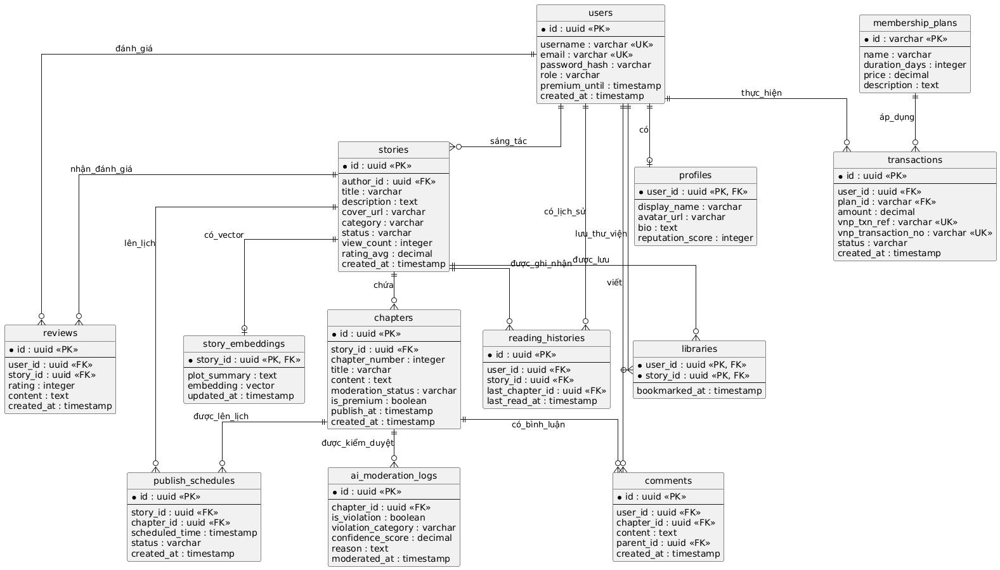

#### Mô tả các thành phần và công nghệ lưu trữ:
- **Cơ sở dữ liệu chính (PostgreSQL):** Lưu trữ toàn bộ dữ liệu có cấu trúc của hệ thống, bao gồm các bảng về tài khoản, hồ sơ cá nhân, thông tin tác phẩm, chi tiết chương, tương tác độc giả (bình luận, đánh giá), các gói dịch vụ và lịch sử giao dịch.
- **Lưu trữ Vector (pgvector):** Bảng `story_embeddings` sử dụng trường kiểu dữ liệu `vector(1536)` để lưu trữ các biểu diễn vector (embeddings) của cốt truyện. Đây là thành phần cốt lõi hỗ trợ chức năng Tìm kiếm thông minh AI (U008) và Đề xuất truyện AI (U009) bằng cách đo lường độ tương đồng cosine (Cosine Similarity).
- **Phân tách bộ nhớ Cache & Hàng đợi:**
  - **Redis (Cache):** Dùng để lưu trữ session, đếm lượt xem (View Count) thời gian thực và lưu cache tạm thời nội dung chương đọc nhiều (U007), không lưu trữ vật lý trong sơ đồ dữ liệu quan hệ này.
  - **RabbitMQ (Message Queue):** Điều phối các tác vụ bất đồng bộ như đẩy tác vụ kiểm duyệt chương sang Gemini API (U013) giúp tối ưu hóa hiệu năng hệ thống.
- **Lưu trữ tệp tĩnh (Cloudinary CDN):** Các trường như `avatar_url` (bảng `profiles`) và `cover_url` (bảng `stories`) chỉ lưu trữ URL liên kết trỏ tới dịch vụ lưu trữ đám mây Cloudinary, tối ưu dung lượng và tốc độ phân phối nội dung tĩnh.

### 4.2. Data Specification
    Written by: 23120182 Nguyễn Duy Trường
    Reviewed by: 23120169 Nguyễn Phú Thọ

#### 4.2.1. Bảng `users` (Tài khoản người dùng)
Bảng này dùng để lưu trữ thông tin đăng nhập, phân quyền (Role-Based Access Control) và trạng thái kích hoạt Membership của người dùng trên hệ thống.

| No. | Column Name | Data Type | Constraint | Key | Description |
| :--- | :--- | :--- | :--- | :--- | :--- |
| 1 | `id` | `UUID` | NOT NULL, DEFAULT gen_random_uuid() | PK | Khóa chính, định danh duy nhất cho tài khoản người dùng |
| 2 | `username` | `VARCHAR(50)` | NOT NULL, UNIQUE, viết liền không dấu | | Tên đăng nhập duy nhất của tài khoản |
| 3 | `email` | `VARCHAR(100)` | NOT NULL, UNIQUE, đúng định dạng Email | | Địa chỉ Email của người dùng phục vụ xác thực/khôi phục mật khẩu |
| 4 | `password_hash` | `VARCHAR(255)` | NOT NULL | | Mật khẩu đã được mã hóa một chiều bằng thuật toán Bcrypt |
| 5 | `role` | `VARCHAR(20)` | NOT NULL, IN ('admin', 'author', 'reader') | | Quyền truy cập: admin (quản trị), author (tác giả), reader (độc giả) |
| 6 | `premium_until` | `TIMESTAMP` | NULL | | Thời hạn hiệu lực của gói Membership (Null nếu chưa đăng ký hoặc đã hết hạn) |
| 7 | `created_at` | `TIMESTAMP` | NOT NULL, DEFAULT NOW() | | Thời điểm đăng ký tài khoản |
| 8 | `updated_at` | `TIMESTAMP` | NOT NULL, DEFAULT NOW() | | Thời điểm cập nhật thông tin tài khoản gần nhất |

#### 4.2.2. Bảng `profiles` (Thông tin hồ sơ chi tiết)
Bảng này lưu trữ thông tin cá nhân bổ sung, bút danh của tác giả/độc giả và điểm uy tín phục vụ giám sát cam kết lộ trình.

| No. | Column Name | Data Type | Constraint | Key | Description |
| :--- | :--- | :--- | :--- | :--- | :--- |
| 1 | `user_id` | `UUID` | NOT NULL, ON DELETE CASCADE | PK, FK | Khóa chính, đồng thời là khóa ngoại liên kết tới bảng `users(id)` |
| 2 | `display_name` | `VARCHAR(100)` | NOT NULL | | Tên hiển thị công khai trên hệ thống (Bút danh của tác giả) |
| 3 | `avatar_url` | `VARCHAR(255)` | NULL | | Đường dẫn URL ảnh đại diện lưu trữ trên Cloudinary |
| 4 | `bio` | `TEXT` | NULL | | Đoạn giới thiệu bản thân ngắn của người dùng |
| 5 | `reputation_score` | `INTEGER` | NOT NULL, DEFAULT 100, Range: 0-100 | | Điểm uy tín sáng tác của tác giả (trừ điểm nếu trễ lộ trình đăng chương) |
| 6 | `created_at` | `TIMESTAMP` | NOT NULL, DEFAULT NOW() | | Thời điểm khởi tạo hồ sơ |
| 7 | `updated_at` | `TIMESTAMP` | NOT NULL, DEFAULT NOW() | | Thời điểm cập nhật hồ sơ gần nhất |

#### 4.2.3. Bảng `stories` (Thông tin tác phẩm)
Bảng này dùng để quản lý các tác phẩm (bộ truyện) được sáng tác bởi các tác giả trên hệ thống.

| No. | Column Name | Data Type | Constraint | Key | Description |
| :--- | :--- | :--- | :--- | :--- | :--- |
| 1 | `id` | `UUID` | NOT NULL, DEFAULT gen_random_uuid() | PK | Khóa chính, định danh duy nhất cho mỗi bộ truyện |
| 2 | `author_id` | `UUID` | NOT NULL, ON DELETE CASCADE | FK | Khóa ngoại liên kết tới bảng `users(id)`, chỉ định tác giả sở hữu |
| 3 | `title` | `VARCHAR(255)` | NOT NULL, UNIQUE | | Tiêu đề của bộ truyện (không được trùng lặp) |
| 4 | `description` | `TEXT` | NOT NULL | | Tóm tắt cốt truyện và các thông tin giới thiệu chung |
| 5 | `cover_url` | `VARCHAR(255)` | NULL | | Đường dẫn URL ảnh bìa truyện lưu trữ trên Cloudinary |
| 6 | `category` | `VARCHAR(50)` | NOT NULL | | Thể loại chính của truyện (Ví dụ: Kiếm hiệp, Kỳ ảo, Đô thị...) |
| 7 | `status` | `VARCHAR(20)` | NOT NULL, DEFAULT 'ongoing', IN ('ongoing', 'completed', 'paused') | | Trạng thái sáng tác: ongoing (đang viết), completed (đã hoàn thành), paused (tạm ngưng) |
| 8 | `view_count` | `INTEGER` | NOT NULL, DEFAULT 0, >= 0 | | Tổng số lượt đọc của bộ truyện (đồng bộ định kỳ từ Redis) |
| 9 | `rating_avg` | `DECIMAL(3,2)` | NOT NULL, DEFAULT 0.00, Range: 0.00 - 5.00 | | Điểm đánh giá trung bình của truyện dựa trên tất cả review |
| 10 | `created_at` | `TIMESTAMP` | NOT NULL, DEFAULT NOW() | | Thời điểm tạo truyện |
| 11 | `updated_at` | `TIMESTAMP` | NOT NULL, DEFAULT NOW() | | Thời điểm cập nhật thông tin truyện gần nhất |

#### 4.2.4. Bảng `chapters` (Nội dung chương truyện)
Bảng này dùng để lưu trữ nội dung chi tiết của từng chương truyện, cấu hình trạng thái duyệt tự động và phân quyền đọc (trả phí/miễn phí).

| No. | Column Name | Data Type | Constraint | Key | Description |
| :--- | :--- | :--- | :--- | :--- | :--- |
| 1 | `id` | `UUID` | NOT NULL, DEFAULT gen_random_uuid() | PK | Khóa chính, định danh duy nhất cho mỗi chương truyện |
| 2 | `story_id` | `UUID` | NOT NULL, ON DELETE CASCADE | FK | Khóa ngoại liên kết tới bảng `stories(id)`, chỉ định thuộc về bộ truyện nào |
| 3 | `chapter_number` | `INTEGER` | NOT NULL, > 0 | | Số thứ tự chương trong bộ truyện |
| 4 | `title` | `VARCHAR(255)` | NOT NULL | | Tiêu đề của chương (Ví dụ: Chương 1: Khởi đầu mới) |
| 5 | `content` | `TEXT` | NOT NULL | | Nội dung văn bản chi tiết của chương truyện |
| 6 | `moderation_status` | `VARCHAR(20)` | NOT NULL, DEFAULT 'pending', IN ('pending', 'approved', 'rejected', 'flagged') | | Trạng thái kiểm duyệt: pending (chờ duyệt), approved (đã duyệt), rejected (bị từ chối), flagged (nghi ngờ vi phạm) |
| 7 | `is_premium` | `BOOLEAN` | NOT NULL, DEFAULT FALSE | | Trạng thái chương VIP: TRUE (yêu cầu Membership để đọc), FALSE (miễn phí) |
| 8 | `publish_at` | `TIMESTAMP` | NOT NULL, DEFAULT NOW() | | Thời gian công bố chương truyện cho độc giả đọc |
| 9 | `created_at` | `TIMESTAMP` | NOT NULL, DEFAULT NOW() | | Thời điểm soạn thảo chương truyện |
| 10 | `updated_at` | `TIMESTAMP` | NOT NULL, DEFAULT NOW() | | Thời điểm cập nhật chương truyện lần cuối |

#### 4.2.5. Bảng `comments` (Bình luận của độc giả)
Bảng này lưu trữ các bình luận tương tác của độc giả trên từng chương truyện cụ thể, hỗ trợ cấu hình phân cấp (reply bình luận).

| No. | Column Name | Data Type | Constraint | Key | Description |
| :--- | :--- | :--- | :--- | :--- | :--- |
| 1 | `id` | `UUID` | NOT NULL, DEFAULT gen_random_uuid() | PK | Khóa chính, định danh duy nhất cho bình luận |
| 2 | `user_id` | `UUID` | NOT NULL, ON DELETE CASCADE | FK | Khóa ngoại liên kết tới bảng `users(id)`, định danh người bình luận |
| 3 | `chapter_id` | `UUID` | NOT NULL, ON DELETE CASCADE | FK | Khóa ngoại liên kết tới bảng `chapters(id)`, bình luận thuộc chương nào |
| 4 | `content` | `TEXT` | NOT NULL | | Nội dung bình luận của độc giả |
| 5 | `parent_id` | `UUID` | NULL, ON DELETE CASCADE | FK | Khóa ngoại liên kết tới `comments(id)` để trả lời bình luận cấp trên |
| 6 | `created_at` | `TIMESTAMP` | NOT NULL, DEFAULT NOW() | | Thời điểm gửi bình luận |

#### 4.2.6. Bảng `reviews` (Đánh giá tác phẩm)
Bảng này ghi nhận số sao đánh giá và nhận xét của độc giả dành cho toàn bộ tác phẩm truyện.

| No. | Column Name | Data Type | Constraint | Key | Description |
| :--- | :--- | :--- | :--- | :--- | :--- |
| 1 | `id` | `UUID` | NOT NULL, DEFAULT gen_random_uuid() | PK | Khóa chính, định danh duy nhất cho lượt đánh giá |
| 2 | `user_id` | `UUID` | NOT NULL, ON DELETE CASCADE | FK | Khóa ngoại liên kết tới bảng `users(id)`, người thực hiện đánh giá |
| 3 | `story_id` | `UUID` | NOT NULL, ON DELETE CASCADE | FK | Khóa ngoại liên kết tới bảng `stories(id)`, đánh giá cho tác phẩm nào |
| 4 | `rating` | `INTEGER` | NOT NULL, IN (1, 2, 3, 4, 5) | | Số điểm đánh giá (từ 1 đến 5 sao) |
| 5 | `content` | `TEXT` | NULL | | Bài nhận xét chi tiết của độc giả |
| 6 | `created_at` | `TIMESTAMP` | NOT NULL, DEFAULT NOW() | | Thời điểm gửi đánh giá |

#### 4.2.7. Bảng `membership_plans` (Danh mục gói hội viên)
Bảng này quản lý thông tin các gói cước đăng ký hội viên Membership có sẵn trên hệ thống.

| No. | Column Name | Data Type | Constraint | Key | Description |
| :--- | :--- | :--- | :--- | :--- | :--- |
| 1 | `id` | `VARCHAR(30)` | NOT NULL | PK | Khóa chính, định danh mã gói hội viên (Ví dụ: 'MONTHLY', 'YEARLY') |
| 2 | `name` | `VARCHAR(100)` | NOT NULL | | Tên gói cước hiển thị trên giao diện (Ví dụ: Gói Bạc 1 Tháng) |
| 3 | `duration_days` | `INTEGER` | NOT NULL, > 0 | | Số ngày sử dụng mà gói cước cung cấp |
| 4 | `price` | `DECIMAL(12,2)` | NOT NULL, >= 0 | | Giá tiền của gói cước bằng Việt Nam Đồng (VND) |
| 5 | `description` | `TEXT` | NULL | | Chi tiết các đặc quyền đi kèm gói Membership |

#### 4.2.8. Bảng `transactions` (Giao dịch thanh toán)
Bảng này lưu trữ toàn bộ lịch sử thanh toán đăng ký Membership của độc giả thông qua cổng thanh toán VNPAY.

| No. | Column Name | Data Type | Constraint | Key | Description |
| :--- | :--- | :--- | :--- | :--- | :--- |
| 1 | `id` | `UUID` | NOT NULL, DEFAULT gen_random_uuid() | PK | Khóa chính, định danh duy nhất cho giao dịch trên hệ thống |
| 2 | `user_id` | `UUID` | NULL, ON DELETE SET NULL | FK | Khóa ngoại liên kết tới bảng `users(id)`, người thực hiện thanh toán |
| 3 | `plan_id` | `VARCHAR(30)` | NOT NULL | FK | Khóa ngoại liên kết tới bảng `membership_plans(id)`, gói cước được mua |
| 4 | `amount` | `DECIMAL(12,2)` | NOT NULL, > 0 | | Số tiền thực tế của giao dịch thanh toán |
| 5 | `vnp_txn_ref` | `VARCHAR(100)` | NOT NULL, UNIQUE | | Mã tham chiếu giao dịch duy nhất gửi sang cổng VNPAY |
| 6 | `vnp_transaction_no`| `VARCHAR(100)` | NULL, UNIQUE | | Mã giao dịch chính thức do cổng VNPAY phản hồi sau khi thanh toán thành công |
| 7 | `status` | `VARCHAR(20)` | NOT NULL, DEFAULT 'pending', IN ('pending', 'success', 'failed') | | Trạng thái giao dịch: pending (đang chờ), success (thành công), failed (thất bại) |
| 8 | `created_at` | `TIMESTAMP` | NOT NULL, DEFAULT NOW() | | Thời điểm khởi tạo giao dịch thanh toán |
| 9 | `updated_at` | `TIMESTAMP` | NOT NULL, DEFAULT NOW() | | Thời điểm cập nhật trạng thái giao dịch gần nhất |

#### 4.2.9. Bảng `ai_moderation_logs` (Nhật ký kiểm duyệt AI)
Bảng này ghi nhận các log kiểm duyệt chương tự động bằng Gemini AI, lưu trữ các phân tích chi tiết phục vụ khiếu nại hoặc kiểm tra của Admin.

| No. | Column Name | Data Type | Constraint | Key | Description |
| :--- | :--- | :--- | :--- | :--- | :--- |
| 1 | `id` | `UUID` | NOT NULL, DEFAULT gen_random_uuid() | PK | Khóa chính, định danh duy nhất cho log kiểm duyệt |
| 2 | `chapter_id` | `UUID` | NOT NULL, ON DELETE CASCADE | FK | Khóa ngoại liên kết bảng `chapters(id)`, xác định chương được quét |
| 3 | `is_violation` | `BOOLEAN` | NOT NULL | | Kết quả kiểm duyệt: TRUE (phát hiện vi phạm chính sách), FALSE (an toàn) |
| 4 | `violation_category`| `VARCHAR(50)` | NULL | | Phân loại lỗi vi phạm chính sách nếu có (Ví dụ: Bạo lực, Nhạy cảm, HateSpeech...) |
| 5 | `confidence_score` | `DECIMAL(5,4)` | NOT NULL, Range: 0.0000 - 1.0000 | | Điểm số độ tin cậy/mức độ vi phạm do Gemini AI đánh giá |
| 6 | `reason` | `TEXT` | NULL | | Giải thích chi tiết hoặc trích dẫn đoạn vi phạm do AI phân tích |
| 7 | `moderated_at` | `TIMESTAMP` | NOT NULL, DEFAULT NOW() | | Thời điểm thực hiện quét và lưu log |

#### 4.2.10. Bảng `story_embeddings` (Dữ liệu Vector cốt truyện - pgvector)
Bảng này lưu trữ biểu diễn vector 1536 chiều của tóm tắt truyện, đây là bảng phục vụ riêng cho tính năng tìm kiếm và đề xuất ngữ nghĩa bằng pgvector.

| No. | Column Name | Data Type | Constraint | Key | Description |
| :--- | :--- | :--- | :--- | :--- | :--- |
| 1 | `story_id` | `UUID` | NOT NULL, ON DELETE CASCADE | PK, FK | Khóa chính, đồng thời là khóa ngoại liên kết tới bảng `stories(id)` |
| 2 | `plot_summary` | `TEXT` | NOT NULL | | Tóm tắt cốt truyện đã được chuẩn hóa phục vụ sinh vector |
| 3 | `embedding` | `vector(1536)` | NOT NULL | | Vector embedding 1536 chiều sinh ra từ mô hình của Gemini API |
| 4 | `updated_at` | `TIMESTAMP` | NOT NULL, DEFAULT NOW() | | Thời điểm cập nhật/đồng bộ hóa vector gần nhất |

#### 4.2.11. Bảng `publish_schedules` (Lịch đăng và cam kết lộ trình)
Bảng này quản lý việc hẹn giờ tự động xuất bản chương và lưu vết giám sát lộ trình đăng truyện của tác giả.

| No. | Column Name | Data Type | Constraint | Key | Description |
| :--- | :--- | :--- | :--- | :--- | :--- |
| 1 | `id` | `UUID` | NOT NULL, DEFAULT gen_random_uuid() | PK | Khóa chính, định danh duy nhất cho lịch hẹn giờ đăng |
| 2 | `story_id` | `UUID` | NOT NULL, ON DELETE CASCADE | FK | Khóa ngoại liên kết bảng `stories(id)`, tác phẩm được hẹn lịch |
| 3 | `chapter_id` | `UUID` | NOT NULL, ON DELETE CASCADE | FK | Khóa ngoại liên kết bảng `chapters(id)`, chương truyện được hẹn đăng |
| 4 | `scheduled_time` | `TIMESTAMP` | NOT NULL | | Thời điểm hẹn giờ xuất bản chính thức |
| 5 | `status` | `VARCHAR(20)` | NOT NULL, DEFAULT 'scheduled', IN ('scheduled', 'published', 'missed') | | Trạng thái: scheduled (đã lên lịch), published (đã đăng), missed (bị trễ/hủy) |
| 6 | `created_at` | `TIMESTAMP` | NOT NULL, DEFAULT NOW() | | Thời điểm thiết lập lịch hẹn giờ |

#### 4.2.12. Bảng `reading_histories` (Lịch sử đọc truyện)
Bảng này ghi nhận thông tin đọc truyện của độc giả, giúp độc giả đọc tiếp dễ dàng và cung cấp dữ liệu đầu vào cho AI Recommendation.

| No. | Column Name | Data Type | Constraint | Key | Description |
| :--- | :--- | :--- | :--- | :--- | :--- |
| 1 | `id` | `UUID` | NOT NULL, DEFAULT gen_random_uuid() | PK | Khóa chính, định danh duy nhất cho bản ghi lịch sử |
| 2 | `user_id` | `UUID` | NOT NULL, ON DELETE CASCADE | FK | Khóa ngoại liên kết bảng `users(id)`, độc giả đọc truyện |
| 3 | `story_id` | `UUID` | NOT NULL, ON DELETE CASCADE | FK | Khóa ngoại liên kết bảng `stories(id)`, bộ truyện đã đọc |
| 4 | `last_chapter_id` | `UUID` | NULL, ON DELETE SET NULL | FK | Khóa ngoại liên kết bảng `chapters(id)`, chương truyện gần nhất đang đọc |
| 5 | `last_read_at` | `TIMESTAMP` | NOT NULL, DEFAULT NOW() | | Thời điểm gần nhất đọc chương này |

#### 4.2.13. Bảng `libraries` (Thư viện truyện cá nhân)
Bảng này lưu trữ danh sách các bộ truyện độc giả đã đánh dấu bookmark hoặc lưu vào thư viện riêng để nhận thông báo chương mới.

| No. | Column Name | Data Type | Constraint | Key | Description |
| :--- | :--- | :--- | :--- | :--- | :--- |
| 1 | `user_id` | `UUID` | NOT NULL, ON DELETE CASCADE | PK, FK | Khóa ngoại liên kết bảng `users(id)`, xác định thư viện của độc giả nào |
| 2 | `story_id` | `UUID` | NOT NULL, ON DELETE CASCADE | PK, FK | Khóa ngoại liên kết bảng `stories(id)`, bộ truyện được thêm vào thư viện |
| 3 | `bookmarked_at` | `TIMESTAMP` | NOT NULL, DEFAULT NOW() | | Thời điểm độc giả thêm bộ truyện này vào thư viện |

## 5. User Interface and User Experience Design

### 5.1. Screen Diagram
    Written by: 23120123 Trần Gia Hiển
    Reviewed by: 23120177 Phạm Hương Trà



Danh sách chi tiết 21 màn hình của hệ thống YAG:

| Seq | Screen | Description |
| :--- | :--- | :--- |
| **S01** | Landing Page | Trang đích giới thiệu hệ thống, thu hút chuyển đổi người dùng mới |
| **S02** | Đăng nhập / Đăng ký | Form xác thực tài khoản (bao gồm cả Login và Register) |
| **S03** | Khôi phục mật khẩu | Quá trình 3 bước khôi phục qua OTP |
| **S04** | Home Feed | Trang chủ chính, hiển thị truyện đề xuất AI và bài viết nổi bật |
| **S05** | Khám phá & Tìm kiếm | Trang tìm kiếm truyện, hỗ trợ tìm kiếm ngữ nghĩa thông minh bằng AI |
| **S06** | Trang truyện (Story Detail)| Thông tin chi tiết tác phẩm, danh sách chương và bình luận |
| **S07** | Reader Mode | Giao diện đọc truyện thuần túy, tùy biến giao diện và hỗ trợ đọc tiếp |
| **S08** | Diễn đàn | Khu vực cộng đồng thảo luận, tạo các chủ đề (Topic) trao đổi |
| **S09** | Membership | Trang giới thiệu đặc quyền và so sánh các gói Premium |
| **S10** | Kết quả thanh toán | Màn hình phản hồi giao dịch sau khi thanh toán qua cổng VNPAY |
| **S11** | Thư viện cá nhân | Quản lý tác phẩm đã theo dõi, đánh dấu trang đang đọc dở |
| **S12** | Hồ sơ cá nhân | Xem thông tin công khai (avatar, giới thiệu, điểm uy tín) |
| **S13** | Cài đặt tài khoản | Tùy chỉnh thông tin riêng tư, đổi mật khẩu, cấu hình bảo mật |
| **S14** | Trung tâm thông báo | Nhận cảnh báo theo thời gian thực (chương mới, kết quả duyệt AI) |
| **S15** | Thư viện tác phẩm (Author)| Danh sách các truyện do Tác giả sáng tác và quản lý |
| **S16** | Author Studio (Editor) | Trình soạn thảo văn bản tích hợp AI Sidebar hỗ trợ gợi ý tình tiết |
| **S17** | Xuất bản chương | Xác nhận và nộp chương mới, gửi tới AI Moderation Queue |
| **S18** | Lịch đăng & Cam kết | Quản lý tiến độ ra chương, theo dõi tỷ lệ tuân thủ lịch trình |
| **S19** | Admin Dashboard | Trang tổng quan quản trị hệ thống, theo dõi doanh thu và vi phạm |
| **S20** | Kiểm duyệt nội dung | Xử lý các chương truyện bị AI gắn cờ (Flagged) hoặc chờ duyệt |
| **S21** | Thống kê & Báo cáo | Phân tích chi tiết số liệu người dùng, nội dung và xuất báo cáo |

### 5.2. Screen Specifications
    Written by: 23120123 Trần Gia Hiển
    Reviewed by: 23120177 Phạm Hương Trà

#### 5.2.1. S05 – Khám phá truyện (Discover & Search)

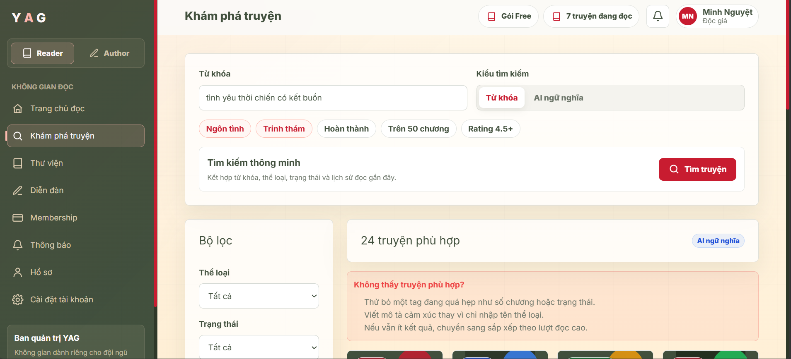

Màn hình này cho phép độc giả tìm kiếm truyện thông thường (từ khóa, bộ lọc) hoặc sử dụng tính năng Tìm kiếm ngữ nghĩa (AI Search - U008) để diễn đạt nội dung cần tìm bằng ngôn ngữ tự nhiên. Giao diện được thiết kế để hiển thị kết quả tìm kiếm và bộ lọc trực quan.

| Seq | Component / Element | Event | Action / Reaction |
| :--- | :--- | :--- | :--- |
| 1 | **Thanh tìm kiếm (Kiểu tìm kiếm)** | Chuyển đổi tab "Từ khóa" hoặc "AI ngữ nghĩa", nhập nội dung và bấm "Tìm truyện" | Gửi request tìm kiếm. Nếu chọn "AI ngữ nghĩa", hệ thống dùng Gemini xử lý câu văn tự nhiên để tìm truyện phù hợp. |
| 2 | **Tags gợi ý tìm kiếm nhanh** | Click vào các tag (Ngôn tình, Trinh thám, Hoàn thành...) | Tự động điền tag vào bộ lọc và cập nhật ngay danh sách kết quả. |
| 3 | **Bộ lọc (Filter Sidebar)** | Chọn giá trị từ dropdown (Thể loại, Trạng thái) | Lọc kết quả tìm kiếm theo nhiều tiêu chí phụ và cập nhật danh sách truyện ở phần chính. |
| 4 | **Khung cảnh báo kết quả tìm kiếm** | Hiển thị khi không có/ít truyện phù hợp | Box "Không thấy truyện phù hợp?" hiển thị, đề xuất người dùng đổi hướng tìm kiếm (VD: thử tag rộng hơn, dùng ngữ nghĩa). |

#### 5.2.2. S06 – Chi tiết truyện (Story Detail)

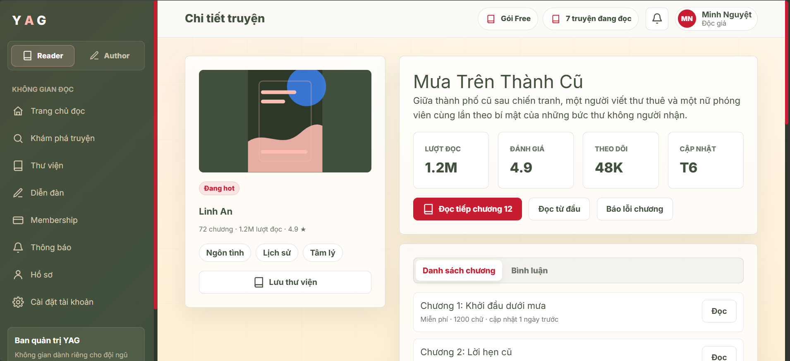

Trang hiển thị thông tin cốt lõi của tác phẩm (Metadata), cung cấp các nút kêu gọi hành động (Call to action - CTA) để đọc truyện, đánh giá, lưu thư viện hoặc xem danh sách chương.

| Seq | Component / Element | Event | Action / Reaction |
| :--- | :--- | :--- | :--- |
| 1 | **Các nút hành động (CTA Buttons)** | Click "Đọc tiếp chương 12", "Đọc từ đầu", "Báo lỗi chương" | Chuyển hướng đến màn hình đọc (S07) theo đúng tiến độ lưu trong hệ thống, hoặc mở form báo lỗi. |
| 2 | **Nút "Lưu thư viện"** | Click chuột | Lưu truyện vào danh sách cá nhân (bảng `libraries`). Trạng thái nút có thể thay đổi sau khi lưu. |
| 3 | **Tab Danh sách chương / Bình luận** | Click đổi tab | Hiển thị danh sách các chương truyện kèm thông tin (số chữ, ngày cập nhật, nút "Đọc") hoặc hiển thị vùng bình luận của độc giả. |
| 4 | **Thẻ thông tin truyện (Stats & Tags)** | Hiển thị | Trực quan hóa số lượt đọc, điểm đánh giá, lượt theo dõi và các tag thể loại (Ngôn tình, Lịch sử, Tâm lý). |

#### 5.2.3. S07 – Trang truyện (Reader Mode)

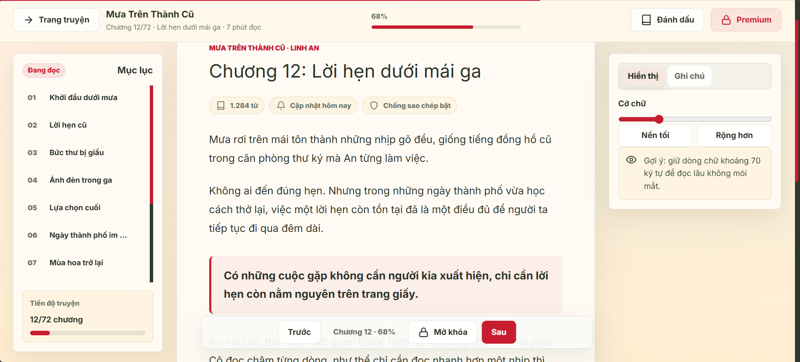

Đây là không gian đọc truyện thuần túy. Giao diện tối ưu hóa hiển thị văn bản với thanh công cụ điều chỉnh trải nghiệm đọc, mục lục bên trái và cơ chế chống sao chép bản quyền.

| Seq | Component / Element | Event | Action / Reaction |
| :--- | :--- | :--- | :--- |
| 1 | **Main Reading Area (Vùng đọc)** | Bôi đen, Right-click hoặc bấm `Ctrl+C` | Script "Chống sao chép bật" sẽ khóa thao tác copy để bảo vệ bản quyền, kèm theo Auto-save tiến trình đọc. |
| 2 | **Bảng tùy chỉnh hiển thị** | Điều chỉnh "Cỡ chữ", chuyển "Nền tối", "Rộng hơn" | Giao diện tự động thay đổi theo thời gian thực (DOM update) để chống mỏi mắt. Cấu hình được lưu lại vào LocalStorage. |
| 3 | **Mục lục & Tiến độ truyện (Sidebar)** | Scroll trang hoặc Click vào 1 chương | Hiển thị chương đang đọc (highlight đỏ) và thanh tiến độ tổng thể (VD: 12/72 chương). Click để chuyển nhanh chương. |
| 4 | **Điều hướng dưới cùng** | Click nút "Trước", "Sau" hoặc "Mở khóa" | Chuyển sang chương liền kề. Nếu là chương Premium, yêu cầu Mở khóa hoặc hiển thị form tính phí. |

#### 5.2.4. S16 – Author Studio (Editor)

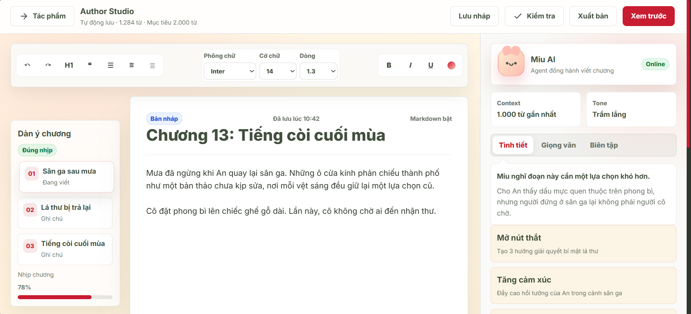

Công cụ soạn thảo toàn màn hình chia làm 3 cột: Dàn ý chương (trái), Khung soạn thảo Markdown (giữa) và **AI Sidebar (phải)** hỗ trợ tác giả phát triển cốt truyện cùng Miu AI (Gemini).

| Seq | Component / Element | Event | Action / Reaction |
| :--- | :--- | :--- | :--- |
| 1 | **Trình soạn thảo & Thanh công cụ** | Gõ văn bản liên tục | Tự động đếm số từ và lưu nháp (Autosave). Toolbar hỗ trợ các định dạng font chữ, giãn dòng, in đậm/nghiêng. |
| 2 | **Dàn ý chương & Nhịp chương** | Thêm, sửa thẻ ghi chú tình tiết (Sân ga sau mưa...) | Giúp tác giả quản lý mạch truyện ở sidebar trái, thanh tiến độ "Nhịp chương" báo cáo về thời lượng của chương hiện tại. |
| 3 | **Miu AI Sidebar (Gợi ý & Biên tập)** | Xem phần "Tình tiết", "Giọng văn", "Biên tập" | AI đọc context (1000 từ gần nhất), nhận diện tone "Trầm lắng" và đưa ra gợi ý xử lý tình huống (Mở nút thắt, Tăng cảm xúc...). |
| 4 | **Action Buttons** | Click "Lưu nháp", "Kiểm tra", "Xuất bản", "Xem trước" | Lưu bản nháp cuối, hoặc điều hướng sang màn hình Xuất bản chương (S17) để khai báo thông số. |

#### 5.2.5. S17 – Xuất bản chương

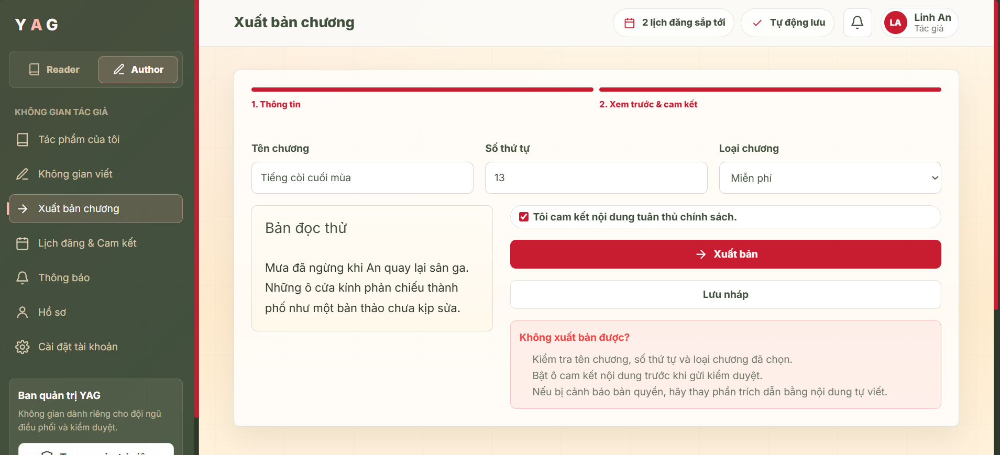

Giao diện giúp tác giả xác nhận thông tin thiết lập chương trước khi gửi yêu cầu xuất bản. Form phân định rõ phần khai báo và phần cam kết nội dung.

| Seq | Component / Element | Event | Action / Reaction |
| :--- | :--- | :--- | :--- |
| 1 | **Form thông tin chương** | Nhập "Tên chương", "Số thứ tự", chọn "Loại chương" (Miễn phí / Premium) | Thu thập các dữ liệu meta quan trọng. Khung bên trái sẽ lấy đoạn đầu chương hiển thị dưới dạng "Bản đọc thử". |
| 2 | **Checkbox Cam kết nội dung** | Tích chọn "Tôi cam kết nội dung tuân thủ chính sách" | Điều kiện bắt buộc để nút "Xuất bản" được kích hoạt. Tránh việc tác giả đẩy nội dung vi phạm mà không đọc luật. |
| 3 | **Nút "Xuất bản" / "Lưu nháp"** | Click chuột | Nếu xuất bản, đẩy tác vụ vào Background Job (RabbitMQ) để tiến hành kiểm duyệt AI tự động. |
| 4 | **Khung cảnh báo xuất bản** | Khi Form có lỗi (Thiếu thông tin, chưa tích cam kết) | Box "Không xuất bản được?" hiện đỏ kèm các hướng dẫn sửa lỗi (VD: Bật ô cam kết, kiểm tra bản quyền). |

#### 5.2.6. S20 – Kiểm duyệt nội dung (Admin)

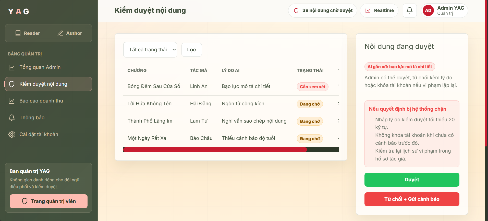

Màn hình dành cho Ban quản trị YAG hiển thị hàng đợi các chương truyện cần xem xét (có nguy cơ vi phạm). Chia làm 2 phần: Bảng danh sách và Khung thao tác nhanh.

| Seq | Component / Element | Event | Action / Reaction |
| :--- | :--- | :--- | :--- |
| 1 | **Queue Table (Danh sách chờ duyệt)**| Theo dõi, sử dụng bộ lọc "Tất cả trạng thái" | Danh sách ưu tiên hiển thị các truyện bị AI bắt lỗi với thông tin: Tên chương, Tác giả, Lý do AI (Bạo lực, Ngôn từ...), Trạng thái. |
| 2 | **Nội dung đang duyệt (Khung chi tiết)**| Click vào 1 dòng trong bảng danh sách | Khung bên phải hiển thị lỗi chi tiết (VD: "AI gắn cờ: bạo lực mô tả chi tiết") và trích xuất đoạn văn bản nghi vấn. |
| 3 | **Gợi ý quyết định xử lý** | Đọc phần cảnh báo "Nếu quyết định bị hệ thống chặn" | Hệ thống hướng dẫn Admin các quy tắc nhập lý do kiểm duyệt tối thiểu 20 ký tự, không khóa account oan... |
| 4 | **Action Buttons (Duyệt / Từ chối)** | Click "Duyệt" (Xanh) hoặc "Từ chối + Gửi cảnh báo" (Đỏ) | Xác nhận ghi đè kết quả của AI. Gửi thông báo đến S14 của Tác giả, cập nhật trạng thái trong database và lưu Audit log. |

### 5.3. The Other UI Design 
    Written by: 23120123 Trần Gia Hiển
    Reviewed by: 23120177 Phạm Hương Trà

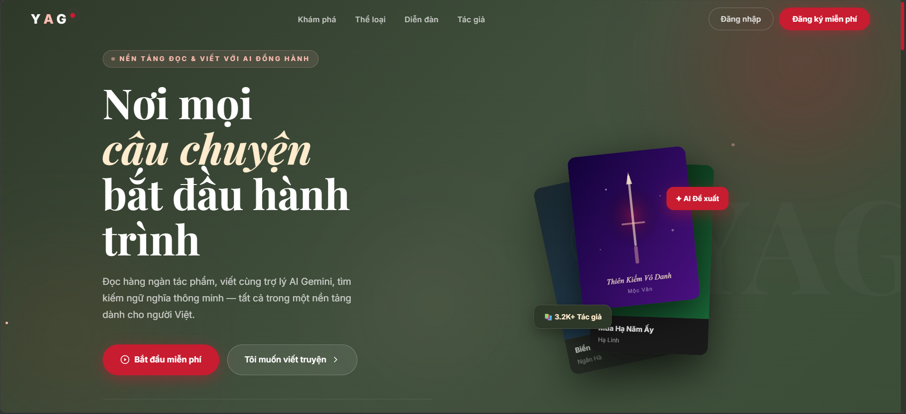
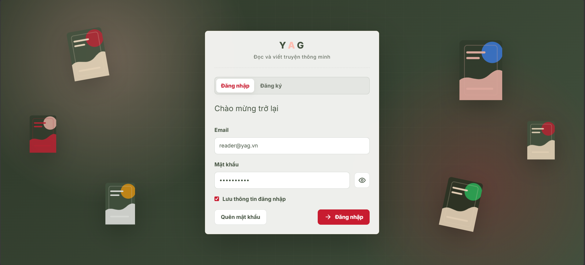
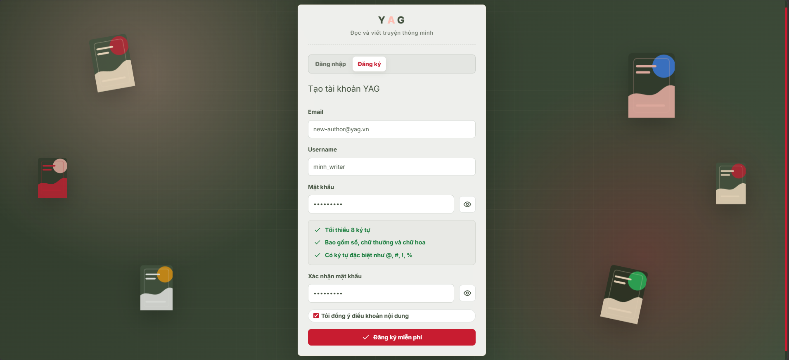
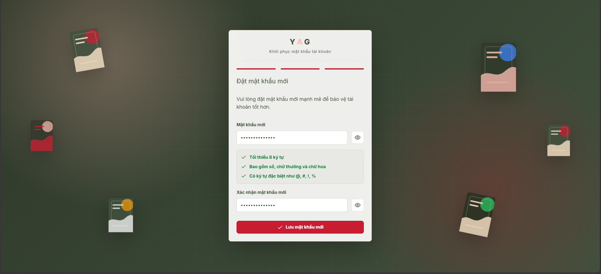
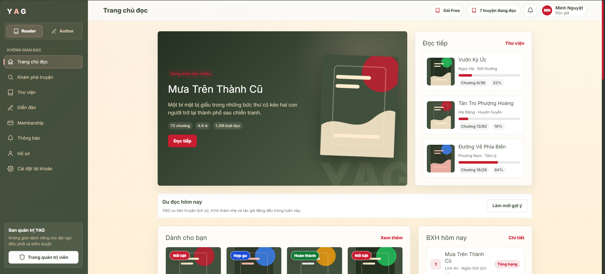
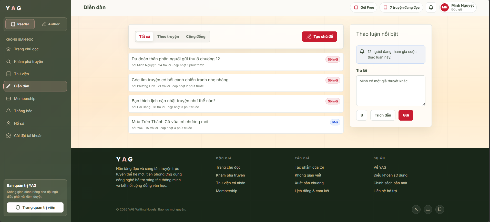
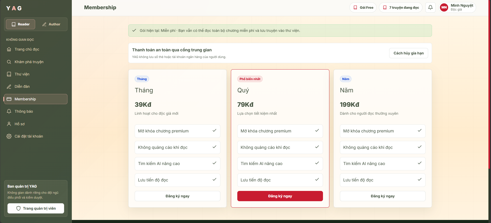
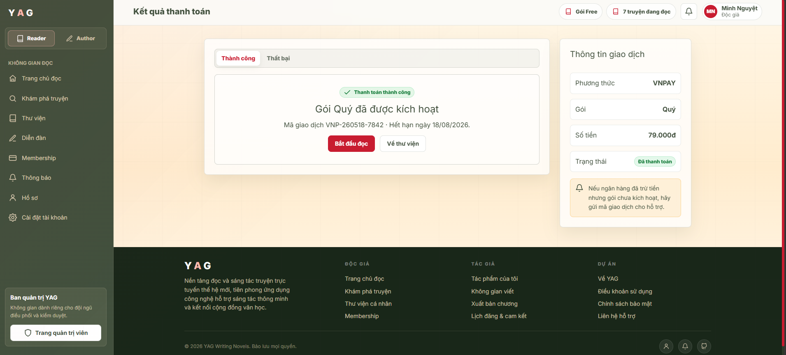
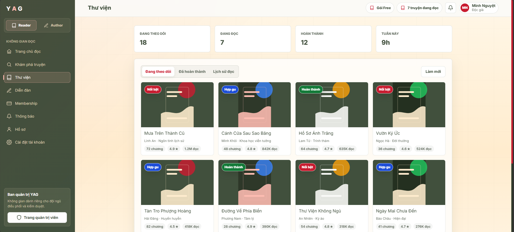
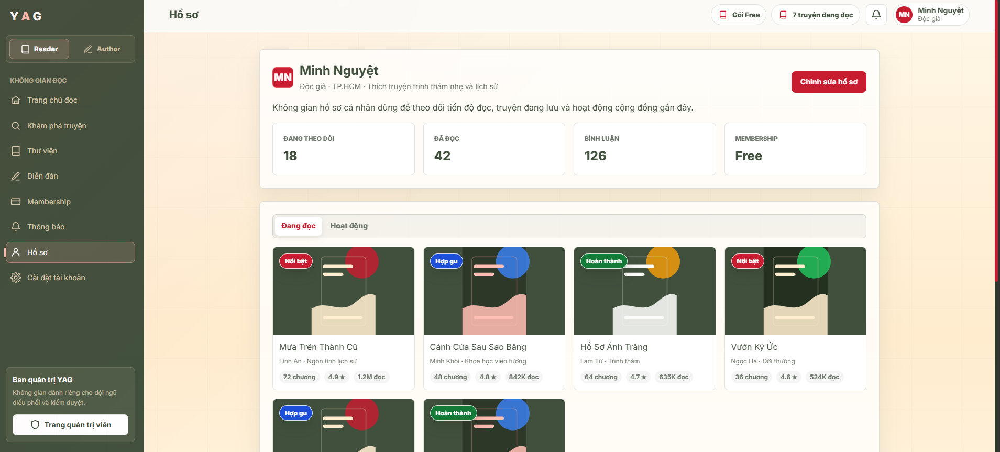
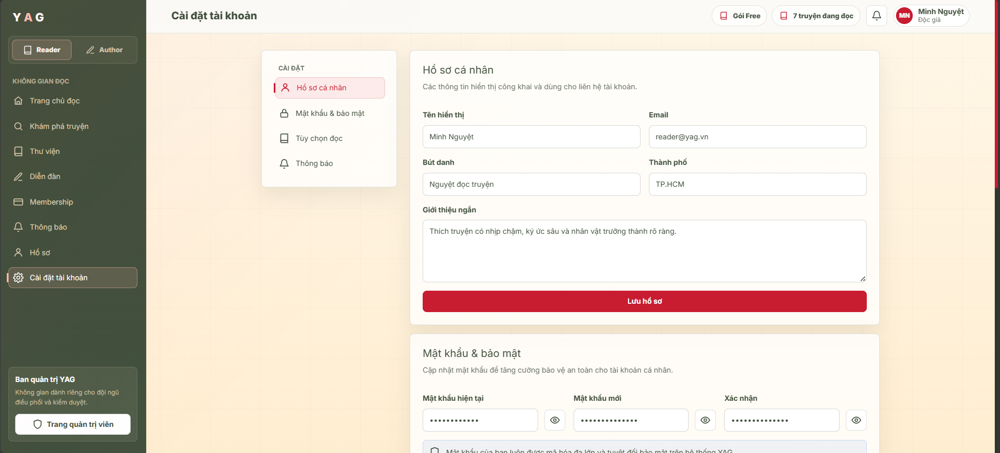
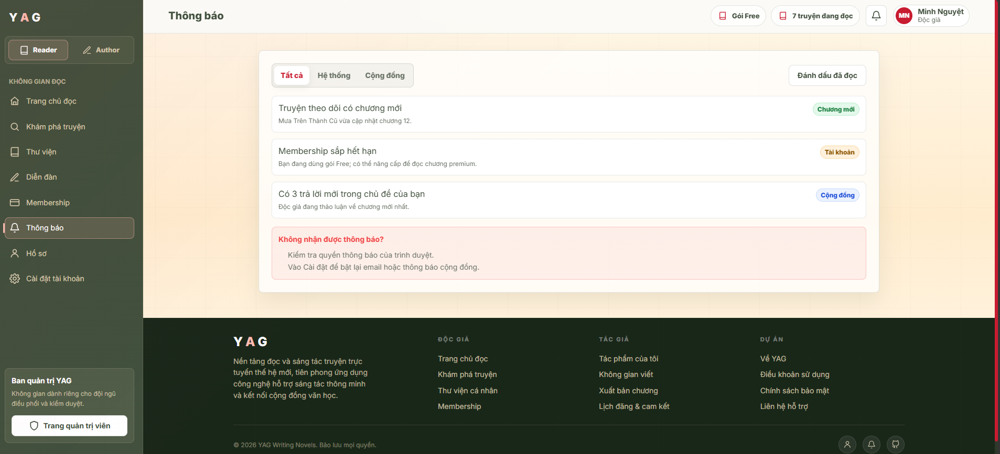
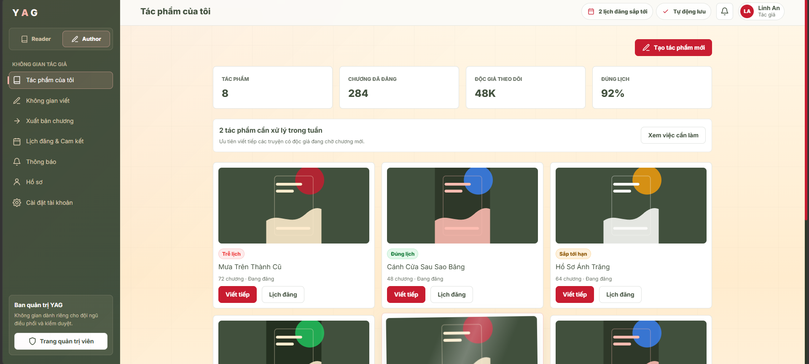
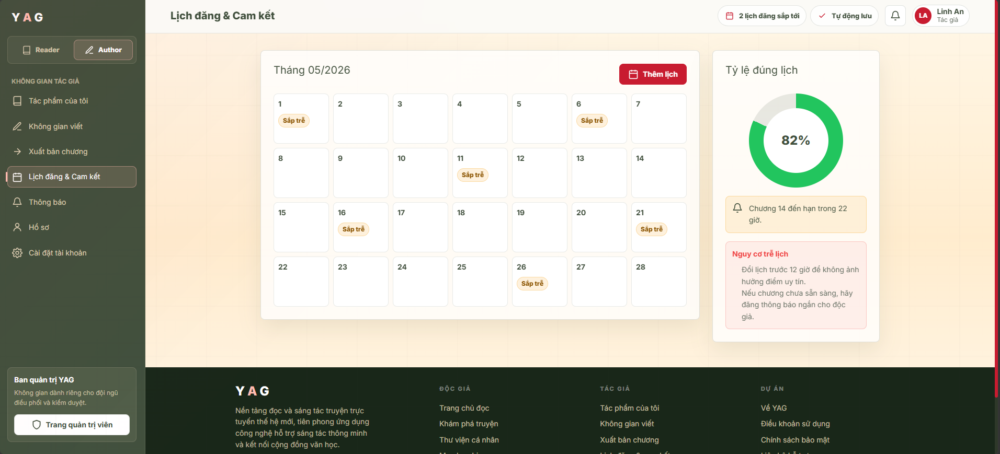
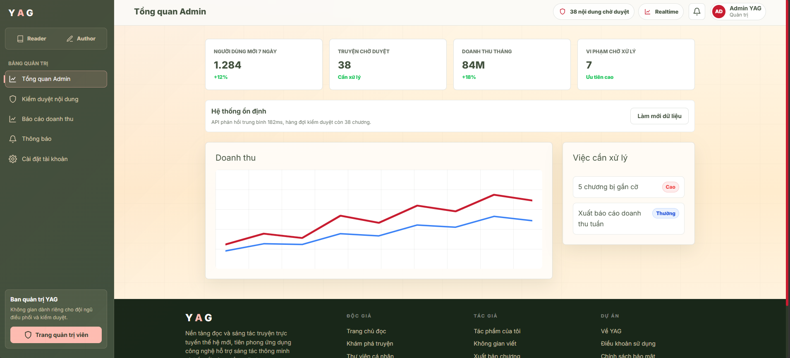
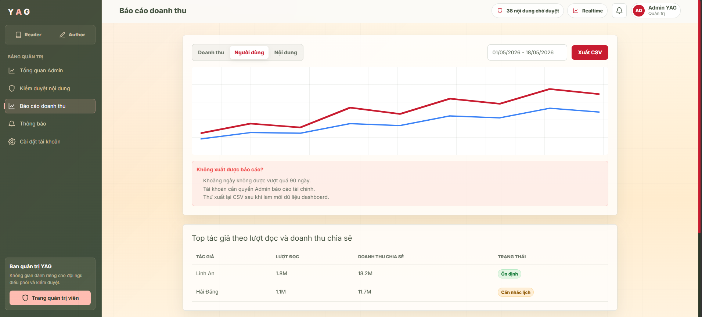

## 6. AI Usage Declaration
*(Đang cập nhật - Sẽ bổ sung sau khi hoàn thiện toàn bộ tài liệu và báo cáo)*

## 7. Presentation
*(Đang cập nhật - Link video thuyết trình sẽ được bổ sung trước thời hạn nộp bài)*

## 8. Reflective Report
### Các phần hữu ích nhất cho quá trình hiện thực

**1. Architectural Design (Mục 3)**
Sơ đồ kiến trúc tổng thể là bản đồ kỹ thuật quan trọng nhất. Việc trực quan hóa các thành phần giúp nhóm phân định rõ ranh giới giữa Frontend (Next.js), Backend (FastAPI), API Gateway, Message Queue và các dịch vụ bên ngoài. Ví dụ, luồng xuất bản chương được thiết kế để đẩy tác vụ kiểm duyệt vào **RabbitMQ** và để Background Worker gọi **Gemini API**, nhờ đó request của tác giả có thể trả về nhanh thay vì chờ AI xử lý văn bản dài.

**2. Data Design (Mục 4)**
Bản đặc tả cấu trúc cơ sở dữ liệu và sơ đồ ERD giúp nhóm ánh xạ trực tiếp thành Entity/Model trong code. Đối với dự án YAG, bảng `story_embeddings` là ví dụ rõ nhất: việc chỉ định kiểu dữ liệu `vector(1536)` từ sớm giúp nhóm chuẩn bị tích hợp **pgvector** cho PostgreSQL, sẵn sàng cho AI Semantic Search và Recommendation.

**3. User Interface and User Experience Design (Mục 5)**
Đặc tả màn hình giúp quá trình phát triển Frontend trực quan hơn và hạn chế việc code sai lệch luồng nghiệp vụ. Ví dụ, **Reader Mode (S07)** nêu rõ các thao tác đổi nền, đổi cỡ chữ, lưu tiến độ đọc và xử lý chương Premium. **Author Studio (S16)** chia rõ layout cho dàn ý, Markdown Editor và AI Sidebar, giúp lập trình viên định hình state/component trước khi triển khai.

### Các phần không hữu ích
Không có.
